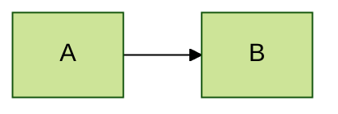

Mermaid provides extensive configuration options to control diagram rendering, appearance, and behavior. Configuration can be applied globally, per-site, or per-diagram.

## Configuration hierarchy

Mermaid uses a layered configuration system:

1. **Default configuration** - Built-in defaults from the library
2. **Site configuration** - Set via `initialize()` or `setSiteConfig()`
3. **Directive configuration** - Per-diagram using `%%{init: {}}%%` syntax
4. **Frontmatter configuration** - Per-diagram using YAML frontmatter

Later configurations override earlier ones, with frontmatter having the highest priority.

## Setting configuration

<Tabs>
  <Tab title="Initialize (recommended)">
    The standard way to configure Mermaid at application startup:

    ```javascript
    import mermaid from 'mermaid';

    mermaid.initialize({
      startOnLoad: true,
      theme: 'dark',
      logLevel: 'error',
      securityLevel: 'strict',
      flowchart: {
        curve: 'basis',
        padding: 20
      }
    });
    ```

    This should be called once before rendering any diagrams.
  </Tab>
  <Tab title="Frontmatter">
    Configure individual diagrams using YAML frontmatter:

    ```mermaid
    ---
    title: My Custom Diagram
    config:
      theme: forest
      flowchart:
        curve: cardinal
    ---
    flowchart LR
        A --> B
    ```

    Frontmatter has the highest priority and only affects the specific diagram.
  </Tab>
  <Tab title="Directives">
    Use directives for quick configuration changes:

    ```mermaid
    %%{init: {'theme':'base', 'themeVariables': {'primaryColor':'#ff0000'}}}%%
    flowchart LR
        A --> B
    ```

    Directives can be placed before or after the diagram declaration.
  </Tab>
  <Tab title="Runtime API">
    Update configuration after initialization:

    ```javascript
    import { updateSiteConfig } from 'mermaid';

    // Update the site config
    updateSiteConfig({
      theme: 'dark'
    });

    // Get current config
    import { getConfig } from 'mermaid';
    const config = getConfig();
    ```
  </Tab>
</Tabs>

## Global configuration options

### Core options

```javascript
{
  // Automatically render diagrams on page load
  startOnLoad: true,
  
  // Maximum text length allowed in diagrams
  maxTextSize: 50000,
  
  // Use deterministic IDs for reproducible output
  deterministicIds: false,
  deterministicIDSeed: undefined,
  
  // Font family for all text
  fontFamily: '"trebuchet ms", verdana, arial, sans-serif',
  
  // Font size
  fontSize: 16,
  
  // Logging level: 'trace' | 'debug' | 'info' | 'warn' | 'error' | 'fatal'
  logLevel: 'fatal',
  
  // Security level: 'strict' | 'loose' | 'sandbox'
  securityLevel: 'strict',
  
  // Theme: 'default' | 'dark' | 'forest' | 'neutral' | 'base'
  theme: 'default',
  
  // Whether to use HTML labels globally
  htmlLabels: true,
}
```

### Security configuration

<Warning>
The `securityLevel` option has important security implications when rendering user-generated content.
</Warning>

```javascript
mermaid.initialize({
  // strict: Prevents dangerous features, encodes tags
  // loose: Allows more features (security risk with user content)
  // sandbox: Renders in sandboxed iframe (safest)
  securityLevel: 'strict',
  
  // Additional security options
  secure: [
    // Keys that cannot be overridden by directives/frontmatter
    'secure',
    'securityLevel',
    'startOnLoad',
    'maxTextSize'
  ]
});
```

### Visual options

```javascript
mermaid.initialize({
  theme: 'default',
  
  // Custom theme variables (requires theme: 'base')
  themeVariables: {
    primaryColor: '#BB2528',
    primaryTextColor: '#fff',
    primaryBorderColor: '#7C0000',
    lineColor: '#F8B229',
    secondaryColor: '#006100',
    tertiaryColor: '#fff'
  },
  
  // Custom CSS (advanced)
  themeCSS: '.node rect { fill: #f9f; }',
  
  // Custom font family
  fontFamily: 'Arial, sans-serif',
  
  // Font size in pixels
  fontSize: 16
});
```

### Layout and rendering

```javascript
mermaid.initialize({
  // Layout engine: 'dagre' | 'elk'
  layout: 'dagre',
  
  // Visual look: 'classic' | 'handDrawn'
  look: 'classic',
  
  // ELK layout options (when layout: 'elk')
  elk: {
    mergeEdges: false,
    nodePlacementStrategy: 'BRANDES_KOEPF', // 'SIMPLE' | 'NETWORK_SIMPLEX' | 'LINEAR_SEGMENTS' | 'BRANDES_KOEPF'
  }
});
```

## Diagram-specific configuration

Each diagram type has its own configuration section:

<Tabs>
  <Tab title="Flowchart">
    ```javascript
    mermaid.initialize({
      flowchart: {
        // Curve style: 'basis' | 'linear' | 'cardinal'
        curve: 'basis',
        
        // Padding around the diagram
        padding: 15,
        
        // Use HTML labels in nodes
        htmlLabels: true,
        
        // Default arrow marker
        defaultRenderer: 'dagre-wrapper',
        
        // Rank direction
        rankSpacing: 50,
        nodeSpacing: 50,
        
        // Wrapping width for node labels
        wrappingWidth: 200
      }
    });
    ```
  </Tab>
  <Tab title="Sequence diagram">
    ```javascript
    mermaid.initialize({
      sequence: {
        // Actor margins
        actorMargin: 50,
        
        // Box margins
        boxMargin: 10,
        boxTextMargin: 5,
        
        // Message alignment: 'left' | 'center' | 'right'
        messageAlign: 'center',
        
        // Mirror actors at bottom
        mirrorActors: true,
        
        // Note margins
        noteMargin: 10,
        
        // Show sequence numbers
        showSequenceNumbers: false,
        
        // Wrap labels
        wrap: false,
        wrapPadding: 10,
        
        // Width
        width: 150,
        height: 65,
        
        // Use max text width
        useMaxWidth: true
      }
    });
    ```
  </Tab>
  <Tab title="Gantt">
    ```javascript
    mermaid.initialize({
      gantt: {
        // Number format for tick intervals
        numberSectionStyles: 4,
        
        // Axis format
        axisFormat: '%Y-%m-%d',
        
        // Tick interval (e.g., '1day', '1week')
        tickInterval: undefined,
        
        // Use width
        useWidth: undefined,
        
        // Section font sizes
        fontSize: 11,
        sectionFontSize: 11,
        
        // Bar height
        barHeight: 20,
        barGap: 4,
        
        // Top padding
        topPadding: 50,
        
        // Left/right padding  
        leftPadding: 75,
        rightPadding: 75,
        
        // Grid line start padding
        gridLineStartPadding: 35,
        
        // Use max width
        useMaxWidth: true
      }
    });
    ```
  </Tab>
  <Tab title="Class diagram">
    ```javascript
    mermaid.initialize({
      class: {
        // Hide empty member boxes
        hideEmptyMembersBox: false,
        
        // Arrow marker: 'true' | 'false' | 'triangle' | 'cross'
        arrowMarkerAbsolute: false,
        
        // Default renderer
        defaultRenderer: 'dagre-wrapper',
        
        // Node spacing
        nodeSpacing: 50,
        rankSpacing: 50,
        
        // Diagram padding
        padding: 20,
        
        // Text height
        textHeight: 10
      }
    });
    ```
  </Tab>
  <Tab title="State diagram">
    ```javascript
    mermaid.initialize({
      state: {
        // Divider margin
        dividerMargin: 10,
        
        // State radius
        radius: 5,
        
        // Text height
        textHeight: 10,
        
        // Fork width/height
        forkWidth: 70,
        forkHeight: 7,
        
        // Mini padding
        miniPadding: 2,
        
        // Font sizes
        fontSize: 24,
        labelHeight: 16,
        edgeLengthFactor: '20',
        
        // Composition
        compositTitleSize: 35,
        
        // Node spacing
        nodeSpacing: 50,
        rankSpacing: 50,
        
        // Default renderer
        defaultRenderer: 'dagre-wrapper',
        
        // Layout
        layout: 'dagre'
      }
    });
    ```
  </Tab>
  <Tab title="ER diagram">
    ```javascript
    mermaid.initialize({
      er: {
        // Diagram padding
        padding: 20,
        
        // Layout direction: 'TB' | 'BT' | 'LR' | 'RL'
        layoutDirection: 'TB',
        
        // Min entity width/height
        minEntityWidth: 100,
        minEntityHeight: 75,
        
        // Entity spacing
        entityPadding: 15,
        
        // Stroke
        stroke: 'gray',
        fill: 'honeydew',
        
        // Font size
        fontSize: 12,
        
        // Use max width
        useMaxWidth: true
      }
    });
    ```
  </Tab>
</Tabs>

## Configuration API

Mermaid exposes several functions for working with configuration:

```javascript
import {
  initialize,        // Set initial configuration
  getConfig,        // Get current configuration
  setConfig,        // Update current configuration  
  getSiteConfig,    // Get site-level configuration
  setSiteConfig,    // Set site-level configuration
  updateSiteConfig, // Update site-level configuration
  reset,            // Reset to site configuration
  defaultConfig     // Get default configuration
} from 'mermaid';

// Initialize (call once at startup)
mermaid.initialize({
  theme: 'dark',
  logLevel: 'error'
});

// Get current configuration
const config = getConfig();
console.log(config.theme); // 'dark'

// Update site config at runtime
updateSiteConfig({
  theme: 'forest'
});

// Reset to site config (clears directive/frontmatter overrides)
reset();

// Reset to specific config
reset(defaultConfig);
```

<Note>
Avoid calling `getConfig()` repeatedly. Store the result in a variable and reuse it. The function creates a deep copy each time it's called.
</Note>

## Configuration best practices

### 1. Initialize once

Call `initialize()` only once at application startup:

```javascript
// Good
mermaid.initialize({ theme: 'dark' });

// Bad - don't re-initialize
mermaid.initialize({ theme: 'dark' });
// ... later ...
mermaid.initialize({ theme: 'forest' }); // Don't do this
```

### 2. Use updateSiteConfig for runtime changes

```javascript
// Good
import { updateSiteConfig } from 'mermaid';
updateSiteConfig({ theme: 'forest' });

// Avoid
mermaid.initialize({ theme: 'forest' }); // Re-initializing
```

### 3. Prefer frontmatter over directives

Frontmatter is more readable and maintainable:



Versus:


### 4. Secure user-generated content

When rendering untrusted diagrams:

```javascript
mermaid.initialize({
  securityLevel: 'strict',
  secure: [
    'secure',
    'securityLevel',
    'startOnLoad',
    'maxTextSize'
  ]
});
```

### 5. Validate configuration

Mermaid silently ignores invalid configuration keys. Use TypeScript for type safety:

```typescript
import type { MermaidConfig } from 'mermaid';

const config: MermaidConfig = {
  theme: 'dark',
  // TypeScript will catch typos
  // them: 'dark', // Error: Object literal may only specify known properties
};

mermaid.initialize(config);
```

## Common configuration patterns

<Tabs>
  <Tab title="Dark mode">
    ```javascript
    mermaid.initialize({
      theme: 'dark',
      themeVariables: {
        darkMode: true,
        background: '#1e1e1e',
        primaryColor: '#4dabf7',
        secondaryColor: '#748ffc',
        tertiaryColor: '#f783ac',
        primaryTextColor: '#fff',
        secondaryTextColor: '#fff',
        tertiaryTextColor: '#fff',
        lineColor: '#f8f8f8',
        textColor: '#f8f8f8'
      }
    });
    ```
  </Tab>
  <Tab title="High-contrast">
    ```javascript
    mermaid.initialize({
      theme: 'base',
      themeVariables: {
        primaryColor: '#000',
        primaryTextColor: '#fff',
        primaryBorderColor: '#fff',
        lineColor: '#000',
        secondaryColor: '#fff',
        tertiaryColor: '#808080',
        background: '#fff',
        textColor: '#000',
        fontSize: '18px'
      }
    });
    ```
  </Tab>
  <Tab title="Compact diagrams">
    ```javascript
    mermaid.initialize({
      flowchart: {
        padding: 5,
        nodeSpacing: 30,
        rankSpacing: 30
      },
      sequence: {
        actorMargin: 25,
        boxMargin: 5,
        noteMargin: 5
      }
    });
    ```
  </Tab>
  <Tab title="Hand-drawn style">
    ```javascript
    mermaid.initialize({
      look: 'handDrawn',
      theme: 'neutral',
      flowchart: {
        curve: 'cardinal'
      }
    });
    ```
  </Tab>
</Tabs>

## Deprecated options

<Warning>
Some configuration options have been deprecated. Mermaid will log warnings when these are used.
</Warning>

```javascript
// Deprecated
{
  flowchart: {
    htmlLabels: true // Use global htmlLabels instead
  },
  lazyLoadedDiagrams: [], // Use registerExternalDiagrams instead
  loadExternalDiagramsAtStartup: false // Use registerExternalDiagrams instead
}

// Preferred
{
  htmlLabels: true
}
```

## Next steps

<CardGroup cols={2}>
  <Card title="Theming" icon="palette" href="/concepts/theming">
    Customize colors and visual appearance
  </Card>
  <Card title="Initialization" icon="gear" href="/concepts/initialization">
    Learn about initialization patterns
  </Card>
  <Card title="API reference" icon="code" href="/api/overview">
    Complete configuration API reference
  </Card>
  <Card title="Security" icon="shield" href="/configuration/setup">
    Learn about security best practices
  </Card>
</CardGroup>