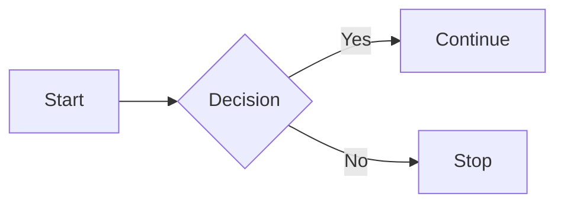
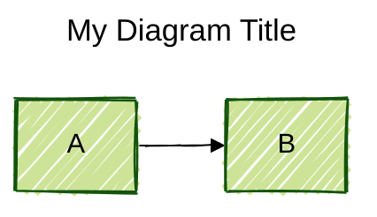
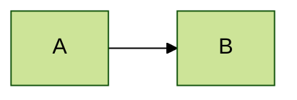
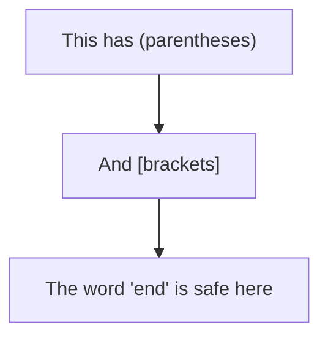
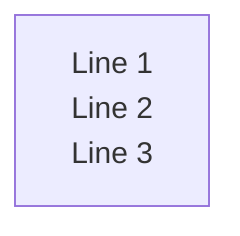

Mermaid uses a text-based syntax to create diagrams. The syntax is designed to be simple and readable, allowing you to create complex diagrams with minimal code.

## Basic structure

All Mermaid diagrams follow a consistent structure:

1. **Diagram type declaration** - Specifies what type of diagram to create
2. **Diagram content** - The actual diagram definition using diagram-specific syntax
3. **Optional frontmatter** - YAML configuration placed before the diagram



In this example:
- `flowchart LR` is the diagram type declaration (flowchart with left-to-right direction)
- The lines below define nodes and connections

## Diagram type declarations

Every diagram begins with a declaration that tells Mermaid which parser to use. Common diagram types include:

| Declaration | Diagram Type |
| --- | --- |
| `flowchart` or `graph` | Flowchart |
| `sequenceDiagram` | Sequence diagram |
| `classDiagram` | Class diagram |
| `stateDiagram-v2` | State diagram |
| `erDiagram` | Entity relationship diagram |
| `journey` | User journey diagram |
| `gantt` | Gantt chart |
| `pie` | Pie chart |
| `gitGraph` | Git graph |
| `mindmap` | Mindmap |
| `timeline` | Timeline |
| `quadrantChart` | Quadrant chart |

## Comments

You can add comments to your diagram code using `%%`. Anything after `%%` on a line is ignored by the parser:

```mermaid
flowchart TD
    %% This is a comment
    A[Start] --> B[Process]
    B --> C[End]  %% This is also a comment
```

<Warning>
Avoid using `{}` within comments (like `%%{` or `}%%`) as this can confuse the parser with directive syntax.
</Warning>

## Frontmatter configuration

Frontmatter allows you to configure individual diagrams using YAML metadata. Place it before your diagram code, enclosed in triple dashes (`---`):



### Frontmatter syntax rules

- The opening `---` must be the only characters on the first line
- Use proper YAML syntax with consistent indentation
- Settings are case-sensitive
- Mermaid silently ignores misspellings, but malformed YAML will break the diagram

### Common frontmatter options

<Tabs>
  <Tab title="Title and display">
    ```yaml
    ---
    title: Diagram Title
    displayMode: compact
    ---
    ```
  </Tab>
  <Tab title="Theme configuration">
    ```yaml
    ---
    config:
      theme: dark
      themeVariables:
        primaryColor: '#BB2528'
        primaryTextColor: '#fff'
    ---
    ```
  </Tab>
  <Tab title="Layout options">
    ```yaml
    ---
    config:
      layout: elk
      look: handDrawn
    ---
    ```
  </Tab>
  <Tab title="Diagram-specific">
    ```yaml
    ---
    config:
      flowchart:
        curve: basis
    gantt:
      useWidth: 400
      compact: true
    ---
    ```
  </Tab>
</Tabs>

## Directives

Directives provide an alternative way to configure diagrams using the `%%{ }%%` syntax:



Directives can be placed before or after the diagram type declaration. While frontmatter is generally preferred for its readability, directives are useful for quick theme or configuration changes.

## Special characters and escaping

Some words and characters can break diagrams. Here are common issues and solutions:

| Issue | Affected Diagrams | Solution |
| --- | --- | --- |
| The word "end" | Flowcharts, Sequence | Wrap in quotes: `"end"` |
| Special characters in labels | All | Use quotes: `["Label with (special) chars"]` |
| Nested shapes | Flowcharts | Use quotes to prevent parser confusion |

### Example with special characters



## Text length limits

Mermaid has a maximum text length limit of 50,000 characters for diagram definitions. Exceeding this limit will result in an error diagram.

## Line breaks in text

Different diagram types support line breaks in text using `<br>` or `<br/>`:



## Best practices

1. **Use meaningful IDs** - Give nodes descriptive identifiers for better readability
2. **Comment complex sections** - Help others (and your future self) understand the diagram
3. **Prefer frontmatter over directives** - Frontmatter is more readable and maintainable
4. **Quote special characters** - When in doubt, use quotes around labels
5. **Validate syntax early** - Use the [Mermaid Live Editor](https://mermaid.live) to test diagrams

## Next steps

<CardGroup cols={2}>
  <Card title="Initialization" icon="gear" href="/concepts/initialization">
    Learn how to initialize Mermaid in your application
  </Card>
  <Card title="Configuration" icon="sliders" href="/concepts/configuration">
    Explore configuration options and patterns
  </Card>
  <Card title="Theming" icon="palette" href="/concepts/theming">
    Customize the appearance of your diagrams
  </Card>
  <Card title="Diagram types" icon="diagram-project" href="/diagrams/overview">
    Explore specific diagram type syntax
  </Card>
</CardGroup>