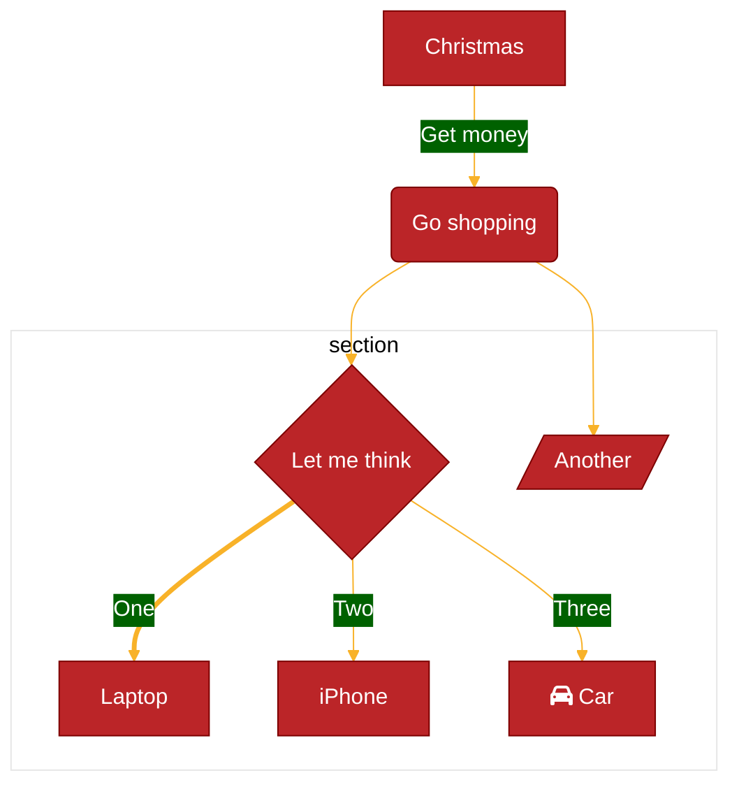

Mermaid provides a powerful theming system that allows you to customize the appearance of diagrams. You can use built-in themes, customize theme variables, or apply custom CSS for complete control.

## Available themes

Mermaid includes five built-in themes:

<Tabs>
  <Tab title="default">
    The default theme with a clean, professional appearance.

    ```mermaid
    %%{init: {'theme':'default'}}%%
    flowchart LR
        A[Start] --> B{Decision}
        B -->|Yes| C[Continue]
        B -->|No| D[Stop]
    ```

    **Best for:** General purpose diagrams, documentation, presentations.
  </Tab>
  <Tab title="dark">
    A dark theme optimized for dark backgrounds and dark mode interfaces.

    ```mermaid
    %%{init: {'theme':'dark'}}%%
    flowchart LR
        A[Start] --> B{Decision}
        B -->|Yes| C[Continue]
        B -->|No| D[Stop]
    ```

    **Best for:** Dark mode applications, reducing eye strain, modern UIs.
  </Tab>
  <Tab title="forest">
    A green-themed design with earthy tones.

    ```mermaid
    %%{init: {'theme':'forest'}}%%
    flowchart LR
        A[Start] --> B{Decision}
        B -->|Yes| C[Continue]
        B -->|No| D[Stop]
    ```

    **Best for:** Nature-related content, environmental topics, alternative styling.
  </Tab>
  <Tab title="neutral">
    A black and white theme perfect for printing.

    ```mermaid
    %%{init: {'theme':'neutral'}}%%
    flowchart LR
        A[Start] --> B{Decision}
        B -->|Yes| C[Continue]
        B -->|No| D[Stop]
    ```

    **Best for:** Printed documents, black and white publications, high contrast.
  </Tab>
  <Tab title="base">
    A minimal theme that serves as the foundation for customization.

    ```mermaid
    %%{init: {'theme':'base'}}%%
    flowchart LR
        A[Start] --> B{Decision}
        B -->|Yes| C[Continue]
        B -->|No| D[Stop]
    ```

    **Best for:** Custom theming via theme variables. This is the only modifiable theme.
  </Tab>
</Tabs>

<Note>
The `base` theme is the only theme that can be customized using theme variables. All other themes have fixed color schemes.
</Note>

## Setting themes

<Tabs>
  <Tab title="Site-wide (initialize)">
    Set a theme for all diagrams when initializing Mermaid:

    ```javascript
    import mermaid from 'mermaid';

    mermaid.initialize({
      theme: 'dark'
    });
    ```
  </Tab>
  <Tab title="Per-diagram (frontmatter)">
    Use frontmatter to set the theme for a specific diagram:

    ```mermaid
    ---
    config:
      theme: forest
    ---
    flowchart LR
        A --> B
    ```
  </Tab>
  <Tab title="Per-diagram (directive)">
    Use a directive for quick theme changes:

    ```mermaid
    %%{init: {'theme':'neutral'}}%%
    flowchart LR
        A --> B
    ```
  </Tab>
</Tabs>

## Theme variables

Theme variables allow you to customize colors and styling. This only works with the `base` theme.

### Core theme variables

```javascript
mermaid.initialize({
  theme: 'base',
  themeVariables: {
    // Dark mode calculation
    darkMode: false,
    
    // Base colors
    primaryColor: '#fff4dd',
    primaryTextColor: '#333',
    primaryBorderColor: '#9370DB',
    
    secondaryColor: '#ffffde',
    secondaryTextColor: '#333',
    secondaryBorderColor: '#66cdaa',
    
    tertiaryColor: '#f0fff0',
    tertiaryTextColor: '#333',
    tertiaryBorderColor: '#9370DB',
    
    // Background and general
    background: '#f4f4f4',
    textColor: '#333',
    lineColor: '#333',
    
    // Fonts
    fontFamily: 'trebuchet ms, verdana, arial, sans-serif',
    fontSize: '16px',
    
    // Notes (sequence diagrams, etc.)
    noteBkgColor: '#fff5ad',
    noteTextColor: '#333',
    noteBorderColor: '#aaaa33'
  }
});
```

### Color calculation

<Accordion title="Understanding derived colors">
Mermaid automatically calculates many colors from your primary color choices to ensure visual consistency:

- **Border colors** are derived from their corresponding fill colors
- **Text colors** are adjusted based on background for readability
- **Secondary and tertiary colors** can be calculated from the primary color
- **darkMode: true** changes how colors are derived for better contrast

```javascript
// Explicitly set colors
themeVariables: {
  primaryColor: '#BB2528',
  primaryTextColor: '#fff',  // Explicit
  primaryBorderColor: '#7C0000'  // Explicit
}

// Or let Mermaid calculate them
themeVariables: {
  primaryColor: '#BB2528'
  // primaryTextColor and primaryBorderColor will be calculated
}
```
</Accordion>

<Warning>
Mermaid only recognizes hex color codes (e.g., `#ff0000`). Color names (e.g., `red`) will not work.
</Warning>

### Complete example with theme variables



## Diagram-specific theme variables

Different diagram types have specific theme variables:

<Tabs>
  <Tab title="Flowchart">
    ```javascript
    themeVariables: {
      // Node styling
      nodeBorder: '#9370DB',
      nodeTextColor: '#333',
      
      // Cluster/subgraph styling  
      clusterBkg: '#f0fff0',
      clusterBorder: '#9370DB',
      
      // Links
      defaultLinkColor: '#333',
      
      // Edge labels
      edgeLabelBackground: '#e8e8e8',
      
      // Title
      titleColor: '#333'
    }
    ```
  </Tab>
  <Tab title="Sequence diagram">
    ```javascript
    themeVariables: {
      // Actors
      actorBkg: '#ececff',
      actorBorder: '#9370DB',
      actorTextColor: '#333',
      actorLineColor: '#9370DB',
      
      // Signals/messages
      signalColor: '#333',
      signalTextColor: '#333',
      
      // Label box
      labelBoxBkgColor: '#ececff',
      labelBoxBorderColor: '#9370DB',
      labelTextColor: '#333',
      
      // Loops
      loopTextColor: '#333',
      
      // Activation
      activationBorderColor: '#666',
      activationBkgColor: '#f4f4f4',
      
      // Sequence numbers
      sequenceNumberColor: '#fff'
    }
    ```
  </Tab>
  <Tab title="Class diagram">
    ```javascript
    themeVariables: {
      // Class text
      classText: '#333'
    }
    ```
  </Tab>
  <Tab title="State diagram">
    ```javascript
    themeVariables: {
      // Label color
      labelColor: '#333',
      
      // Composite states
      altBackground: '#f0fff0'
    }
    ```
  </Tab>
  <Tab title="ER diagram">
    ```javascript
    themeVariables: {
      // No specific ER variables currently
      // Uses general theme variables
    }
    ```
  </Tab>
  <Tab title="Gantt chart">
    ```javascript
    themeVariables: {
      // Grid
      gridColor: '#e0e0e0',
      
      // Today marker
      todayLineColor: '#db5757',
      
      // Sections
      sectionBkgColor: '#d9d9d9',
      sectionBkgColor2: '#ececec',
      
      // Tasks
      taskBorderColor: '#9370DB',
      taskBkgColor: '#b19cd9',
      taskTextColor: '#333',
      taskTextOutsideColor: '#333',
      taskTextLightColor: '#333',
      
      // Active/done/critical tasks
      activeTaskBorderColor: '#7c0',
      activeTaskBkgColor: '#a3f',
      doneTaskBorderColor: '#690',
      doneTaskBkgColor: '#bfc',
      critBorderColor: '#f88',
      critBkgColor: '#fcc',
      
      // Excluded days
      excludeBkgColor: '#f9f9f9'
    }
    ```
  </Tab>
  <Tab title="Pie chart">
    ```javascript
    themeVariables: {
      // Pie slices (pie1-pie12)
      pie1: '#BB2528',
      pie2: '#F8B229',
      pie3: '#006100',
      pie4: '#0066CC',
      pie5: '#9370DB',
      pie6: '#FF6B6B',
      pie7: '#4ECDC4',
      pie8: '#FFE66D',
      pie9: '#A8E6CF',
      pie10: '#FF8B94',
      pie11: '#C7CEEA',
      pie12: '#FFDAC1',
      
      // Title
      pieTitleTextSize: '25px',
      pieTitleTextColor: '#333',
      
      // Section labels
      pieSectionTextSize: '17px',
      pieSectionTextColor: '#333',
      
      // Legend
      pieLegendTextSize: '17px',
      pieLegendTextColor: '#333',
      
      // Stroke
      pieStrokeColor: '#000',
      pieStrokeWidth: '2px',
      pieOuterStrokeWidth: '2px',
      pieOuterStrokeColor: '#000',
      
      // Opacity
      pieOpacity: '0.7'
    }
    ```
  </Tab>
</Tabs>

## Custom CSS

For advanced customization, you can inject custom CSS:

```javascript
mermaid.initialize({
  theme: 'base',
  themeCSS: `
    .node rect {
      fill: #f9f;
      stroke: #333;
      stroke-width: 2px;
    }
    .node text {
      font-weight: bold;
    }
    .edgeLabel {
      background-color: #ffe;
    }
  `
});
```

<Warning>
Custom CSS has the highest specificity and will override theme variables. Use with caution as it may break when Mermaid updates its internal structure.
</Warning>

## Dynamic theming

Change themes based on user preferences or system settings:

```javascript
import mermaid, { updateSiteConfig } from 'mermaid';

// Initialize with default theme
mermaid.initialize({ 
  theme: 'default',
  startOnLoad: false 
});

// Switch theme based on system preference
function applyTheme() {
  const isDark = window.matchMedia('(prefers-color-scheme: dark)').matches;
  
  updateSiteConfig({
    theme: isDark ? 'dark' : 'default'
  });
  
  // Re-render diagrams
  mermaid.run();
}

// Listen for changes
window.matchMedia('(prefers-color-scheme: dark)')
  .addEventListener('change', applyTheme);

// Apply initial theme
applyTheme();
```

## Theme examples

<Tabs>
  <Tab title="Corporate brand">
    ```javascript
    mermaid.initialize({
      theme: 'base',
      themeVariables: {
        primaryColor: '#0066CC',      // Brand blue
        primaryTextColor: '#fff',
        primaryBorderColor: '#004C99',
        secondaryColor: '#00CC66',    // Brand green
        tertiaryColor: '#FFB84D',     // Brand orange
        background: '#FFFFFF',
        fontFamily: 'Helvetica, Arial, sans-serif',
        fontSize: '14px'
      }
    });
    ```
  </Tab>
  <Tab title="High contrast">
    ```javascript
    mermaid.initialize({
      theme: 'base',
      themeVariables: {
        primaryColor: '#000000',
        primaryTextColor: '#FFFFFF',
        primaryBorderColor: '#FFFFFF',
        secondaryColor: '#FFFFFF',
        secondaryTextColor: '#000000',
        secondaryBorderColor: '#000000',
        lineColor: '#000000',
        background: '#FFFFFF',
        textColor: '#000000',
        fontSize: '18px'
      }
    });
    ```
  </Tab>
  <Tab title="Pastel">
    ```javascript
    mermaid.initialize({
      theme: 'base',
      themeVariables: {
        primaryColor: '#FFE4E1',      // Misty rose
        primaryTextColor: '#333',
        primaryBorderColor: '#FFB6C1',
        secondaryColor: '#E0FFFF',    // Light cyan
        secondaryTextColor: '#333',
        tertiaryColor: '#F0E68C',     // Khaki
        background: '#FFF8F8',
        lineColor: '#D8BFD8',         // Thistle
        fontFamily: 'Georgia, serif'
      }
    });
    ```
  </Tab>
  <Tab title="Dark blue">
    ```javascript
    mermaid.initialize({
      theme: 'base',
      themeVariables: {
        darkMode: true,
        primaryColor: '#1e3a5f',
        primaryTextColor: '#e0e0e0',
        primaryBorderColor: '#4a90e2',
        secondaryColor: '#2c5aa0',
        tertiaryColor: '#16213e',
        background: '#0f1419',
        textColor: '#e0e0e0',
        lineColor: '#4a90e2'
      }
    });
    ```
  </Tab>
</Tabs>

## Theme reference tables

### Core variables

| Variable | Default | Description |
| --- | --- | --- |
| `darkMode` | `false` | Affects how derived colors are calculated |
| `background` | `#f4f4f4` | Background color for calculations |
| `primaryColor` | `#fff4dd` | Primary node fill color |
| `primaryTextColor` | calculated | Text color in primary nodes |
| `primaryBorderColor` | calculated | Border color for primary nodes |
| `secondaryColor` | calculated | Secondary element color |
| `secondaryTextColor` | calculated | Text in secondary elements |
| `secondaryBorderColor` | calculated | Border for secondary elements |
| `tertiaryColor` | calculated | Tertiary element color |
| `tertiaryTextColor` | calculated | Text in tertiary elements |
| `tertiaryBorderColor` | calculated | Border for tertiary elements |
| `lineColor` | calculated | Line and connector color |
| `textColor` | calculated | General text color |
| `fontFamily` | `trebuchet ms, verdana, arial` | Font family |
| `fontSize` | `16px` | Font size |

### Note variables

| Variable | Default | Description |
| --- | --- | --- |
| `noteBkgColor` | `#fff5ad` | Note background color |
| `noteTextColor` | `#333` | Text in notes |
| `noteBorderColor` | calculated | Note border color |

## Best practices

1. **Use the base theme for customization** - It's the only theme designed to be modified
2. **Test color contrast** - Ensure text is readable against backgrounds
3. **Use hex colors only** - Color names are not supported
4. **Set darkMode appropriately** - Helps Mermaid calculate better derived colors
5. **Consider accessibility** - Follow WCAG guidelines for color contrast
6. **Document your theme** - Keep a reference of your custom color scheme
7. **Test across diagram types** - Theme variables affect different diagrams differently

## Troubleshooting

<Accordion title="Theme changes not applying">
  - Ensure you're using the `base` theme when setting `themeVariables`
  - Check that colors are in hex format (`#rrggbb`)
  - Verify there are no typos in variable names
  - Clear any cached configurations with `reset()`
</Accordion>

<Accordion title="Poor color contrast">
  - Set `darkMode: true` for dark backgrounds
  - Explicitly set text colors instead of relying on calculation
  - Test with a contrast checker tool
  - Use the `neutral` theme for black and white output
</Accordion>

<Accordion title="Inconsistent appearance across diagrams">
  - Some diagram types use different theme variables
  - Not all variables apply to all diagram types
  - Consider using custom CSS for fine-grained control
  - Check diagram-specific theme variable tables
</Accordion>

## Next steps

<CardGroup cols={2}>
  <Card title="Configuration" icon="sliders" href="/concepts/configuration">
    Explore all configuration options
  </Card>
  <Card title="Syntax overview" icon="code" href="/concepts/syntax-overview">
    Learn Mermaid syntax basics
  </Card>
  <Card title="Diagram types" icon="diagram-project" href="/diagrams/overview">
    Explore different diagram types
  </Card>
  <Card title="Examples" icon="images" href="/examples/overview">
    See themed diagram examples
  </Card>
</CardGroup>