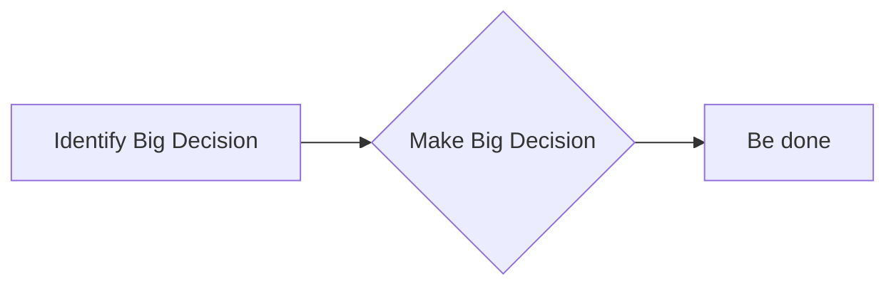
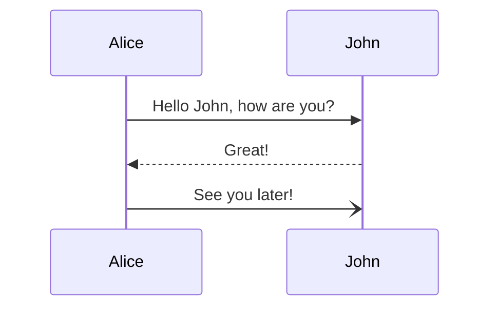
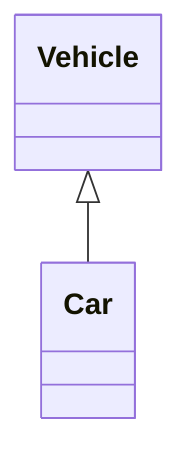
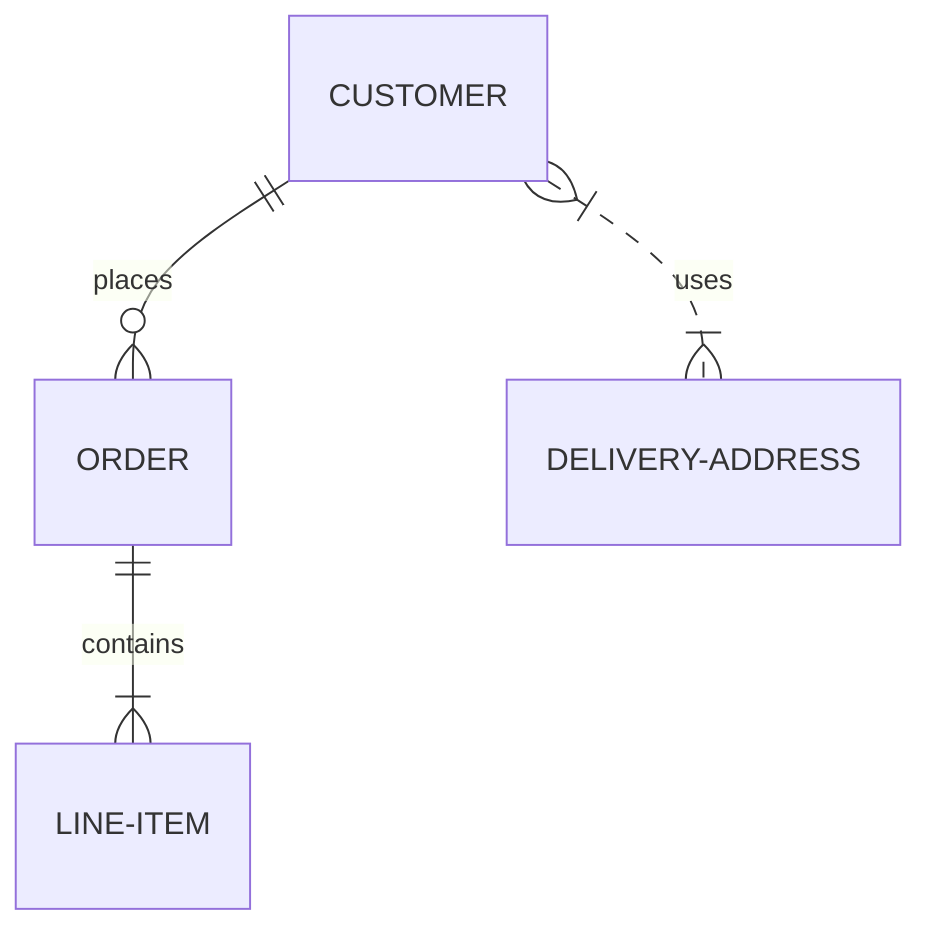
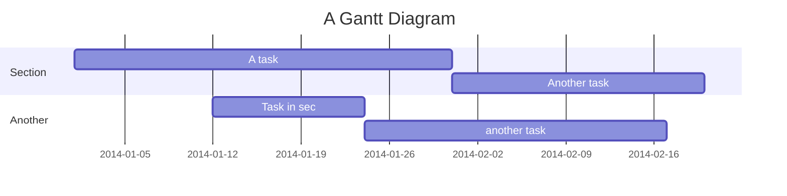
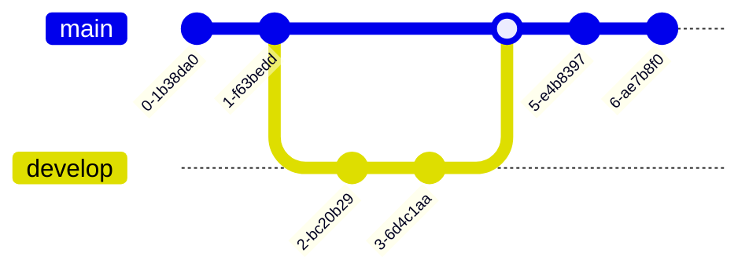
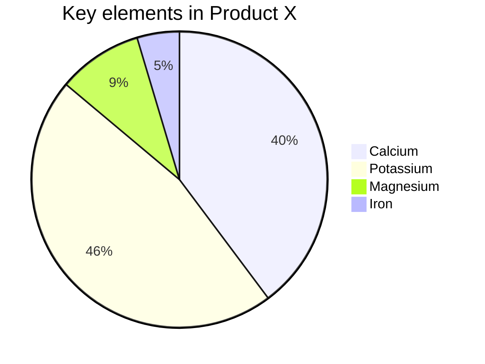
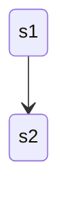
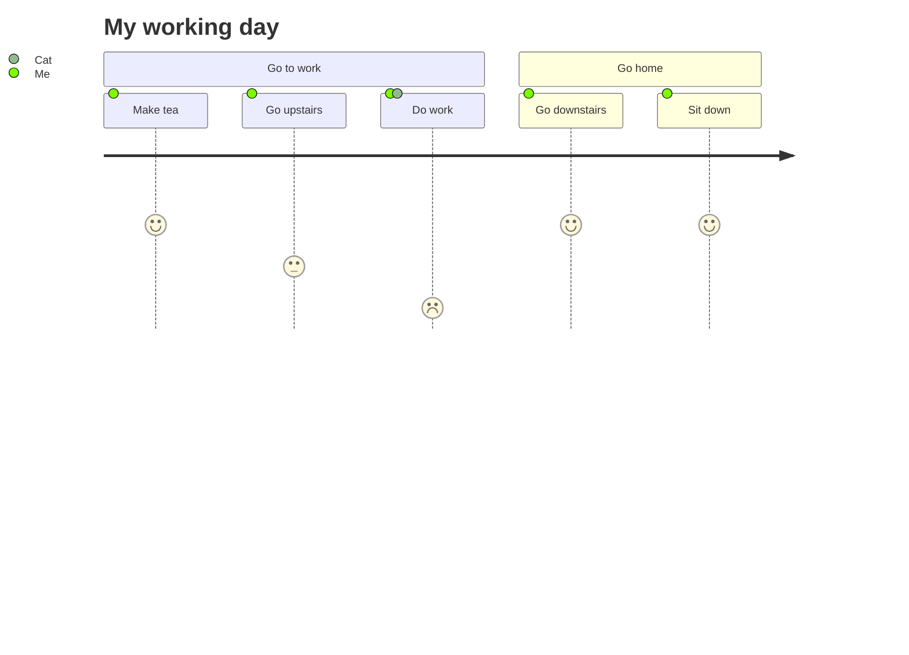
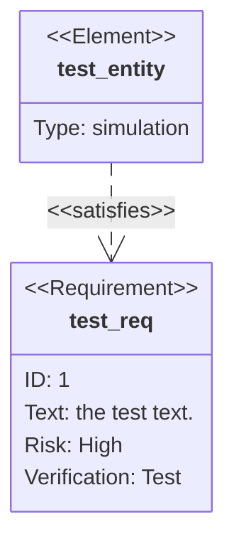

Mermaid provides accessibility features to make diagrams usable with assistive technologies and improve SEO. These features follow W3C's [Accessible Rich Internet Applications (ARIA)](https://www.w3.org/WAI/standards-guidelines/aria/) standards.

## Automatic ARIA attributes

Mermaid automatically adds accessibility attributes to diagram SVG elements:

- **aria-roledescription** - Set to the diagram type (e.g., "flowchart-v2", "sequenceDiagram")
- **aria-labelledby** - References the accessible title element
- **aria-describedby** - References the accessible description element

### Example SVG output

```html
<svg
  aria-labelledby="chart-title-mermaid-1668725057758"
  aria-describedby="chart-desc-mermaid-1668725057758"
  aria-roledescription="flowchart-v2"
  xmlns="http://www.w3.org/2000/svg"
  width="100%"
  id="mermaid-1668725057758"
>
  <title id="chart-title-mermaid-1668725057758">This is the accessible title</title>
  <desc id="chart-desc-mermaid-1668725057758">This is an accessible description</desc>
</svg>
```

## Accessible titles

Use the `accTitle` keyword to add an accessible title to your diagram. The title appears in the `<title>` element and is announced by screen readers.

### Syntax

```
accTitle: Your title text here
```

The title must be a single line and ends at the line break.

### Example



This generates:

```html
<title id="chart-title-mermaid_382ee221">Big Decisions</title>
```

## Accessible descriptions

Use the `accDescr` keyword to add a detailed description of your diagram. Descriptions can be single-line or multi-line.

### Single-line description

```
accDescr: Your description text here
```

### Multi-line description

For longer descriptions, omit the colon and use curly brackets:

```
accDescr {
  This is a multiple line accessible description.
  It does not have a colon and is surrounded by curly brackets.
  You can include as many lines as needed.
}
```

### Example with multi-line description


This generates:

```html
<desc id="chart-desc-mermaid_382ee221">
  The official Bob's Burgers corporate processes that are used for making very, very big
  decisions. This is actually a very simple flow: identify the big decision and then make the big
  decision.
</desc>
```

## Examples by diagram type

### Flowchart


### Sequence diagram



### Class diagram



### Entity relationship diagram



### Gantt chart



### Git graph



### Pie chart



### State diagram



### User journey



### Requirement diagram



## Best practices

- **Always provide titles** - Screen readers announce titles when focusing on diagrams
- **Write meaningful descriptions** - Describe the purpose and key information, not just the visual structure
- **Keep titles concise** - Titles should be brief (1-10 words)
- **Use multi-line for complex diagrams** - Longer descriptions help users understand intricate diagrams
- **Test with screen readers** - Verify your accessibility features work with actual assistive technology

## Benefits

### For users with disabilities

- Screen readers can announce diagram titles and descriptions
- Alternative text provides context when visuals aren't accessible
- ARIA attributes help assistive technologies understand diagram structure

### For all users

- **Better SEO** - Search engines index title and description content
- **Improved documentation** - Descriptions serve as documentation
- **Context for complex diagrams** - Helps everyone understand the diagram's purpose

## Testing accessibility

To verify your accessibility features:

1. **Inspect the HTML** - Check that `<title>` and `<desc>` elements are present
2. **Use a screen reader** - Test with NVDA, JAWS, or VoiceOver
3. **Check ARIA attributes** - Verify `aria-labelledby` and `aria-describedby` reference correct IDs
4. **Validate HTML** - Ensure the generated SVG is valid

## Next steps

<CardGroup cols={2}>
  <Card title="Setup and configuration" icon="gear" href="/configuration/setup">
    Configure global and diagram-specific settings
  </Card>
  <Card title="Icons" icon="icons" href="/configuration/icons">
    Add icons to your diagrams
  </Card>
</CardGroup>