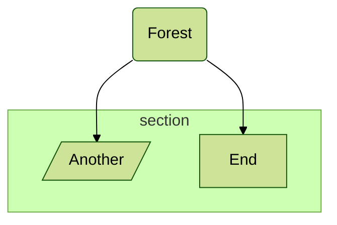
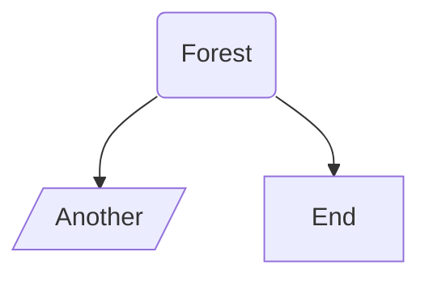
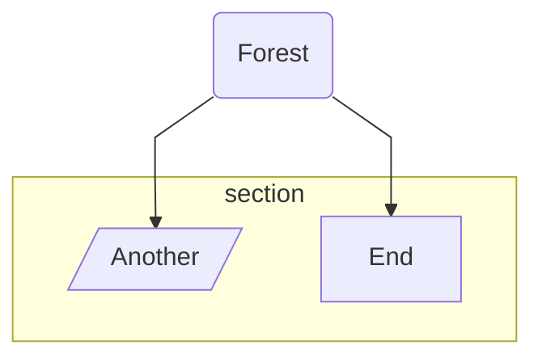
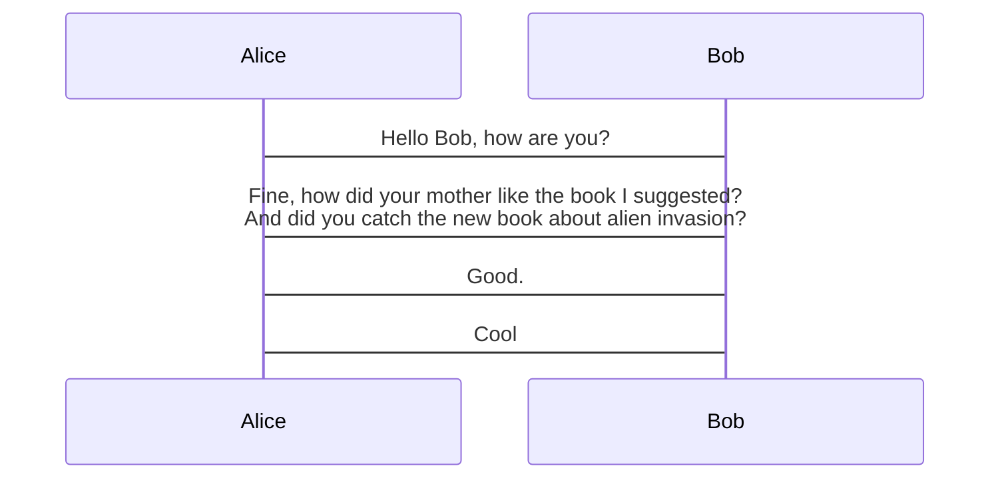

<Warning>
Directives are deprecated from v10.5.0. Please use the `config` key in frontmatter to pass configuration. See [Setup and configuration](/configuration/setup) for more details.
</Warning>

## What are directives?

Directives give diagram authors the capability to alter the appearance of a diagram before rendering by changing the applied configuration. They are applied on top of the site configuration and allow you to override settings for individual diagrams.

## Directive syntax

A directive always starts and ends with `%%` signs with directive text in between:

```
%%{directive_text}%%
```

The directive text is a JSON object with `init` as the root key. All general configurations are defined at the top level, and diagram-specific configurations are nested under the diagram type.

### Multi-line format

```mermaid
%%{
  init: {
    "theme": "dark",
    "fontFamily": "monospace",
    "logLevel": "info",
    "htmlLabels": true,
    "flowchart": {
      "curve": "linear"
    },
    "sequence": {
      "mirrorActors": true
    }
  }
}%%
```

### Single-line format

```mermaid
%%{init: { "theme": "forest", "logLevel": "debug" } }%%
```

<Note>
The JSON object must use valid key-value pairs and be enclosed in quotation marks, or it will be ignored.
</Note>

## Types of directive options

Mermaid supports two types of configuration options in directives:

### General/top-level configurations

These apply to all diagrams:

- `theme` - Visual theme selection
- `fontFamily` - Font family for all text  
- `logLevel` - Logging verbosity
- `securityLevel` - Security restrictions
- `startOnLoad` - Auto-render behavior
- `htmlLabels` - HTML support in labels

### Diagram-specific configurations

These apply only to specific diagram types:

- `flowchart` - Flowchart options like `curve`, `diagramPadding`
- `sequence` - Sequence diagram options like `mirrorActors`, `wrap`
- `gantt` - Gantt chart options like `barHeight`, `fontSize`
- And more for each diagram type

## Directive examples

### Changing theme

Set the theme to `forest`:



Available themes: `default`, `base`, `dark`, `forest`, `neutral`

### Changing font family

Set a custom font family:


### Changing log level

Set the log level for debugging:



Log level values:
- `1` - debug
- `2` - info
- `3` - warn
- `4` - error
- `5` - fatal only (default)

### Flowchart configuration

Configure flowchart-specific options:



Common flowchart options:
- `curve` - Edge curve style (linear, basis, cardinal)
- `diagramPadding` - Padding around the diagram
- `useMaxWidth` - Fit to container width

<Warning>
`flowchart.htmlLabels` is deprecated. Use the global `htmlLabels` configuration instead:

```javascript
// Deprecated
%%{init: { "flowchart": { "htmlLabels": true } } }%%

// Preferred
%%{init: { "htmlLabels": true } }%%
```
</Warning>

### Sequence diagram configuration

Enable text wrapping for long messages:



Common sequence diagram options:
- `width` - Actor box width
- `height` - Actor box height  
- `messageAlign` - Message text alignment (left, center, right)
- `mirrorActors` - Show actors on both sides
- `useMaxWidth` - Fit to container width
- `rightAngles` - Use right-angle arrows
- `showSequenceNumbers` - Display sequence numbers
- `wrap` - Wrap long message text

## Combining directives

Multiple `init` or `initialize` directives are merged together. Later values override earlier ones:

```mermaid
%%{init: { 'logLevel': 'debug', 'theme': 'forest' } }%%
%%{initialize: { 'logLevel': 'fatal', "theme":'dark', 'startOnLoad': true } }%%
```

This produces the merged configuration:

```json
{
  "logLevel": "fatal",
  "theme": "dark",
  "startOnLoad": true
}
```

<Note>
Both `init` and `initialize` are accepted as directive keywords and will be grouped together.
</Note>

## Migration to frontmatter

The frontmatter syntax is the recommended replacement for directives:

<Tabs>
  <Tab title="Directive (deprecated)">
    ```mermaid
    %%{init: { "theme": "forest", "logLevel": "debug" } }%%
    graph LR
    A-->B
    ```
  </Tab>
  <Tab title="Frontmatter (recommended)">
    ```mermaid
    ---
    config:
      theme: forest
      logLevel: debug
    ---
    graph LR
    A-->B
    ```
  </Tab>
</Tabs>

## Limitations

- **Security restrictions** - Secure configuration keys cannot be overridden via directives
- **No schema validation** - Invalid options are silently ignored
- **JSON syntax only** - Must use valid JSON with quoted keys and values
- **Deprecated** - Directives will be removed in a future major version

## Next steps

<CardGroup cols={2}>
  <Card title="Setup and configuration" icon="gear" href="/configuration/setup">
    Learn about frontmatter and modern configuration
  </Card>
  <Card title="Accessibility" icon="universal-access" href="/configuration/accessibility">
    Add accessibility features to diagrams
  </Card>
</CardGroup>