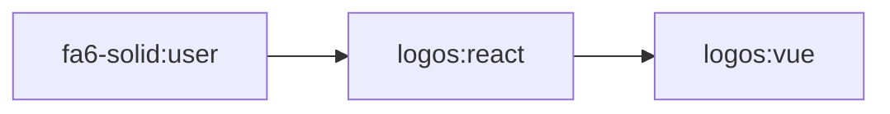

Mermaid supports icons from the [Iconify](https://icones.js.org/) library, giving you access to thousands of icons from popular icon sets. You can register icon packs and use them in your diagrams.

## Overview

Mermaid uses Iconify's icon format and allows you to:

- Register icon packs from the Iconify ecosystem
- Load icons from CDN or bundled packages
- Use custom names for icon packs (overriding the default prefix)
- Lazy load icon packs only when used in diagrams

## Registering icon packs

Icon packs must be registered before they can be used in diagrams. The `registerIconPacks()` method accepts an array of icon pack configurations.

### Using CDN

Load icon packs directly from a CDN:

```javascript
import mermaid from 'mermaid';

mermaid.registerIconPacks([
  {
    name: 'logos',
    loader: () =>
      fetch('https://unpkg.com/@iconify-json/logos@1/icons.json')
        .then((res) => res.json()),
  },
]);
```

### Using packages with lazy loading

Install an icon pack as a dependency and lazy load it:

```bash
npm install @iconify-json/logos@1
```

```javascript
import mermaid from 'mermaid';

mermaid.registerIconPacks([
  {
    name: 'logos',
    loader: () => import('@iconify-json/logos')
      .then((module) => module.icons),
  },
]);
```

<Note>
Lazy loading is recommended for better performance. Icons are only loaded when a diagram uses them.
</Note>

### Using packages without lazy loading

Load icon packs immediately when the application starts:

```bash
npm install @iconify-json/logos@1
```

```javascript
import mermaid from 'mermaid';
import { icons } from '@iconify-json/logos';

mermaid.registerIconPacks([
  {
    name: icons.prefix,  // Use the default prefix from the pack
    icons,
  },
]);
```

## Icon pack configuration

Each icon pack configuration supports the following properties:

| Property | Type | Required | Description |
|----------|------|----------|-------------|
| `name` | string | Yes | Custom name for the icon pack (overrides the prefix) |
| `icons` | object | Conditional | Icon data object (required if not using `loader`) |
| `loader` | function | Conditional | Async function that returns icon data (required if not using `icons`) |

### Custom names vs. default prefix

You can use a custom `name` to simplify icon references:

<Tabs>
  <Tab title="Custom name">
    ```javascript
    mermaid.registerIconPacks([
      {
        name: 'brands',  // Custom short name
        loader: () => import('@iconify-json/logos')
          .then((module) => module.icons),
      },
    ]);
    
    // Use as: brands:icon-name
    ```
  </Tab>
  <Tab title="Default prefix">
    ```javascript
    import { icons } from '@iconify-json/logos';
    
    mermaid.registerIconPacks([
      {
        name: icons.prefix,  // Use default prefix (e.g., 'logos')
        icons,
      },
    ]);
    
    // Use as: logos:icon-name
    ```
  </Tab>
</Tabs>

## Using icons in diagrams

Once registered, icons can be used in diagrams using the syntax `packName:iconName`.

### Flowchart example



### Architecture diagram example

```mermaid
architecture-beta
  service web(logos:chrome)[Web Browser]
  service api(logos:nodejs)[API Server]
  service db(logos:postgresql)[Database]
  
  web:R --> L:api
  api:R --> L:db
```



## Available icon packs

Iconify provides access to over 150 icon sets. Popular options include:

### Brand icons

- **@iconify-json/logos** - Brand and technology logos
- **@iconify-json/simple-icons** - Simple icons for popular brands
- **@iconify-json/devicon** - Programming languages and development tools

### General purpose

- **@iconify-json/fa6-solid** - Font Awesome 6 Solid
- **@iconify-json/fa6-regular** - Font Awesome 6 Regular
- **@iconify-json/mdi** - Material Design Icons
- **@iconify-json/heroicons** - Heroicons

### Specialized

- **@iconify-json/emojione** - Emoji One
- **@iconify-json/twemoji** - Twitter Emoji
- **@iconify-json/noto** - Google Noto Emoji

Browse all available icon packs at [icones.js.org](https://icones.js.org/).

## Best practices

### Performance optimization

- **Use lazy loading** - Load icon packs only when needed
- **Register specific packs** - Don't register icon packs you won't use
- **Bundle icons in production** - For better performance, bundle frequently used icons

### Naming conventions

- **Use short custom names** - Make icon references easier to type
- **Be consistent** - Use the same naming pattern across your application
- **Document your icons** - Keep a list of registered icon packs

### Error handling

```javascript
mermaid.registerIconPacks([
  {
    name: 'logos',
    loader: async () => {
      try {
        const res = await fetch('https://unpkg.com/@iconify-json/logos@1/icons.json');
        if (!res.ok) {
          throw new Error(`Failed to load icons: ${res.status}`);
        }
        return await res.json();
      } catch (error) {
        console.error('Icon pack loading failed:', error);
        // Return empty icon set or fallback
        return { icons: {} };
      }
    },
  },
]);
```

## Complete example

Here's a complete example with multiple icon packs:

```javascript
import mermaid from 'mermaid';
import { icons as logos } from '@iconify-json/logos';

mermaid.initialize({
  startOnLoad: true,
  theme: 'default',
});

mermaid.registerIconPacks([
  // Bundled logos (no lazy loading)
  {
    name: 'logos',
    icons: logos,
  },
  // Lazy loaded Font Awesome
  {
    name: 'fa',
    loader: () => import('@iconify-json/fa6-solid')
      .then((module) => module.icons),
  },
  // CDN loaded Material Design Icons
  {
    name: 'mdi',
    loader: () =>
      fetch('https://unpkg.com/@iconify-json/mdi@1/icons.json')
        .then((res) => res.json()),
  },
]);
```

## Troubleshooting

### Icons not displaying

1. **Check pack registration** - Ensure the icon pack is registered before rendering diagrams
2. **Verify icon name** - Check that the icon exists in the pack at [icones.js.org](https://icones.js.org/)
3. **Check syntax** - Use `packName:iconName` format
4. **Inspect console** - Look for loading errors in browser console

### Performance issues

- **Use lazy loading** - Don't load all icons upfront
- **Minimize pack size** - Only register packs you actually use
- **Cache CDN responses** - Configure proper cache headers

## Next steps

<CardGroup cols={2}>
  <Card title="Layouts" icon="diagram-project" href="/configuration/layouts">
    Configure layout engines for your diagrams
  </Card>
  <Card title="Math support" icon="square-root-variable" href="/configuration/math">
    Add mathematical expressions to diagrams
  </Card>
</CardGroup>