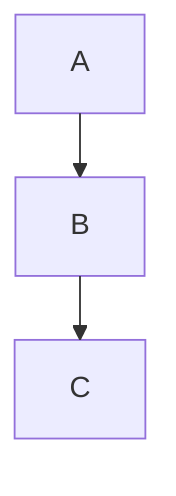
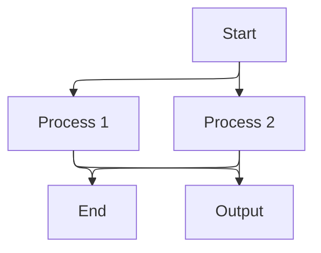
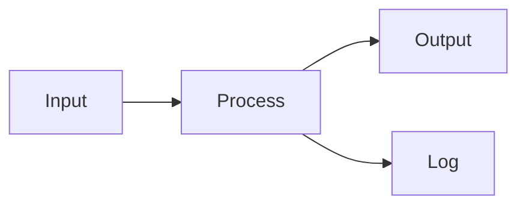
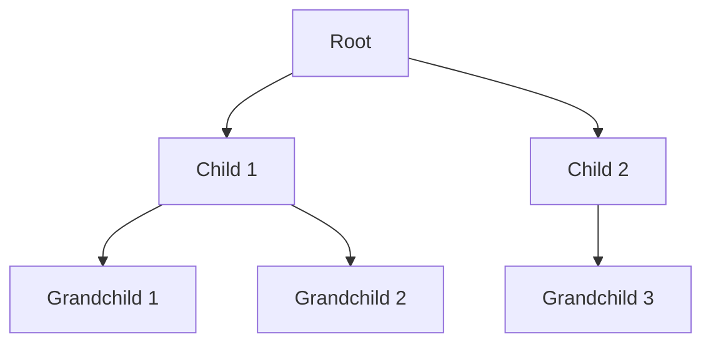
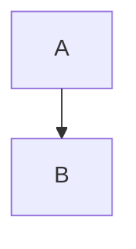

Mermaid supports multiple layout engines that determine how diagram elements are positioned. Different layouts work better for different diagram types and complexity levels.

## Available layouts

Mermaid supports the following layout engines:

| Layout | Description | Best for |
|--------|-------------|----------|
| **elk** | [Eclipse Layout Kernel](https://www.eclipse.org/elk/) - Advanced hierarchical layout | Complex flowcharts, large diagrams |
| **dagre** | Directed acyclic graph layout | General flowcharts, moderate complexity |
| **tidy-tree** | Hierarchical tree layout | Tree structures, org charts |
| **cose-bilkent** | Force-directed graph layout | Network diagrams, graphs with cycles |

## Configuring layouts

You can specify the layout engine using frontmatter, initialization, or diagram-specific configuration.

### Using frontmatter



### Using initialization

```javascript
import mermaid from 'mermaid';

mermaid.initialize({
  startOnLoad: true,
  layout: 'elk',
});
```

### Using directive (deprecated)


## ELK (Eclipse Layout Kernel)

ELK is an advanced layout engine that provides high-quality layouts for complex diagrams.

### Features

- Multiple layout algorithms
- Node placement strategies
- Edge routing options
- Support for hierarchical structures

### Configuration

```javascript
mermaid.initialize({
  elk: {
    mergeEdges: false,
    nodePlacementStrategy: 'BRANDES_KOEPF',
    forceNodeModelOrder: false,
    considerModelOrder: 'NODES_AND_EDGES',
  },
});
```

### ELK options

| Option | Type | Default | Description |
|--------|------|---------|-------------|
| `mergeEdges` | boolean | `false` | Merge multiple edges between same nodes |
| `nodePlacementStrategy` | string | `'BRANDES_KOEPF'` | Algorithm for node placement |
| `forceNodeModelOrder` | boolean | `false` | Force nodes to follow model order |
| `considerModelOrder` | string | `'NODES_AND_EDGES'` | What to consider for ordering |

### Node placement strategies

- **BRANDES_KOEPF** - Fast and produces good results for most diagrams
- **LINEAR_SEGMENTS** - Emphasizes straight line segments
- **INTERACTIVE** - Optimized for interactive diagrams
- **SIMPLE** - Simple placement algorithm

### Example with ELK



## Dagre

Dagre is the default layout engine for most Mermaid diagrams. It's optimized for directed acyclic graphs.

### Features

- Fast performance
- Good for moderate complexity
- Layered layout algorithm
- Handles most common use cases

### Configuration

```javascript
mermaid.initialize({
  flowchart: {
    defaultRenderer: 'dagre',
  },
});
```

### Example with dagre



## Tidy tree

Tidy tree layout is specialized for hierarchical tree structures.

### Features

- Optimized for tree structures
- Clean, organized layout
- Configurable spacing and orientation

### Configuration

See the [Tidy tree configuration documentation](/config/tidy-tree) for detailed options.

### Example with tidy tree



## Cose Bilkent

Cose Bilkent is a force-directed layout algorithm that works well for graphs with cycles.

### Features

- Handles cyclic graphs
- Force-directed positioning
- Natural-looking layouts
- Good for network diagrams

### Example with cose-bilkent

```mermaid
---
config:
  layout: cose-bilkent
---
graph TD
  A[Node 1] --> B[Node 2]
  B --> C[Node 3]
  C --> A
  B --> D[Node 4]
  D --> B
```

## Choosing the right layout

Select a layout engine based on your diagram characteristics:

### Use ELK when:

- Diagrams are large and complex
- You need fine-tuned control over layout
- Standard layouts don't produce good results
- You have hierarchical structures with many levels

### Use dagre when:

- Diagrams are small to medium sized
- Performance is important
- Diagrams are directed acyclic graphs
- You want the standard Mermaid look

### Use tidy tree when:

- Diagrams are pure tree structures
- You want clean hierarchical layouts
- Parent-child relationships are clear
- You need predictable spacing

### Use cose-bilkent when:

- Diagrams have cycles
- You want force-directed layouts
- Network topology is important
- Standard layouts create overlaps

## Comparison example

Here's the same diagram with different layouts:

<Tabs>
  <Tab title="ELK">
    ```mermaid
    ---
    config:
      layout: elk
    ---
    graph TD
      A[Start] --> B[Process 1]
      A --> C[Process 2]
      B --> D[Merge]
      C --> D
      D --> E[End]
    ```
  </Tab>
  <Tab title="Dagre">
    ```mermaid
    ---
    config:
      layout: dagre
    ---
    graph TD
      A[Start] --> B[Process 1]
      A --> C[Process 2]
      B --> D[Merge]
      C --> D
      D --> E[End]
    ```
  </Tab>
  <Tab title="Tidy Tree">
    ```mermaid
    ---
    config:
      layout: tidy-tree
    ---
    graph TD
      A[Start] --> B[Process 1]
      A --> C[Process 2]
      B --> D[Merge]
      C --> D
      D --> E[End]
    ```
  </Tab>
</Tabs>

## Per-diagram configuration

You can override the global layout for specific diagrams:

```javascript
// Global configuration
mermaid.initialize({
  layout: 'dagre',  // Default layout
});
```



## Performance considerations

### Layout engine performance

- **Fastest**: dagre
- **Fast**: tidy-tree
- **Moderate**: ELK
- **Slower**: cose-bilkent (for large graphs)

### Optimization tips

- Use dagre for simple diagrams to maximize performance
- Switch to ELK only when needed for complex layouts
- Limit diagram size when using force-directed layouts
- Consider pre-calculating layouts for static diagrams

## Troubleshooting

### Overlapping nodes

- Try switching to ELK layout
- Increase diagram padding
- Adjust node placement strategy
- Simplify the diagram structure

### Poor layout quality

- Experiment with different layout engines
- Adjust layout-specific configuration options
- Restructure your diagram for better flow
- Use subgraphs to organize complex sections

### Slow rendering

- Switch to dagre if using ELK
- Reduce diagram complexity
- Split large diagrams into smaller ones
- Use lazy loading for multiple diagrams

## Next steps

<CardGroup cols={2}>
  <Card title="Math support" icon="square-root-variable" href="/configuration/math">
    Add mathematical expressions to diagrams
  </Card>
  <Card title="Setup and configuration" icon="gear" href="/configuration/setup">
    Configure global and diagram-specific settings
  </Card>
</CardGroup>