Mermaid supports rendering mathematical expressions through the [KaTeX](https://katex.org/) typesetter, allowing you to include formulas, equations, and mathematical notation in your diagrams.

<Note>
Math support was added in v10.9.0. Ensure you're using a compatible version.
</Note>

## Syntax

Surround mathematical expressions with `$$` delimiters:

```
$$expression$$
```

The expression is rendered using KaTeX's LaTeX-compatible syntax.

## Supported diagram types

Math expressions are currently supported in:

- **Flowcharts** - In node labels and edge labels
- **Sequence diagrams** - In participant names, messages, and notes

Support for additional diagram types will be added in future releases.

## Flowchart examples

### Basic expressions

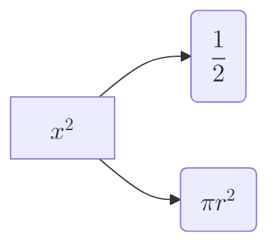

### Complex formulas

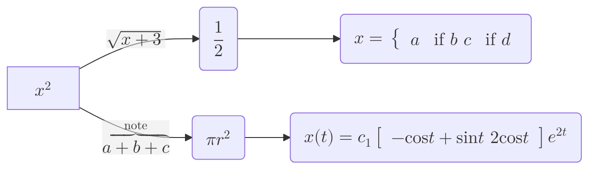

### In node labels

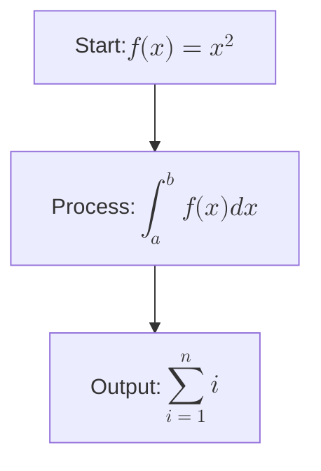

### In edge labels

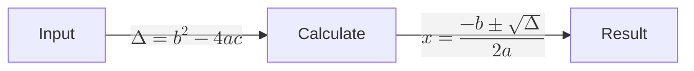

## Sequence diagram examples

### Participant names

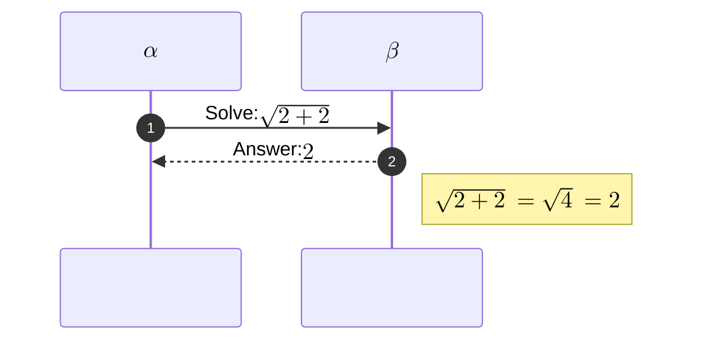

### Messages with formulas

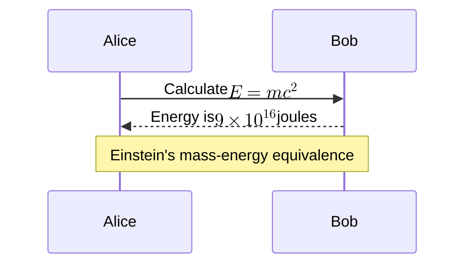

## Common LaTeX expressions

### Greek letters

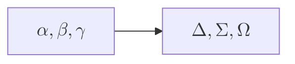

### Fractions and roots

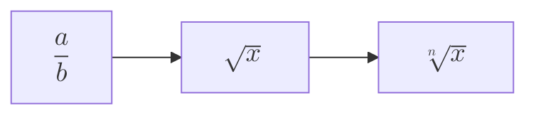

### Superscripts and subscripts

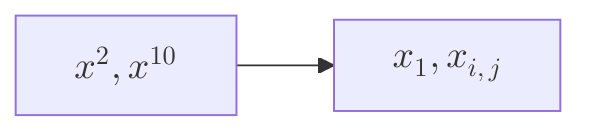

### Operators and symbols

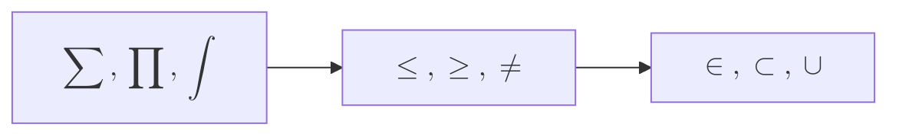

### Matrices

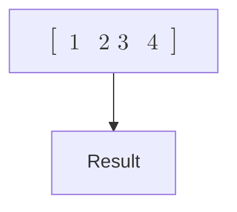

### Equations

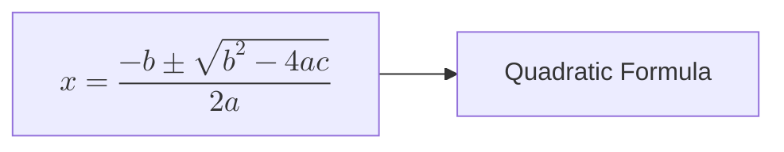

## Rendering modes

Mermaid supports two rendering modes for math:

### MathML (default)

By default, Mermaid uses MathML for rendering mathematical expressions. MathML is natively supported by modern browsers.

**Advantages:**
- No additional CSS required
- Native browser support
- Better performance

**Browser support:** [Check MathML compatibility](https://caniuse.com/?search=mathml)

### CSS rendering (legacy mode)

For browsers without MathML support, you can enable CSS-based rendering using KaTeX's stylesheets.

```javascript
import mermaid from 'mermaid';

mermaid.initialize({
  legacyMathML: true,
});
```

<Warning>
When using `legacyMathML`, you **must** include KaTeX's CSS stylesheet in your HTML.
</Warning>

#### Include KaTeX stylesheet

```html
<!doctype html>
<html lang="en">
  <head>
    <link
      rel="stylesheet"
      href="https://cdn.jsdelivr.net/npm/katex@0.16.9/dist/katex.min.css"
      integrity="sha384-n8MVd4RsNIU0tAv4ct0nTaAbDJwPJzDEaqSD1odI+WdtXRGWt2kTvGFasHpSy3SV"
      crossorigin="anonymous"
    />
  </head>
  <body>
    <script type="module">
      import mermaid from './mermaid.esm.mjs';
      mermaid.initialize({
        legacyMathML: true,
      });
    </script>
  </body>
</html>
```

<Note>
Ensure the KaTeX version in your stylesheet matches the version in your package-lock.json.
</Note>

## Force legacy rendering

For consistent rendering across all browsers, you can force CSS rendering even when MathML is supported:

```javascript
import mermaid from 'mermaid';

mermaid.initialize({
  forceLegacyMathML: true,
});
```

<Note>
Only `forceLegacyMathML` needs to be set; it automatically includes `legacyMathML` behavior.
</Note>

### When to use force legacy

- **Cross-browser consistency** - MathML rendering varies between browsers
- **Production apps** - When you need identical output everywhere
- **Custom styling** - When you want to apply custom styles to math

### Rendering differences

Different browsers render MathML differently due to font and implementation variations:

- **Chrome/Edge** - Uses system fonts, may vary by OS
- **Firefox** - Better MathML support, more consistent
- **Safari** - Native MathML support with macOS fonts

Using `forceLegacyMathML` ensures KaTeX's CSS rendering is used everywhere, providing consistent results.

## Best practices

### Escaping special characters

- Use double backslashes for LaTeX commands: `$$\\alpha$$`
- Escape curly braces in nested structures
- Test expressions in [KaTeX demo](https://katex.org/) first

### Performance

- **Use MathML when possible** - Faster rendering, no extra CSS
- **Limit complex expressions** - Very complex formulas can slow rendering
- **Cache rendered diagrams** - For static content, render once and cache

### Accessibility

- Add accessible descriptions explaining mathematical content
- Use semantic LaTeX commands (e.g., `\frac` instead of manual formatting)
- Test with screen readers to ensure formulas are announced correctly

### Styling

```javascript
mermaid.initialize({
  forceLegacyMathML: true,
  themeVariables: {
    // Math inherits text colors from theme
    primaryTextColor: '#333',
  },
});
```

## Complete example

```html
<!doctype html>
<html lang="en">
  <head>
    <link
      rel="stylesheet"
      href="https://cdn.jsdelivr.net/npm/katex@0.16.9/dist/katex.min.css"
      integrity="sha384-n8MVd4RsNIU0tAv4ct0nTaAbDJwPJzDEaqSD1odI+WdtXRGWt2kTvGFasHpSy3SV"
      crossorigin="anonymous"
    />
  </head>
  <body>
    <div class="mermaid">
      graph LR
        A["$$f(x) = x^2$$"] --> B["$$f'(x) = 2x$$"]
        B --> C["$$\int f(x)dx = \frac{x^3}{3} + C$$"]
    </div>

    <script type="module">
      import mermaid from 'https://cdn.jsdelivr.net/npm/mermaid@10/dist/mermaid.esm.min.mjs';
      
      mermaid.initialize({
        startOnLoad: true,
        theme: 'default',
        legacyMathML: true,
      });
    </script>
  </body>
</html>
```

## Troubleshooting

### Formulas not rendering

1. **Check Mermaid version** - Math support requires v10.9.0+
2. **Verify delimiters** - Must use `$$` around expressions
3. **Check LaTeX syntax** - Test expression at [katex.org](https://katex.org/)
4. **Include KaTeX CSS** - Required when using `legacyMathML`

### Rendering differences

- **Enable forceLegacyMathML** - For consistent cross-browser rendering
- **Check font availability** - MathML relies on system fonts
- **Validate browser support** - Ensure browser supports MathML or CSS rendering

### Special characters not working

- **Use double backslashes** - `\\alpha` instead of `\alpha`
- **Escape in JSON** - When in configuration, escape backslashes again
- **Check encoding** - Ensure UTF-8 encoding for your files

## KaTeX resources

- [KaTeX documentation](https://katex.org/docs/supported.html) - Supported functions and symbols
- [KaTeX demo](https://katex.org/) - Test expressions interactively
- [LaTeX math symbols](http://tug.ctan.org/info/symbols/comprehensive/symbols-a4.pdf) - Comprehensive symbol reference

## Next steps

<CardGroup cols={2}>
  <Card title="Setup and configuration" icon="gear" href="/configuration/setup">
    Configure global and diagram-specific settings
  </Card>
  <Card title="Accessibility" icon="universal-access" href="/configuration/accessibility">
    Add accessibility features to diagrams
  </Card>
</CardGroup>