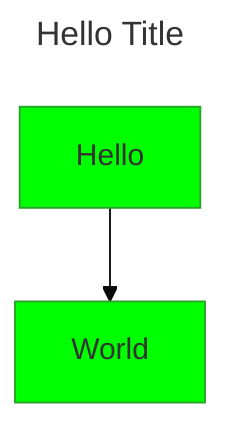
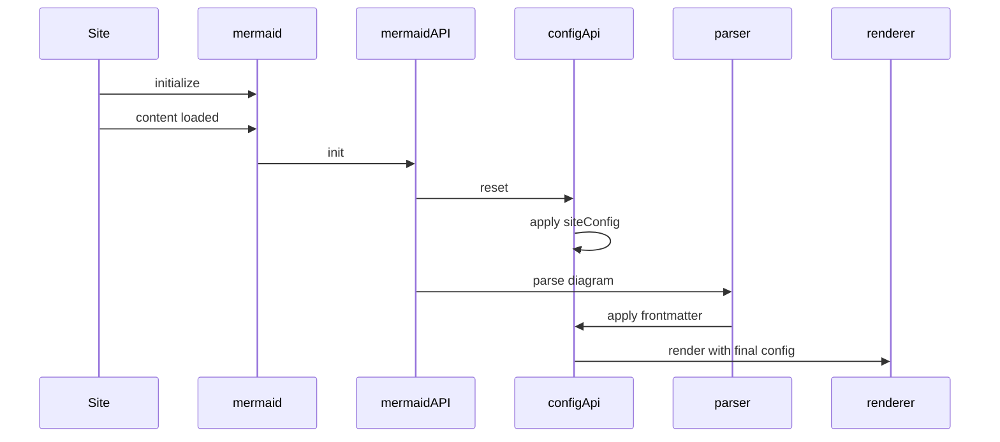

Mermaid provides multiple ways to configure diagrams, from site-wide settings to diagram-specific customization. Understanding the configuration hierarchy helps you control how your diagrams render.

## Configuration hierarchy

When Mermaid renders a diagram, configuration is applied in the following order:

1. **Default configuration** - Built-in defaults for all options
2. **Site configuration** - Set via `mermaid.initialize()` and applied to all diagrams
3. **Frontmatter** - Diagram-level configuration in YAML format (v10.5.0+)
4. **Directives** - Deprecated diagram-level configuration

The final **render configuration** is the result of merging these sources, with later sources overriding earlier ones.

## Site configuration with initialize

The `initialize()` method sets site-wide configuration that applies to all diagrams. This should be called once when your application loads.

<Tabs>
  <Tab title="JavaScript">
    ```javascript
    import mermaid from 'mermaid';

    mermaid.initialize({
      startOnLoad: true,
      theme: 'forest',
      logLevel: 'error',
      securityLevel: 'loose',
      flowchart: {
        useMaxWidth: true,
        htmlLabels: true,
        curve: 'basis'
      }
    });
    ```
  </Tab>
  <Tab title="HTML">
    ```html
    <script type="module">
      import mermaid from 'https://cdn.jsdelivr.net/npm/mermaid@10/dist/mermaid.esm.min.mjs';
      
      mermaid.initialize({
        startOnLoad: true,
        theme: 'dark'
      });
    </script>
    ```
  </Tab>
</Tabs>

<Note>
The `initialize()` call is applied **only once**. Subsequent calls will not override the initial configuration.
</Note>

## Frontmatter configuration

Frontmatter allows diagram authors to override configuration for individual diagrams. The frontmatter is a YAML block at the top of the diagram.



The `config` key can contain any configuration option except secure options (like `securityLevel`).

### Available frontmatter options

- **title** - Set an accessible title for the diagram
- **config** - Override any non-secure configuration options
- **theme** - Change the theme (default, base, dark, forest, neutral)
- **themeVariables** - Customize theme colors and styles

## Common configuration options

### Top-level options

These options apply to all diagram types:

| Option | Type | Default | Description |
|--------|------|---------|-------------|
| `theme` | string | `'default'` | Visual theme (default, base, dark, forest, neutral) |
| `fontFamily` | string | `'"trebuchet ms", verdana, arial, sans-serif'` | Font family for all text |
| `logLevel` | number | `5` | Logging level (1=debug, 5=fatal) |
| `securityLevel` | string | `'strict'` | Security level (strict, loose, antiscript, sandbox) |
| `startOnLoad` | boolean | `true` | Automatically render diagrams on page load |
| `htmlLabels` | boolean | `true` | Enable HTML in labels |
| `maxTextSize` | number | `50000` | Maximum text size for diagrams |
| `maxEdges` | number | `500` | Maximum number of edges in a diagram |

### Diagram-specific options

Each diagram type has its own configuration namespace:

<Tabs>
  <Tab title="Flowchart">
    ```javascript
    flowchart: {
      curve: 'basis',          // Curve style (basis, linear, cardinal)
      diagramPadding: 8,       // Padding around diagram
      useMaxWidth: true,       // Fit to container width
      defaultRenderer: 'elk'   // Layout engine (dagre, elk)
    }
    ```
  </Tab>
  <Tab title="Sequence">
    ```javascript
    sequence: {
      mirrorActors: true,      // Show actors on both sides
      messageAlign: 'center',  // Message text alignment
      wrap: false,             // Wrap long messages
      showSequenceNumbers: false,
      width: 150,              // Actor box width
      height: 65               // Actor box height
    }
    ```
  </Tab>
  <Tab title="Gantt">
    ```javascript
    gantt: {
      titleTopMargin: 25,
      barHeight: 20,
      barGap: 4,
      topPadding: 50,
      leftPadding: 75,
      gridLineStartPadding: 35,
      fontSize: 11,
      numberSectionStyles: 4
    }
    ```
  </Tab>
</Tabs>

## Resetting configuration

The `reset()` method resets the current configuration back to the site configuration:

```javascript
import { configApi } from 'mermaid';

// Reset to site config
configApi.reset();

// Reset to default config
configApi.reset(configApi.defaultConfig);
```

## Security considerations

Certain configuration options cannot be overridden by diagram authors for security reasons. These **secure options** include:

- `securityLevel`
- `secure` (the list of secure keys itself)
- Any keys listed in `siteConfig.secure`

<Warning>
Attempts to modify secure keys via frontmatter or directives will be ignored and logged as warnings.
</Warning>

## Configuration flow



## Best practices

- **Use initialize for site-wide settings** - Set common options once instead of repeating them
- **Use frontmatter for diagram-specific changes** - Override only what's needed per diagram
- **Avoid directive syntax** - Directives are deprecated; use frontmatter instead
- **Store config in variables** - Avoid calling `getConfig()` repeatedly
- **Validate your configuration** - Invalid options will be silently ignored

## Next steps

<CardGroup cols={2}>
  <Card title="Directives" icon="code" href="/configuration/directives">
    Learn about the deprecated directive syntax
  </Card>
  <Card title="Accessibility" icon="universal-access" href="/configuration/accessibility">
    Configure accessibility features
  </Card>
</CardGroup>