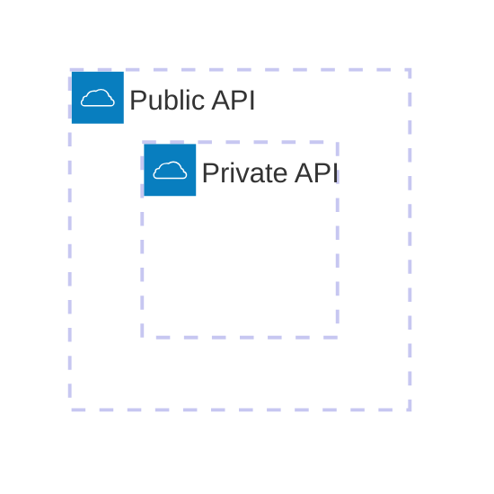
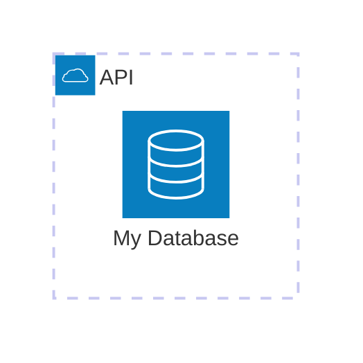
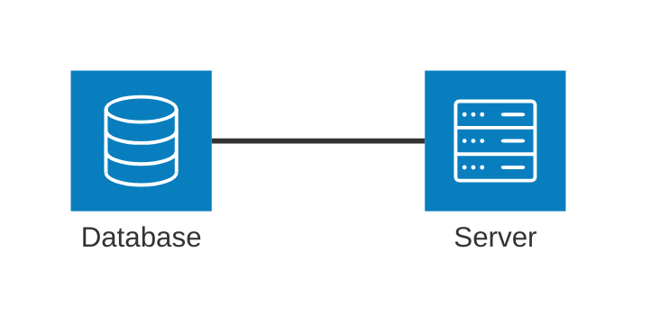
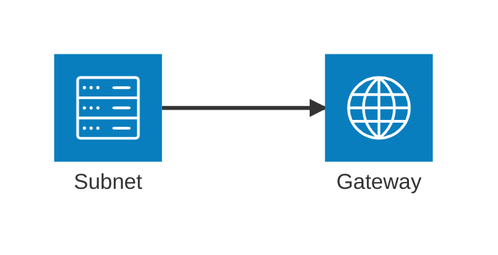
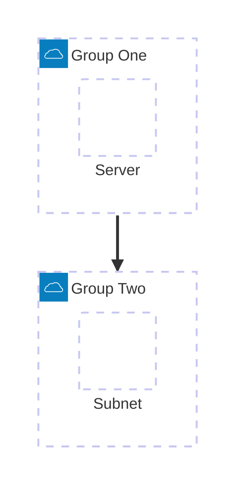
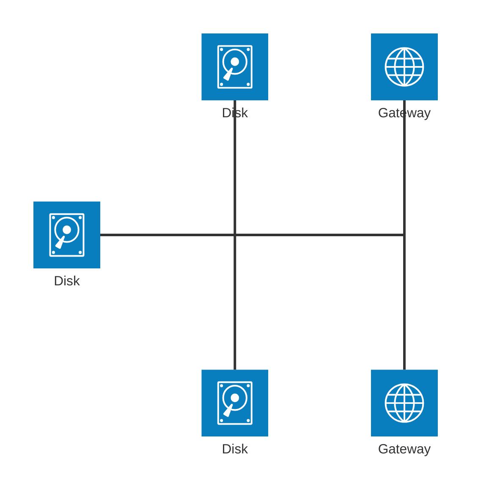

Architecture diagrams are used to show the relationship between services and resources commonly found within Cloud or CI/CD deployments. Services (nodes) are connected by edges, and related services can be placed within groups to better illustrate how they are organized.

<Note>
Architecture diagrams are available in Mermaid v11.1.0+. This is a beta feature and uses the `architecture-beta` keyword.
</Note>

## Basic architecture diagram

This example shows a basic cloud API architecture with a database, storage, and server components:


## Syntax overview

### Building blocks

Architecture diagrams consist of four main building blocks:

- **Groups**: Containers for related services
- **Services**: Individual components or resources
- **Edges**: Connections between services
- **Junctions**: Special nodes for 4-way edge splits

All components use icons declared with `(icon_name)` and labels with `[label text]`.

### Groups

Groups organize related services together:

```
group {group_id}({icon_name})[{title}] (in {parent_id})?
```

**Example:**



### Services

Services represent individual components:

```
service {service_id}({icon_name})[{title}] (in {parent_id})?
```

**Example:**



## Edge connections

### Edge direction

Specify which side of a service the edge connects to using `L` (left), `R` (right), `T` (top), or `B` (bottom):



### Arrows

Add directional arrows with `<` or `>`:



### Edges from groups

To create edges between groups, use the `{group}` modifier:



## Junctions

Junctions create 4-way splits for connecting multiple services:



## Icons

<Accordion title="Default icons">

Architecture diagrams include these built-in icons:

- `cloud`
- `database`
- `disk`
- `internet`
- `server`

</Accordion>

<Accordion title="Custom icons">

You can use any of the 200,000+ icons from [Iconify](https://iconify.design) by registering an icon pack. After registration, use the format `pack_name:icon_name`:

```mermaid
architecture-beta
    group api(logos:aws-lambda)[API]

    service db(logos:aws-aurora)[Database] in api
    service disk1(logos:aws-glacier)[Storage] in api
    service disk2(logos:aws-s3)[Storage] in api
    service server(logos:aws-ec2)[Server] in api

    db:L -- R:server
    disk1:T -- B:server
    disk2:T -- B:db
```



See the [icon configuration guide](/configuration/icons) for details on registering icon packs.

</Accordion>

## Complete example

Here's a more complex architecture diagram with nested groups and multiple connections:


<Tip>
Use groups to organize related services and make your architecture diagrams more readable. Groups can be nested within other groups for complex hierarchies.
</Tip>