Block diagrams provide an intuitive way to represent complex systems, processes, or architectures visually. They are composed of blocks and connectors, where blocks represent fundamental components and connectors show relationships between them.

## Introduction

Block diagrams give you full control over where shapes are positioned, unlike flowcharts where automatic layout can move shapes unexpectedly.

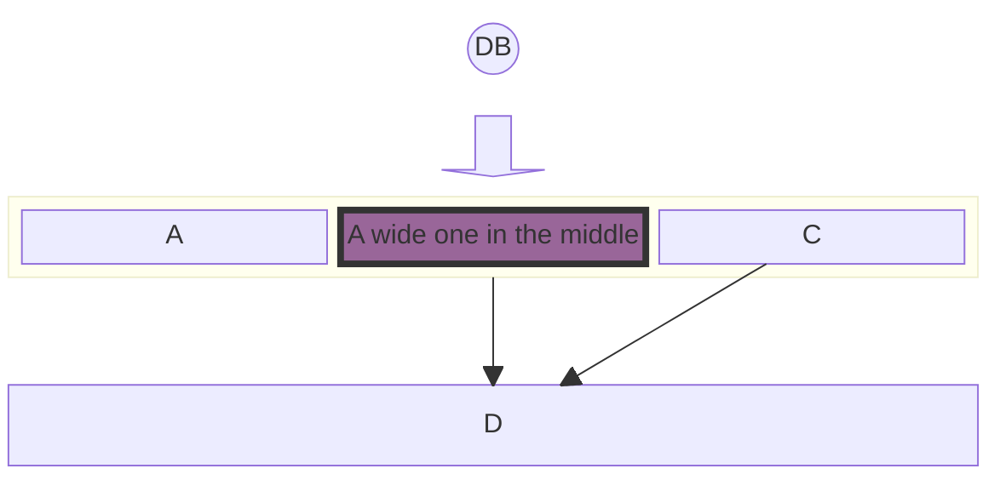

## Basic syntax

### Simple blocks

Create a basic block diagram with three blocks:

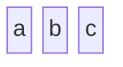

### Columns

Organize blocks into columns:

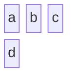

This creates a 3-column layout where 'd' wraps to the second row.

## Advanced configuration

### Block width

Span blocks across multiple columns:

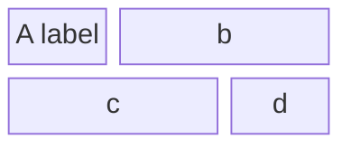

Blocks 'b' and 'c' each span 2 columns.

### Composite blocks

Create nested blocks:

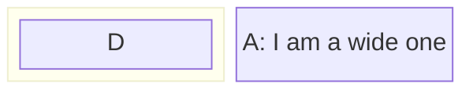

### Complex layouts

Combine column widths and composite blocks:

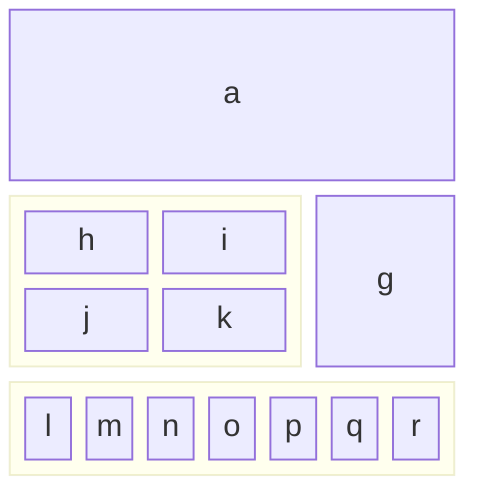

### Vertical stacking

Stack blocks vertically using a single column:

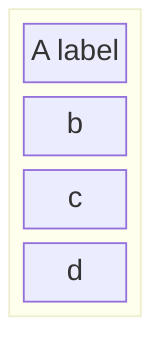

## Block shapes

### Round edged

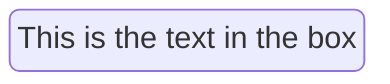

### Stadium shaped

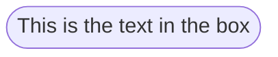

### Subroutine

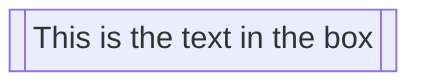

### Cylindrical (database)

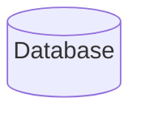

### Circle

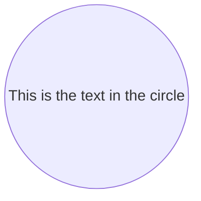

### Asymmetric

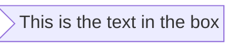

### Rhombus

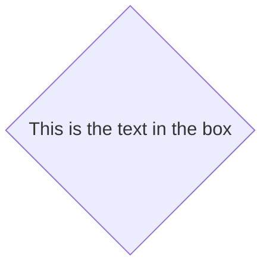

### Hexagon

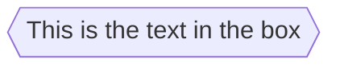

### Parallelogram and trapezoid

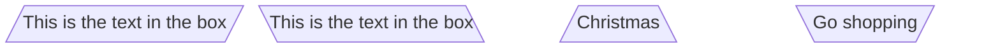

### Double circle

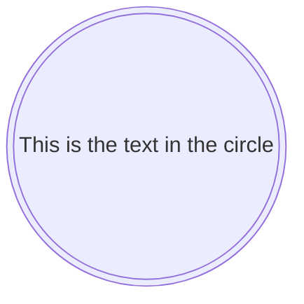

## Block arrows and spaces

### Block arrows

Indicate directional flow:

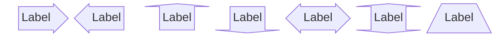

### Space blocks

Create intentional empty spaces:

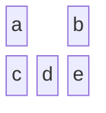

Or specify width:

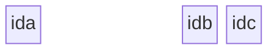

## Connecting blocks

### Basic links

```mermaid
block
  A space B
  A-->B
```

### Text on links

```mermaid
block
  A space:2 B
  A-- "X" -->B
```

### Complete example

```mermaid
block
columns 1
  db(("DB"))
  blockArrowId6<["&nbsp;&nbsp;&nbsp;"]>(down)
  block:ID
    A
    B["A wide one in the middle"]
    C
  end
  space
  D
  ID --> D
  C --> D
  style B fill:#939,stroke:#333,stroke-width:4px
```

## Styling

### Individual block styling

```mermaid
block
  id1 space id2
  id1("Start")-->id2("Stop")
  style id1 fill:#636,stroke:#333,stroke-width:4px
  style id2 fill:#bbf,stroke:#f66,stroke-width:2px,color:#fff,stroke-dasharray: 5 5
```

### Class styling

Define reusable styles:

```mermaid
block
  A space B
  A-->B
  classDef blue fill:#6e6ce6,stroke:#333,stroke-width:4px;
  class A blue
  style B fill:#bbf,stroke:#f66,stroke-width:2px,color:#fff,stroke-dasharray: 5 5
```

## Practical examples

### System architecture

```mermaid
block
  columns 3
  Frontend blockArrowId6<[" "]>(right) Backend
  space:2 down<[" "]>(down)
  Disk left<[" "]>(left) Database[("Database")]

  classDef front fill:#696,stroke:#333;
  classDef back fill:#969,stroke:#333;
  class Frontend front
  class Backend,Database back
```

### Business process flow

```mermaid
block
  columns 3
  Start(("Start")) space:2
  down<[" "]>(down) space:2
  Decision{{"Make Decision"}} right<["Yes"]>(right) Process1["Process A"]
  downAgain<["No"]>(down) space r3<["Done"]>(down)
  Process2["Process B"] r2<["Done"]>(right) End(("End"))

  style Start fill:#969;
  style End fill:#696;
```

## Tips and best practices

<Tip>
Use comments with `%%` to document your diagram structure, especially when working in teams.
</Tip>

<Tip>
Break down complex diagrams into smaller, modular components for easier maintenance.
</Tip>

<Note>
Ensure links between blocks use correct arrow syntax (`-->` or `---`) and remember to add space blocks between connected blocks for proper positioning.
</Note>

<Note>
When applying styles, separate properties with commas and use proper CSS property format: `style A fill:#969,stroke:#333;`
</Note>