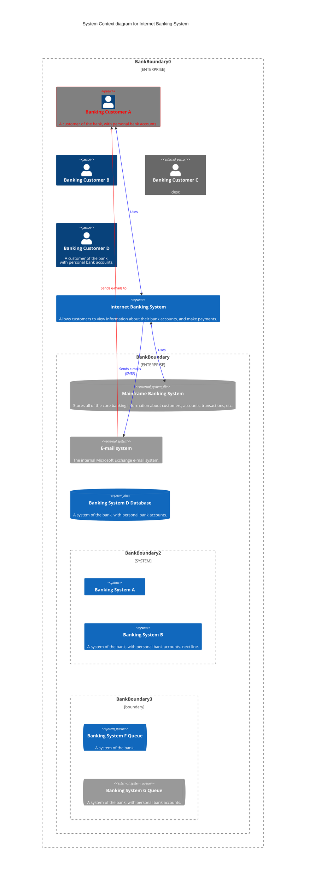
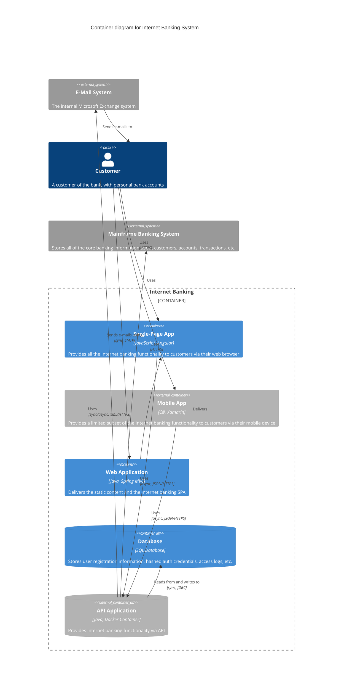
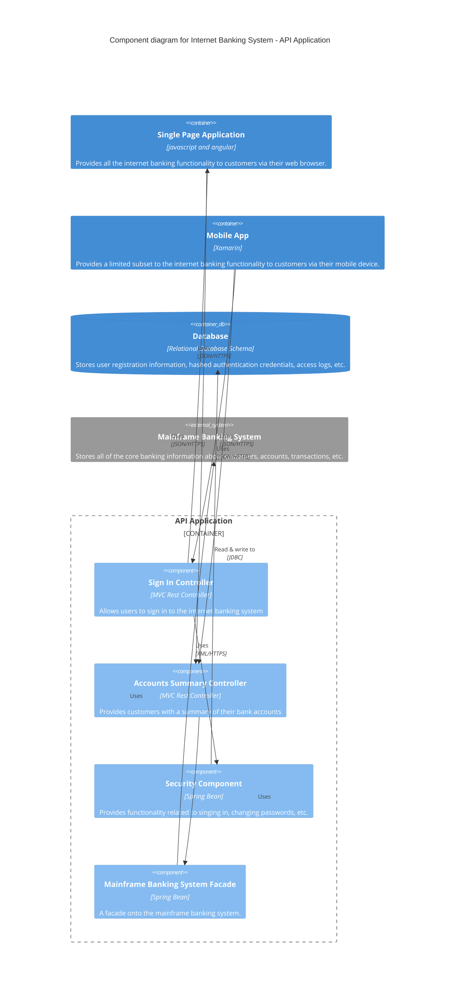
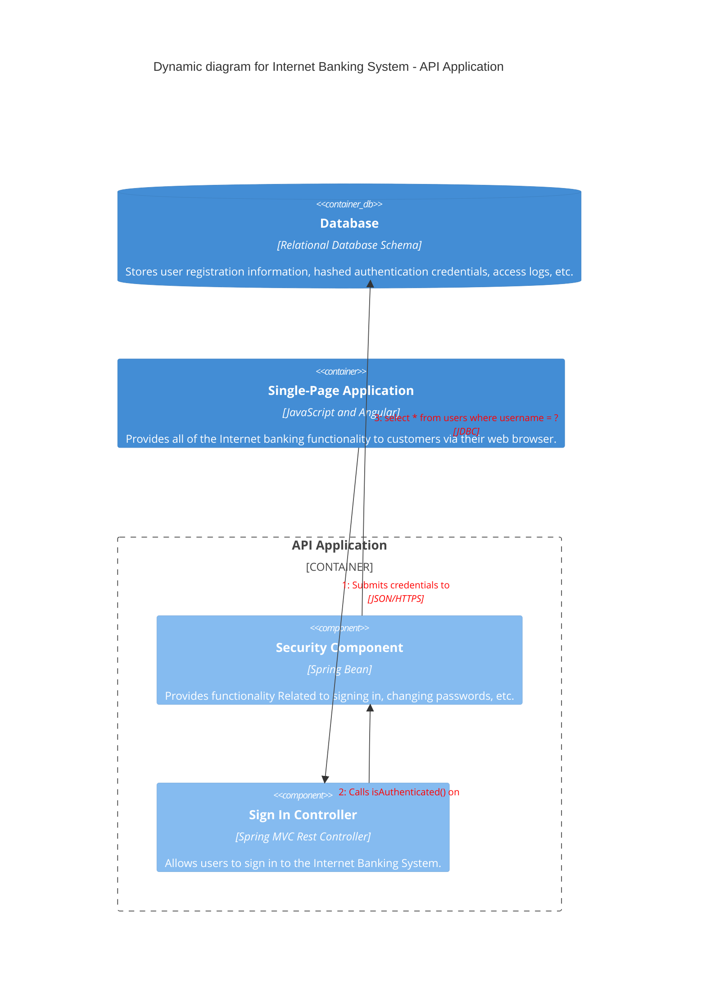
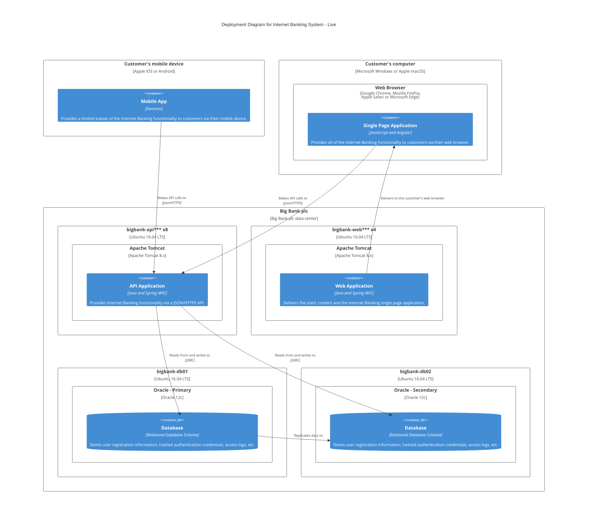

C4 diagrams provide a way to visualize software architecture at different levels of abstraction. The C4 model consists of hierarchical diagrams showing system context, containers, components, and code.

<Note>
C4 diagrams are experimental in Mermaid. The syntax and properties may change in future releases. Syntax is compatible with PlantUML.
</Note>

## Diagram types

Mermaid supports five types of C4 diagrams:

1. **System Context** (`C4Context`) - Shows the system and its users
2. **Container** (`C4Container`) - Shows high-level technical building blocks
3. **Component** (`C4Component`) - Shows components within a container
4. **Dynamic** (`C4Dynamic`) - Shows runtime behavior and collaborations
5. **Deployment** (`C4Deployment`) - Shows deployment topology

## System context diagram

Shows the big picture of the system and how it fits into the world:



## Container diagram

Shows the high-level technology choices and how containers communicate:



## Component diagram

Shows how a container is made up of components:



## Dynamic diagram

Shows how elements collaborate at runtime:



## Deployment diagram

Shows how containers are deployed to infrastructure:



## Styling elements

<Accordion title="UpdateElementStyle">

Customize the appearance of elements:

```
UpdateElementStyle(elementName, $bgColor="color", $fontColor="color", $borderColor="color")
```

Example:
```
UpdateElementStyle(customerA, $fontColor="red", $bgColor="grey", $borderColor="red")
```

</Accordion>

<Accordion title="UpdateRelStyle">

Customize the appearance of relationships:

```
UpdateRelStyle(from, to, $textColor="color", $lineColor="color", $offsetX="value", $offsetY="value")
```

Example:
```
UpdateRelStyle(customerA, SystemAA, $textColor="blue", $lineColor="blue", $offsetX="5")
```

</Accordion>

<Accordion title="UpdateLayoutConfig">

Adjust the layout configuration:

```
UpdateLayoutConfig($c4ShapeInRow="number", $c4BoundaryInRow="number")
```

Example:
```
UpdateLayoutConfig($c4ShapeInRow="3", $c4BoundaryInRow="1")
```

</Accordion>

## Parameter assignment

There are two ways to assign optional parameters (those with `?` prefix):

### Positional parameters

```
UpdateRelStyle(customerA, bankA, "red", "blue", "-40", "60")
```

### Named parameters

Parameter names must start with `$`:

```
UpdateRelStyle(customerA, bankA, $offsetX="-40", $offsetY="60", $lineColor="blue", $textColor="red")
UpdateRelStyle(customerA, bankA, $offsetY="60")
```

<Tip>
Use named parameters for better readability and when you only need to set specific optional parameters.
</Tip>

## Supported elements

<Accordion title="System context elements">

- `Person(alias, label, ?descr, ?sprite, ?tags, $link)`
- `Person_Ext` - External person
- `System(alias, label, ?descr, ?sprite, ?tags, $link)`
- `SystemDb` - System database
- `SystemQueue` - System queue
- `System_Ext` - External system
- `SystemDb_Ext` - External database
- `SystemQueue_Ext` - External queue
- `Boundary(alias, label, ?type, ?tags, $link)`
- `Enterprise_Boundary(alias, label, ?tags, $link)`
- `System_Boundary`

</Accordion>

<Accordion title="Container elements">

- `Container(alias, label, ?techn, ?descr, ?sprite, ?tags, $link)`
- `ContainerDb` - Container database
- `ContainerQueue` - Container queue
- `Container_Ext` - External container
- `ContainerDb_Ext` - External database
- `ContainerQueue_Ext` - External queue
- `Container_Boundary(alias, label, ?tags, $link)`

</Accordion>

<Accordion title="Component elements">

- `Component(alias, label, ?techn, ?descr, ?sprite, ?tags, $link)`
- `ComponentDb` - Component database
- `ComponentQueue` - Component queue
- `Component_Ext` - External component
- `ComponentDb_Ext` - External database
- `ComponentQueue_Ext` - External queue

</Accordion>

<Accordion title="Relationship types">

- `Rel(from, to, label, ?techn, ?descr, ?sprite, ?tags, $link)`
- `BiRel` - Bidirectional relationship
- `Rel_U`, `Rel_Up` - Upward relationship
- `Rel_D`, `Rel_Down` - Downward relationship
- `Rel_L`, `Rel_Left` - Left relationship
- `Rel_R`, `Rel_Right` - Right relationship
- `Rel_Back` - Backward relationship

</Accordion>

## Limitations

<Note>
The following features are not currently supported:

- Sprites (custom icons)
- Tags
- Links
- Legend
- Layout statements (Lay_U, Lay_D, Lay_L, Lay_R)
- Custom element and relationship tags (AddElementTag, AddRelTag)

</Note>

<Tip>
C4 diagrams have a fixed style. Different CSS themes do not affect C4 diagram appearance.
</Tip>