Class diagrams describe the structure of a system by showing the system's classes, their attributes, operations (or methods), and the relationships among objects.

## Basic example

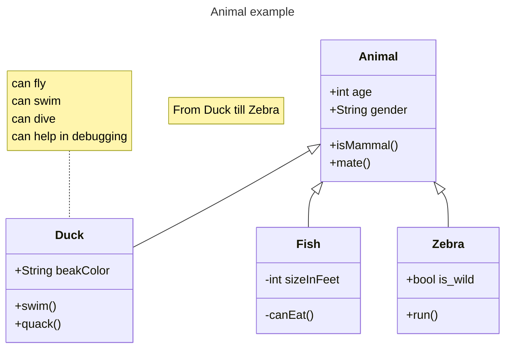

## Define a class

There are two ways to define a class:

### Using the class keyword

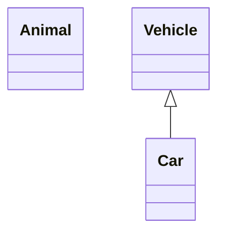

### Class labels

Provide custom labels for classes:

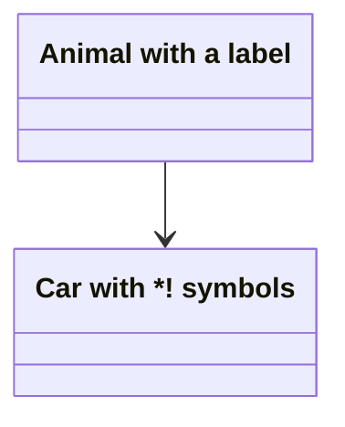

Or use backticks:

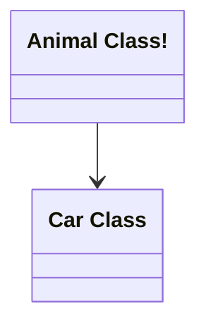

## Defining members

Mermaid distinguishes between attributes and methods based on parentheses `()`.

### Using colon notation

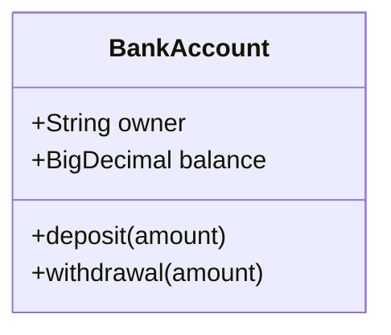

### Using bracket notation


### Return types

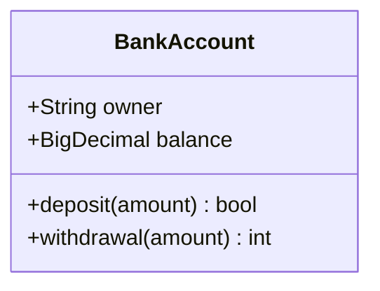

### Generic types

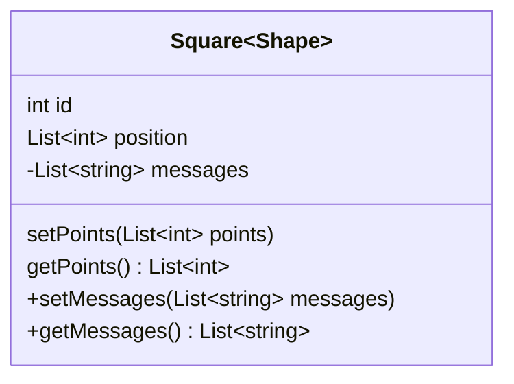

### Visibility

Describe encapsulation of class members:

- `+` Public
- `-` Private
- `#` Protected
- `~` Package/Internal

Additional classifiers:
- `*` Abstract (after method)
- `$` Static (after method or field)

## Defining relationships

Eight different types of relationships are supported:

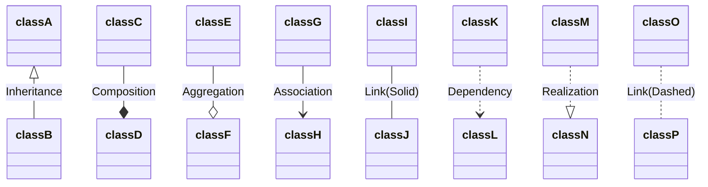

### Labels on relations

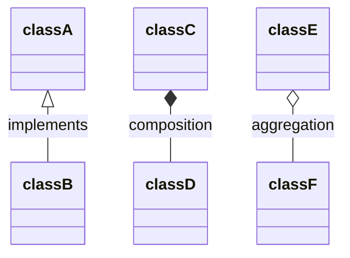

### Two-way relations

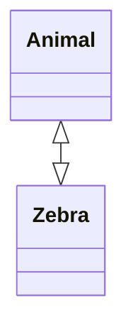

### Lollipop interfaces

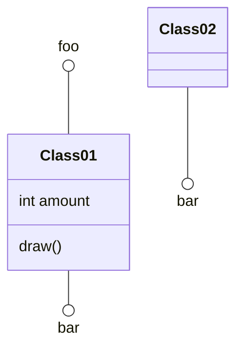

## Namespaces

Group classes in namespaces:

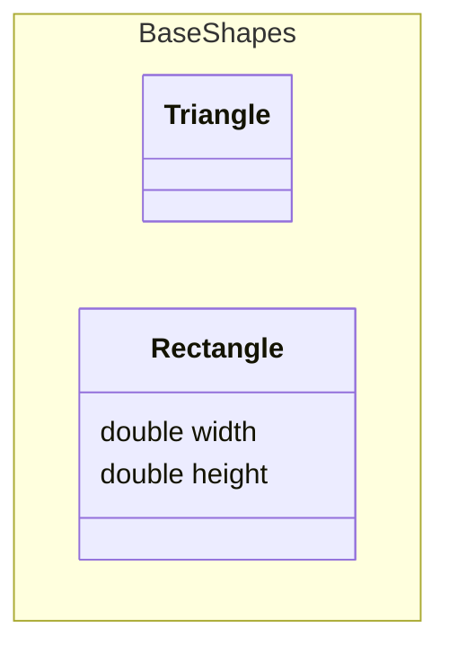

## Cardinality / Multiplicity

Indicate the number of instances:

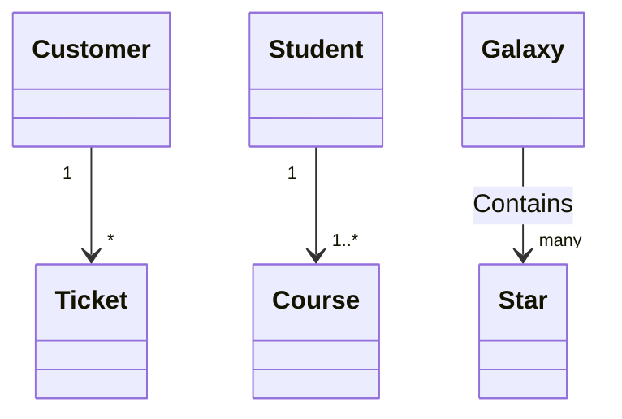

<Accordion title="Cardinality options">
- `1` - Only 1
- `0..1` - Zero or One
- `1..*` - One or more
- `*` - Many
- `n` - n (where n>1)
- `0..n` - zero to n (where n>1)
- `1..n` - one to n (where n>1)
</Accordion>

## Annotations

Annotate classes with markers:

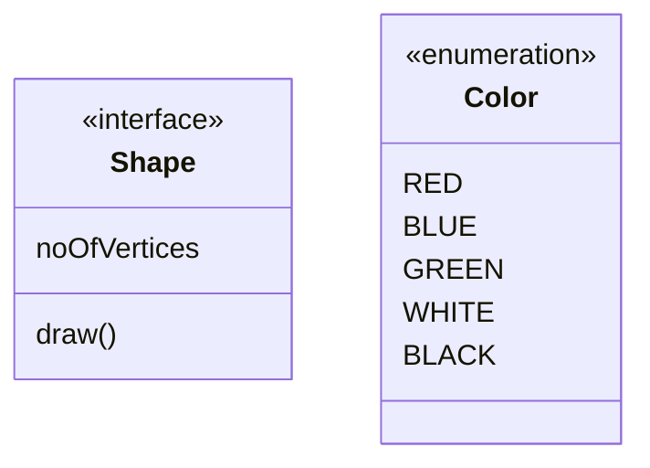

<Tip>
Common annotations include:
- `<<Interface>>`
- `<<Abstract>>`
- `<<Service>>`
- `<<Enumeration>>`
</Tip>

## Direction

Set the rendering direction:

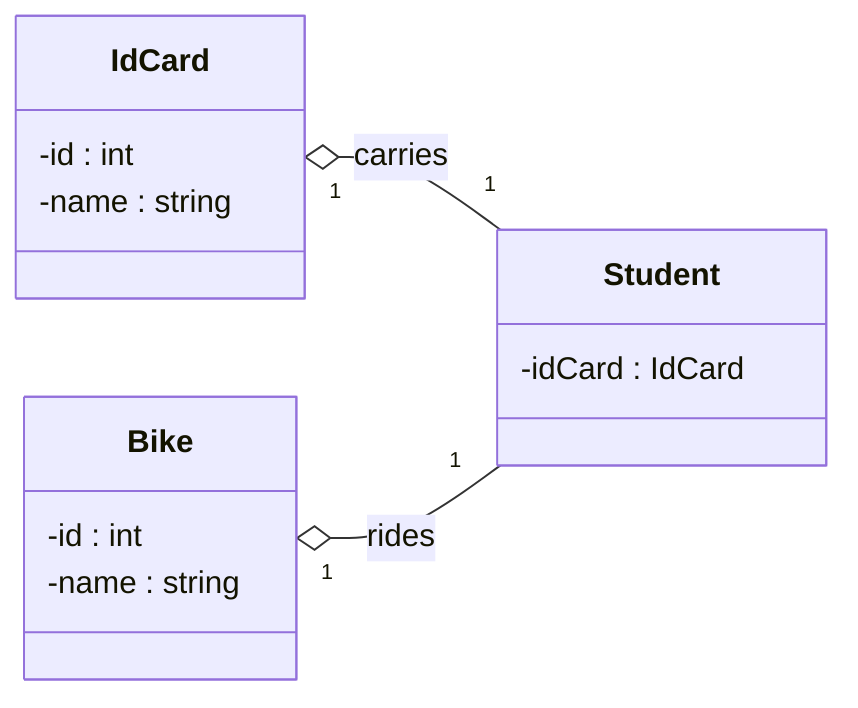

## Interaction

Bind click events to classes:

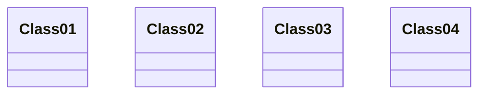

<Note>
This functionality is disabled when using `securityLevel='strict'`.
</Note>

## Notes

Add notes to diagrams:

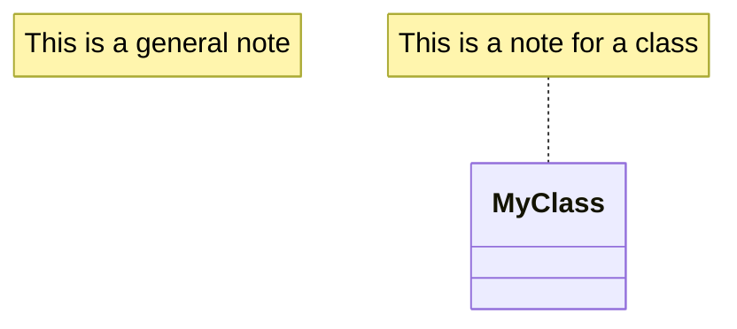

## Styling

### Styling a node

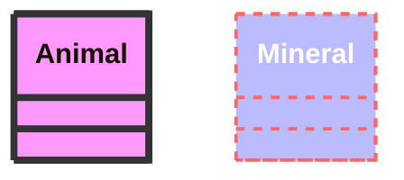

### Using classes

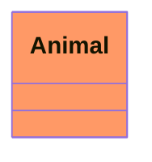

Or with bracket notation:

```mermaid
classDiagram
    class Animal:::someclass {
        -int sizeInFeet
        -canEat()
    }
    classDef someclass fill:#f96
```

## Comments

Add comments with `%%`:

```mermaid
classDiagram
%% This whole line is a comment classDiagram class Shape <<interface>>
class Shape{
    <<interface>>
    noOfVertices
    draw()
}
```
