An entity-relationship (ER) model describes interrelated things of interest in a specific domain of knowledge. An ER model is composed of entity types and specifies relationships that can exist between entities.

## Basic example

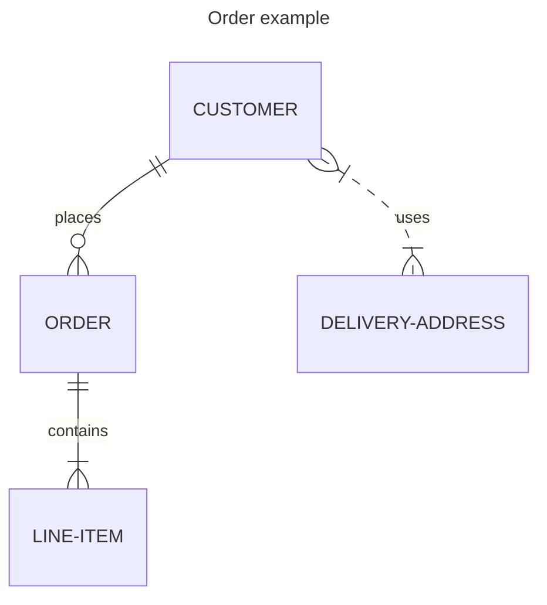

<Note>
Entity names are often capitalized, although this is not required in Mermaid.
</Note>

## Entities with attributes

Define attributes with their types:

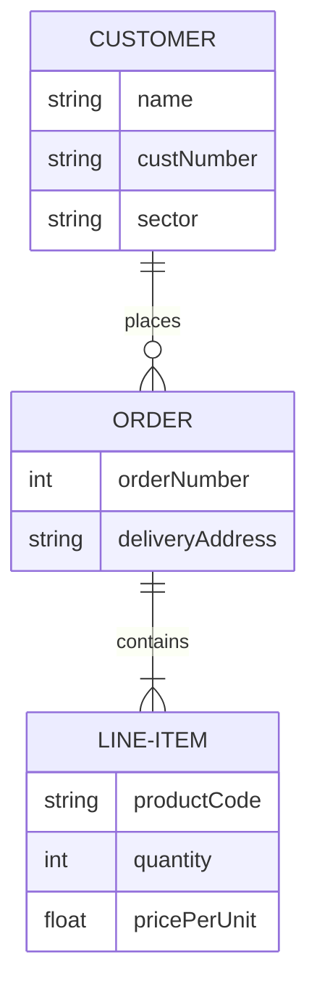

## Syntax

### Entities and relationships

Each statement consists of:

```
<first-entity> [<relationship> <second-entity> : <relationship-label>]
```

Example:

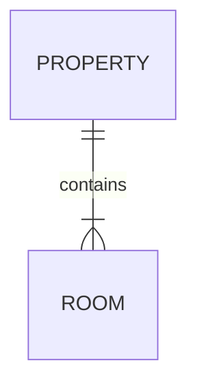

This reads as: "A property contains one or more rooms, and a room is part of one and only one property."

### Relationship syntax

The relationship consists of three parts:
- Cardinality of the first entity
- Whether the relationship confers identity
- Cardinality of the second entity

#### Cardinality

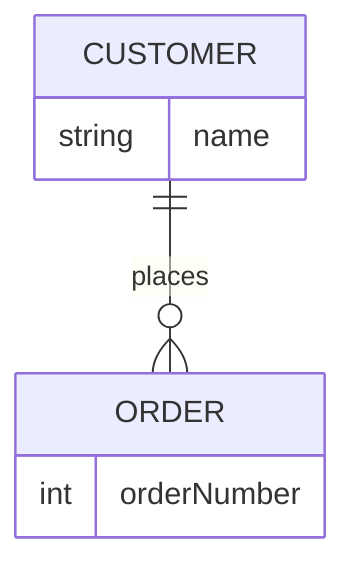

<Accordion title="Cardinality values">
| Value (left) | Value (right) | Meaning                       |
| :----------: | :-----------: | ----------------------------- |
|    `\|o`     |     `o\|`     | Zero or one                   |
|    `\|\|`    |    `\|\|`     | Exactly one                   |
|     `}o`     |     `o{`      | Zero or more (no upper limit) |
|    `}\|`     |     `\|{`     | One or more (no upper limit)  |

Aliases like `one or more`, `zero or many`, `1+`, `0+` are also supported.
</Accordion>

### Identification

Relationships can be identifying (solid line) or non-identifying (dashed line):

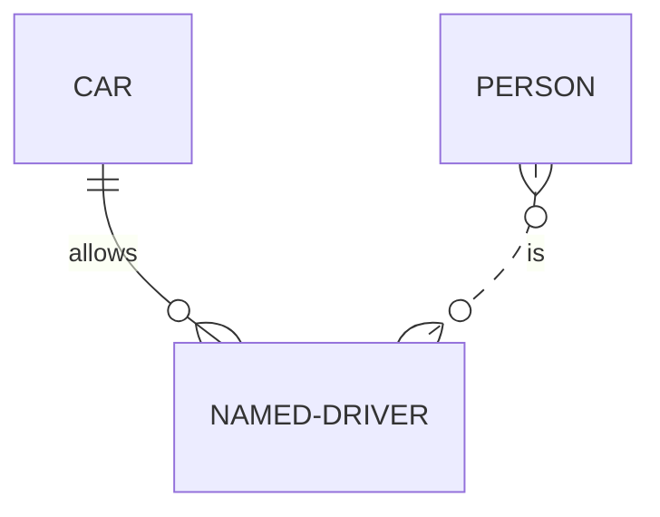

Using aliases:


## Attributes

Define attributes with type and name:

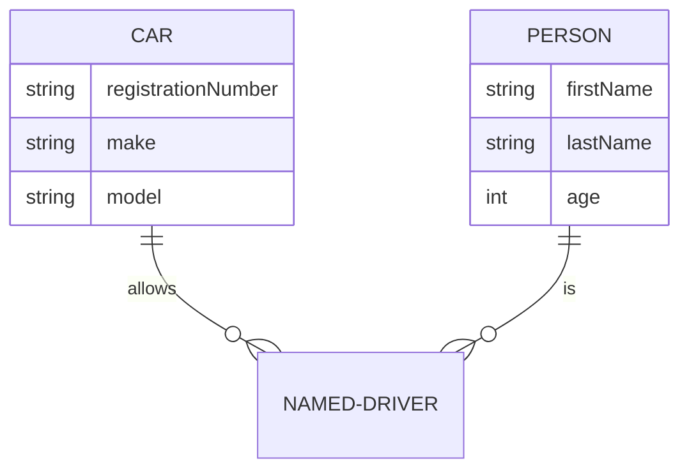

### Attribute keys and comments

Specify primary keys, foreign keys, and comments:

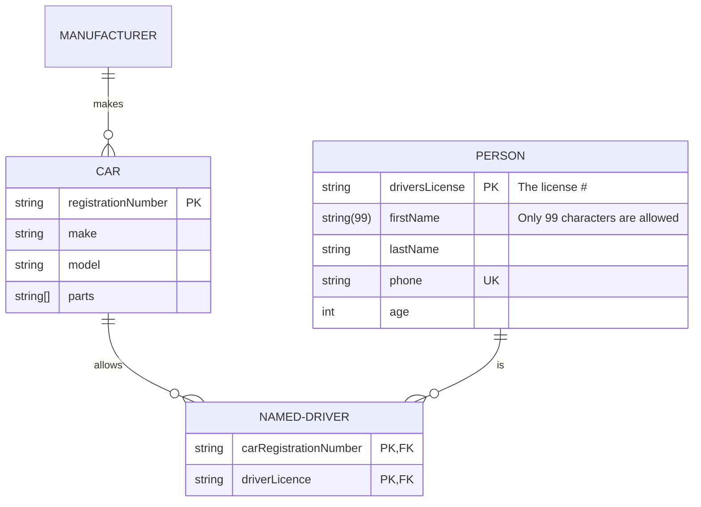

<Tip>
Available keys: `PK` (Primary Key), `FK` (Foreign Key), `UK` (Unique Key). Multiple keys can be specified with commas.
</Tip>

## Entity name aliases

Use aliases for display names:

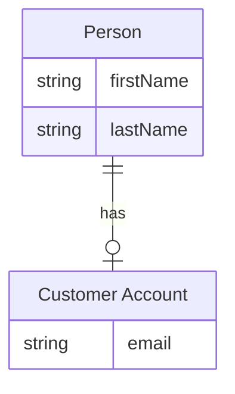

## Unicode and Markdown

### Unicode text

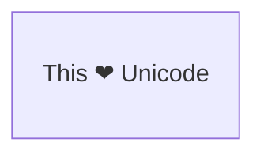

### Markdown formatting

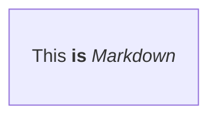

## Direction

Set the diagram orientation:

### Top to bottom


### Left to right

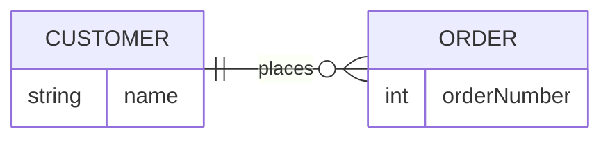

<Accordion title="Direction options">
- `TB` - Top to bottom
- `BT` - Bottom to top
- `RL` - Right to left
- `LR` - Left to right
</Accordion>

## Styling

### Styling a node

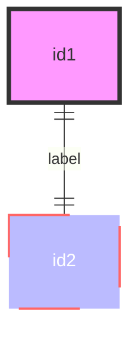

### Using classes

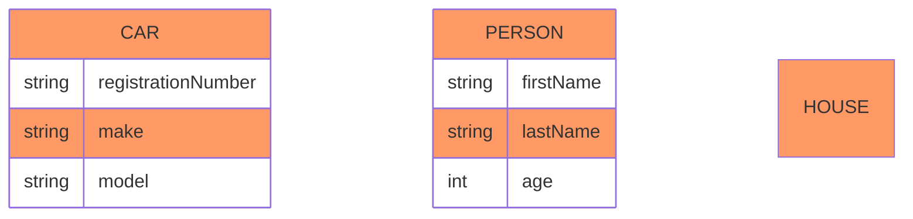

With relationships:

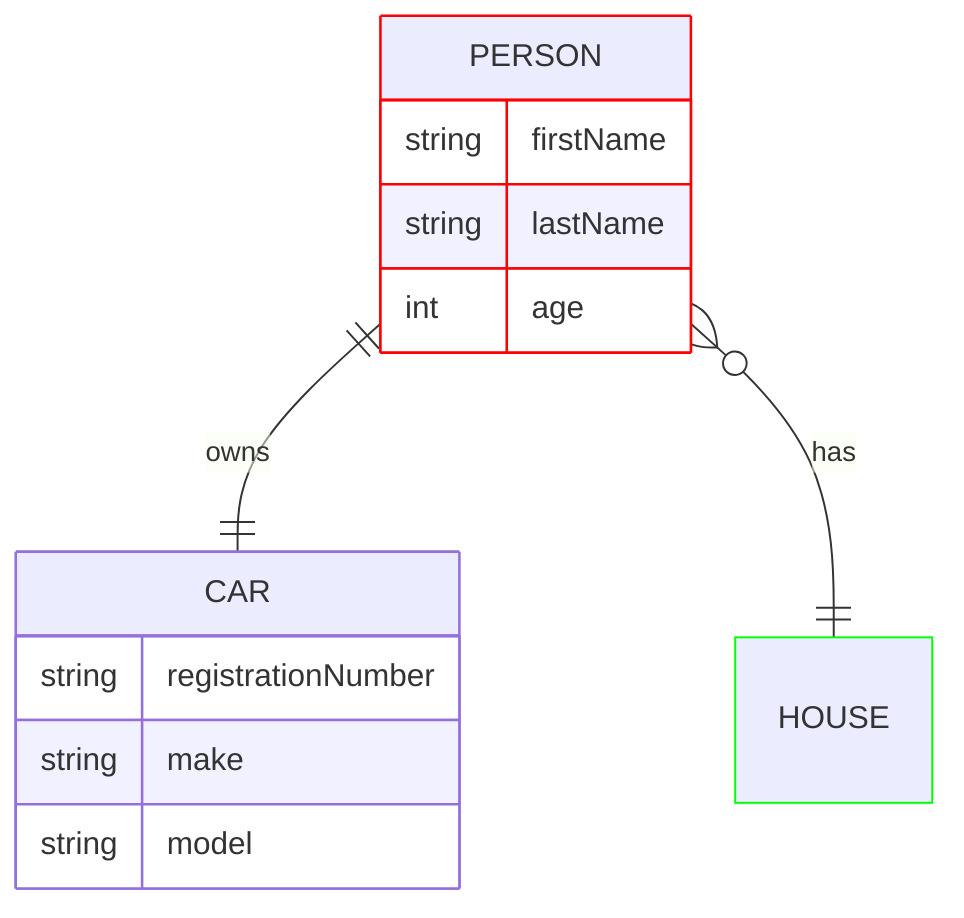

## Configuration

### Layout

For larger diagrams, use ELK layout:

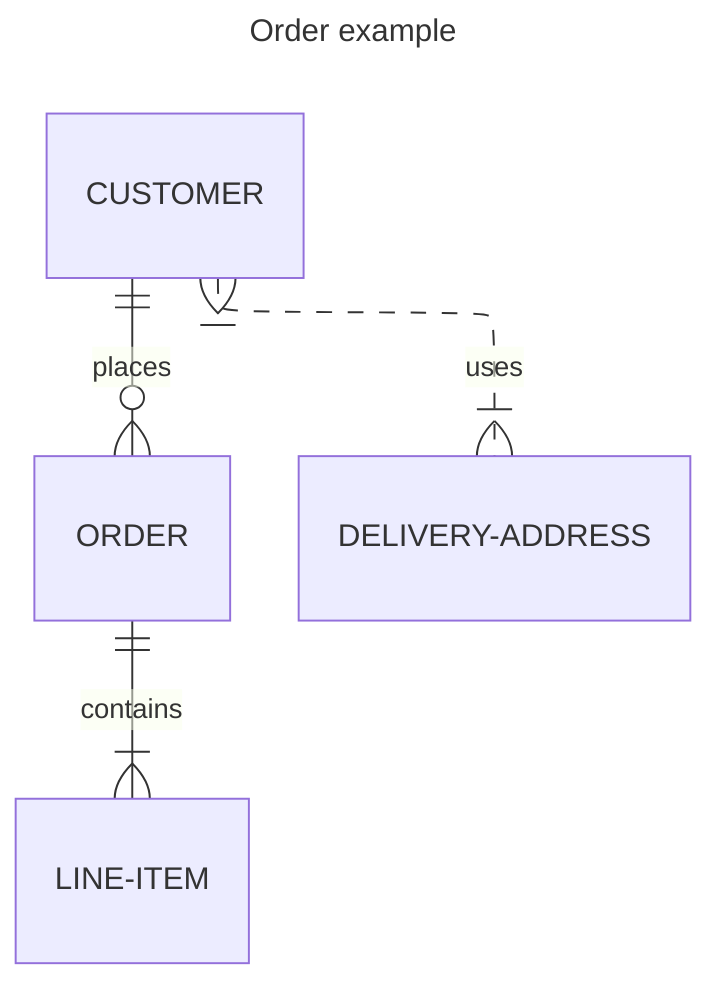

<Note>
Requires Mermaid version 9.4+ with lazy-loading enabled.
</Note>
