Flowcharts are composed of **nodes** (geometric shapes) and **edges** (arrows or lines). The Mermaid code defines how nodes and edges are made and accommodates different arrow types, multi-directional arrows, and linking to and from subgraphs.

## Basic example

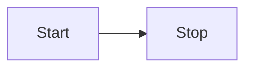

## Direction

This statement declares the direction of the flowchart. You can orient flowcharts in different directions:

- `TB` or `TD` - Top to bottom
- `BT` - Bottom to top
- `RL` - Right to left
- `LR` - Left to right

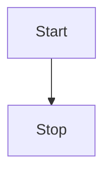

<Tip>
Instead of `flowchart` you can also use `graph`.
</Tip>

## Node shapes

Mermaid supports a wide variety of node shapes to represent different types of elements in your flowchart.

### Basic shapes

```mermaid
flowchart LR
    id1[Rectangle]
    id2(Rounded edges)
    id3([Stadium shape])
    id4[[Subroutine shape]]
    id5[(Database)]
    id6((Circle)]
    id7{Diamond}
    id8{{Hexagon}}
```

### Advanced shapes

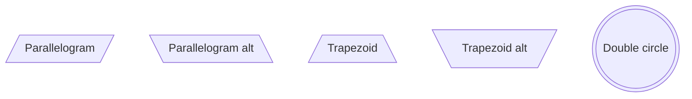

### Extended shape syntax (v11.3.0+)

Mermaid introduces 30+ new shapes using a general syntax format:

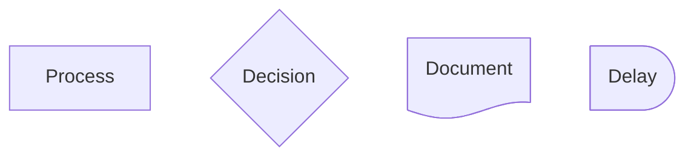

<Accordion title="Common shape types">
- `rect` - Rectangle (process)
- `rounded` - Rounded rectangle (event)
- `stadium` - Stadium shape (terminal)
- `subroutine` - Rectangle with double lines
- `cylinder` - Database
- `circle` - Circle (start/end)
- `diamond` - Diamond (decision)
- `hexagon` - Hexagon (preparation)
- `doc` - Document shape
- `delay` - Half-rounded rectangle

See the full list in the source documentation for all 30+ available shapes.
</Accordion>

## Links between nodes

Nodes can be connected with different types of links:

### Arrow types

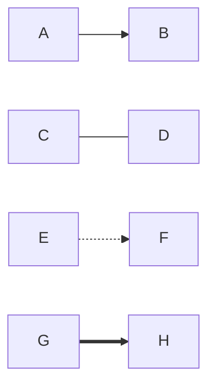

### Links with text

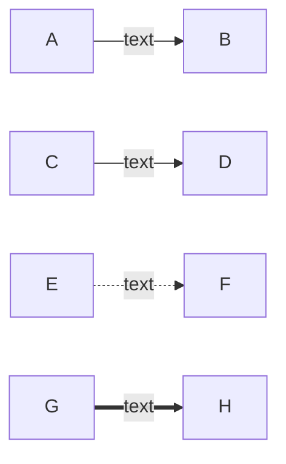

### Chaining links

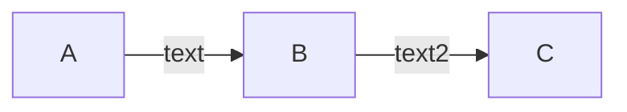

### Multi-directional arrows

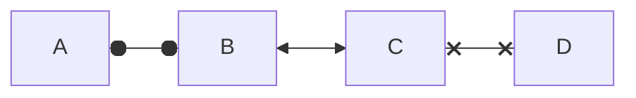

## Node text formatting

### Unicode text

Use `"` to enclose unicode text:

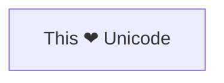

### Markdown formatting

Use double quotes and backticks to enable markdown:

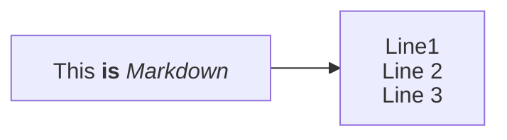

## Subgraphs

You can group nodes into subgraphs:

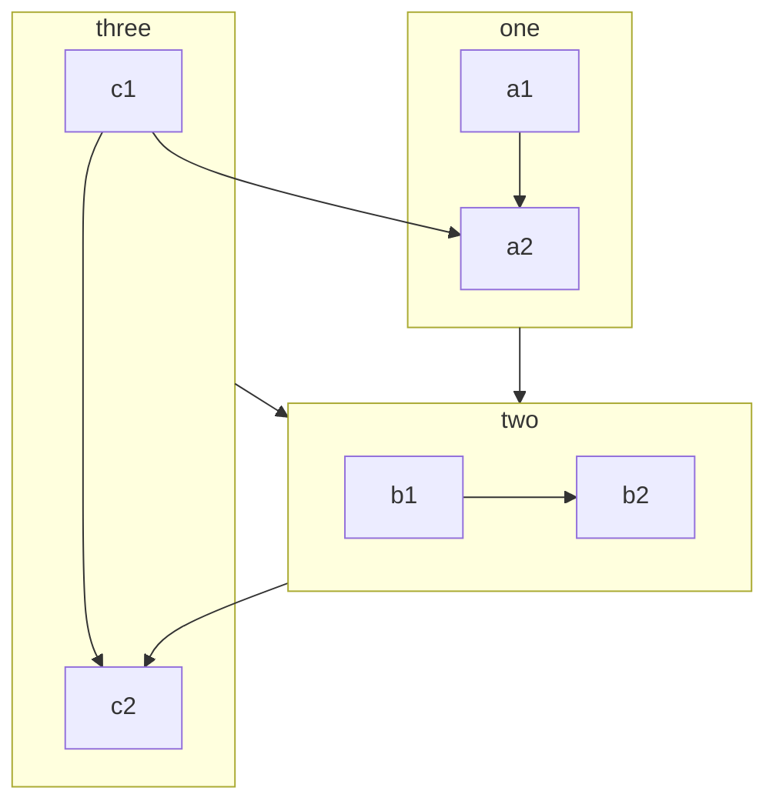

### Direction in subgraphs

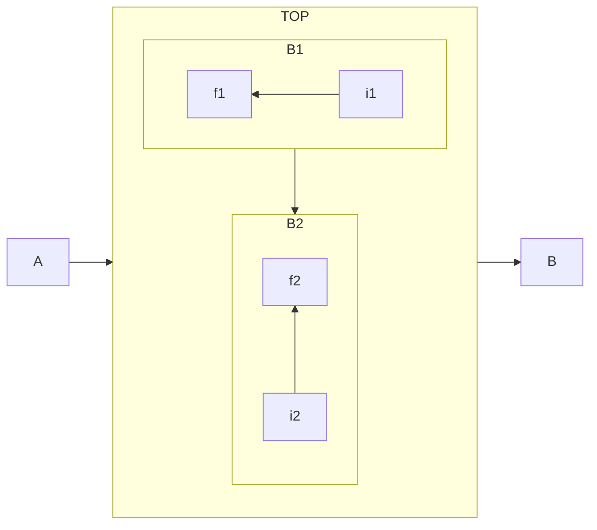

## Styling

### Styling a node

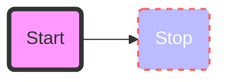

### Using classes

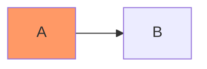

### Styling links

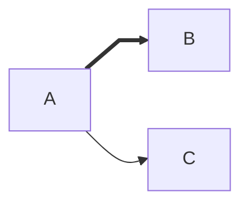

## Interaction

You can bind click events to nodes:

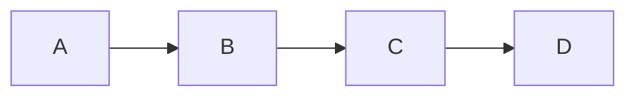

<Note>
This functionality is disabled when using `securityLevel='strict'` and enabled when using `securityLevel='loose'`.
</Note>

## Comments

Comments must be on their own line and prefaced with `%%`:


## Special characters

Use quotes to include special characters:

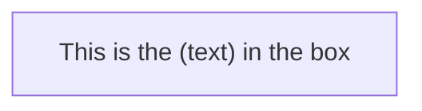

### Entity codes

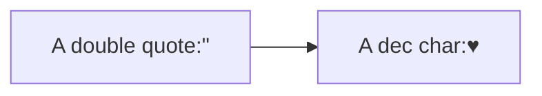
