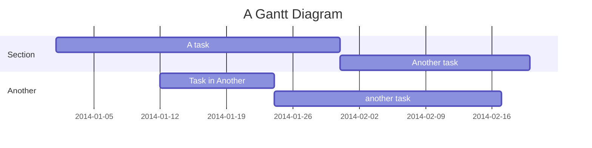
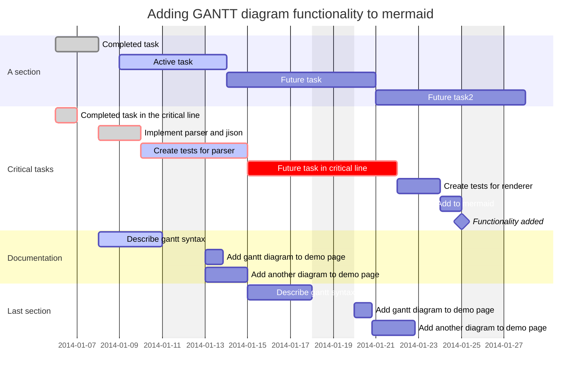
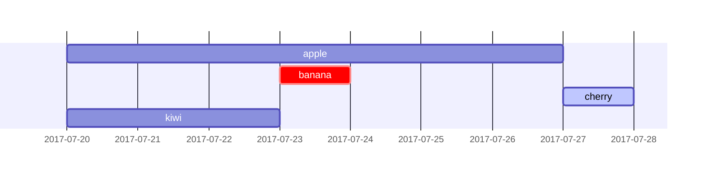
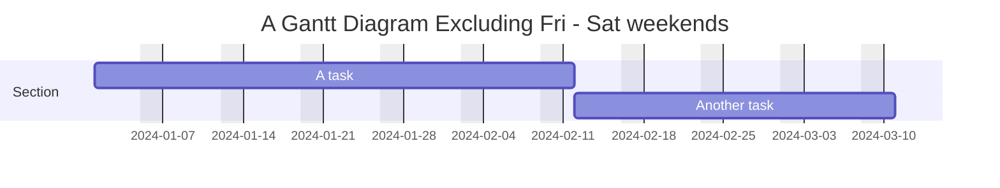
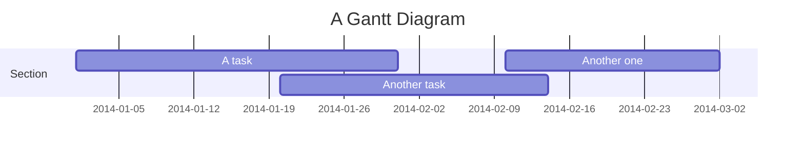
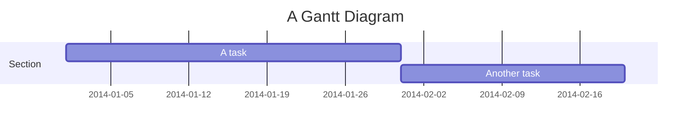

A Gantt chart is a type of bar chart that illustrates a project schedule. It shows the start and finish dates of terminal elements and summary elements of a project.

## Basic example



<Note>
When dates are "excluded", the Gantt chart extends tasks to the right, not by creating gaps inside the task.
</Note>

## Comprehensive example



## Task metadata

Tasks use colon `:` to separate title from metadata. Metadata items are comma-separated.

### Tags

Optional tags (must be specified first):
- `active` - Currently active task
- `done` - Completed task
- `crit` - Critical task
- `milestone` - Milestone marker

### Task timing



<Accordion title="Metadata syntax examples">
| Syntax | Start date | End date |
| ------ | ---------- | -------- |
| `<taskID>, <startDate>, <endDate>` | Specified date | Specified date |
| `<taskID>, <startDate>, <length>` | Specified date | Start + length |
| `<taskID>, after <otherTaskId>, <endDate>` | After other task | Specified date |
| `<taskID>, after <otherTaskId>, <length>` | After other task | Start + length |
| `<taskID>, <startDate>, until <otherTaskId>` | Specified date | When other task starts |
| `<endDate>` | After previous task | Specified date |
| `<length>` | After previous task | Start + length |
</Accordion>

## Title

Add an optional title:

```
gantt
    title A Gantt Diagram
```

## Excludes

Exclude specific dates, days, or weekends:

```
excludes weekends
excludes 2024-12-25
excludes sunday
```

### Weekend configuration (v11.0.0+)

Configure weekend start day:



## Sections

Divide the chart into sections:

```
section Development
    Task 1 :2014-01-01, 30d
    Task 2 :20d
section Documentation
    Task 3 :2014-01-12, 12d
```

## Milestones

Milestones represent a single instant in time:

```mermaid
gantt
    dateFormat HH:mm
    axisFormat %H:%M
    Initial milestone : milestone, m1, 17:49, 2m
    Task A : 10m
    Task B : 5m
    Final milestone : milestone, m2, 18:08, 4m
```



## Vertical markers

Add vertical reference lines:

```mermaid
gantt
    dateFormat HH:mm
    axisFormat %H:%M
    Initial vert : vert, v1, 17:30, 2m
    Task A : 3m
    Task B : 8m
    Final vert : vert, v2, 17:58, 4m
```



## Date formats

### Input date format

Define how dates are parsed:

```
dateFormat YYYY-MM-DD
```

<Accordion title="Format options">
| Input | Example | Description |
| ----- | ------- | ----------- |
| `YYYY` | 2014 | 4 digit year |
| `YY` | 14 | 2 digit year |
| `Q` | 1..4 | Quarter of year |
| `M MM` | 1..12 | Month number |
| `MMM MMMM` | January..Dec | Month name |
| `D DD` | 1..31 | Day of month |
| `H HH` | 0..23 | 24 hour time |
| `h hh` | 1..12 | 12 hour time |
| `m mm` | 0..59 | Minutes |
| `s ss` | 0..59 | Seconds |
</Accordion>

### Output axis format

Define how dates are displayed:

```
axisFormat %Y-%m-%d
```

<Accordion title="Axis format options">
| Format | Definition |
| ------ | ---------- |
| `%Y` | Year with century |
| `%y` | Year without century |
| `%m` | Month as decimal |
| `%b` | Abbreviated month name |
| `%B` | Full month name |
| `%d` | Zero-padded day of month |
| `%H` | Hour (24-hour clock) |
| `%I` | Hour (12-hour clock) |
| `%M` | Minute as decimal |
| `%S` | Second as decimal |
</Accordion>

### Axis ticks (v10.3.0+)

Customize tick intervals:

```mermaid
gantt
  tickInterval 1week
  weekday monday
```

Pattern: `/^([1-9][0-9]*)(millisecond|second|minute|hour|day|week|month)$/`

## Compact mode

Display multiple tasks in the same row:



## Interaction

Bind click events to tasks:

```
click taskId call callback(arguments)
click taskId href URL
```

<Note>
This functionality is disabled when using `securityLevel='strict'`.
</Note>

## Today marker

Style or hide the current date marker:

```
todayMarker stroke-width:5px,stroke:#0f0,opacity:0.5
```

To hide:

```
todayMarker off
```

## Comments

Add comments with `%%`:


