Git graphs are visual representations of Git commits and Git actions (commands) on various branches. These diagrams are particularly helpful for developers and DevOps teams to share their Git branching strategies.

## Basic example

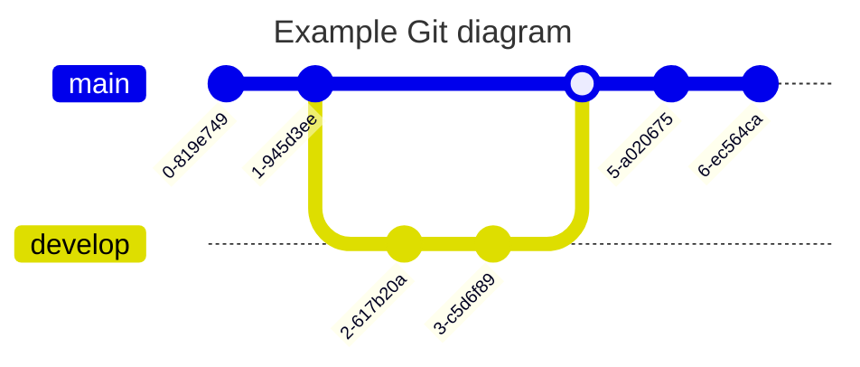

## Syntax overview

Mermaid supports the basic Git operations:

- **commit** - Representing a new commit on the current branch
- **branch** - To create and switch to a new branch
- **checkout** - To check out an existing branch and set it as current
- **merge** - To merge an existing branch onto the current branch

<Note>
`checkout` and `switch` can be used interchangeably.
</Note>

### Basic commits

A simple gitgraph showing three commits on the default (main) branch:

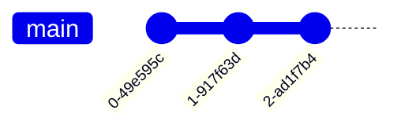

### Custom commit IDs

You can specify custom IDs for commits:

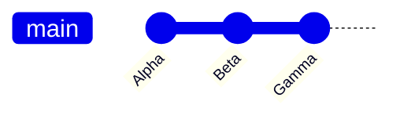

### Commit types

Commits can be of three types:

- **NORMAL** - Default type, represented by a solid circle
- **REVERSE** - Emphasized as a reverse commit, shown with a crossed solid circle
- **HIGHLIGHT** - Highlighted commit, shown as a filled rectangle

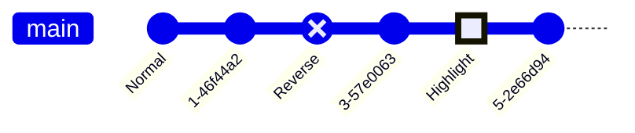

### Tags

You can attach tags to commits:

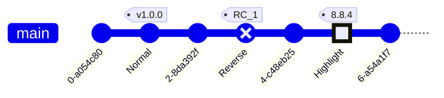

## Branches and merging

### Creating branches

Use the `branch` keyword to create a new branch:

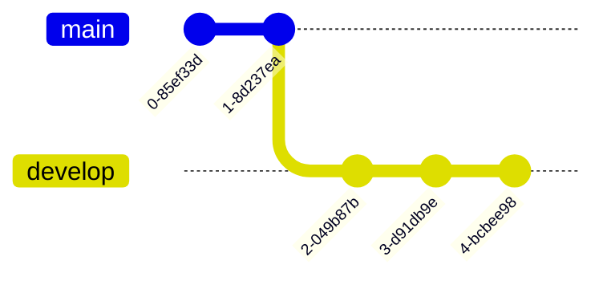

### Checking out branches

Switch between branches using `checkout`:

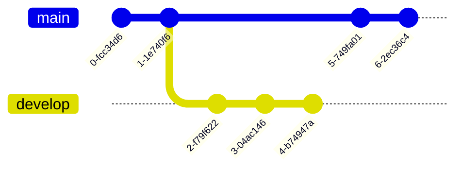

### Merging branches

Merge branches using the `merge` keyword:

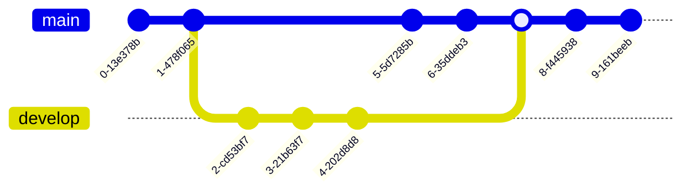

You can customize merge commits with attributes:

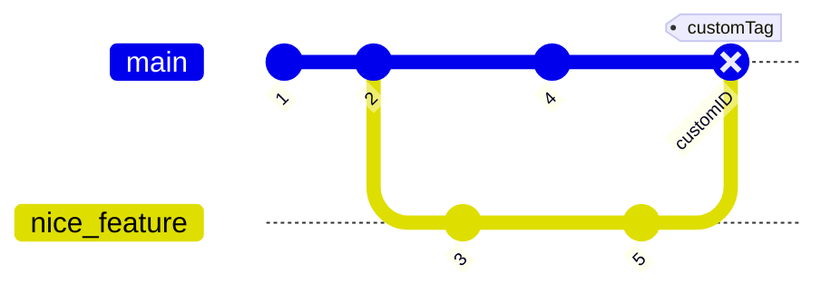

### Cherry picking

Cherry-pick commits from other branches:

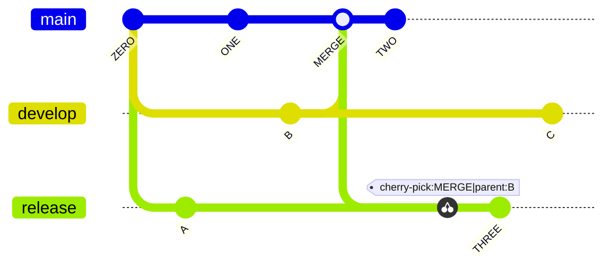

<Note>
When cherry-picking a merge commit, you must specify the parent commit ID using the `parent` attribute.
</Note>

## Configuration options

<Accordion title="Show/hide branches">

Control branch visibility with `showBranches`:

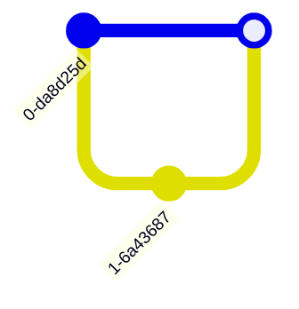

</Accordion>

<Accordion title="Commit label orientation">

Control label rotation with `rotateCommitLabel`:

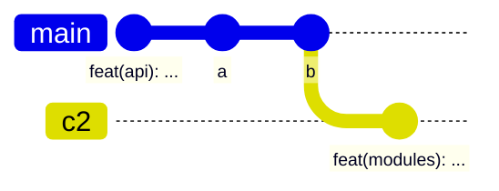

</Accordion>

<Accordion title="Hide commit labels">

Hide commit labels with `showCommitLabel`:

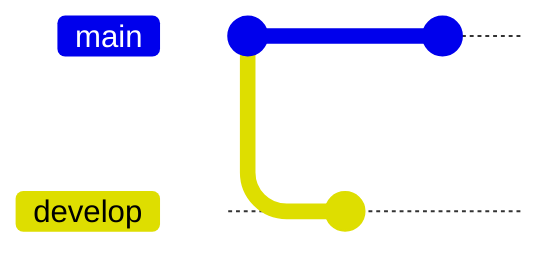

</Accordion>

<Accordion title="Custom main branch name">

Customize the main branch name:

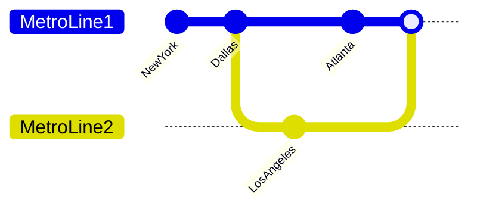

</Accordion>

<Accordion title="Branch ordering">

Control branch order with the `order` keyword:

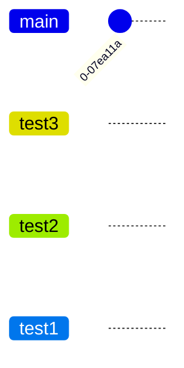

</Accordion>

## Orientation

Git graphs support three orientations:

### Left to right (default)

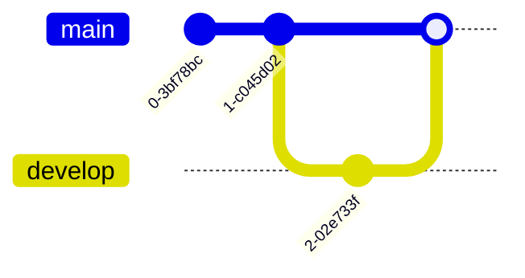

### Top to bottom

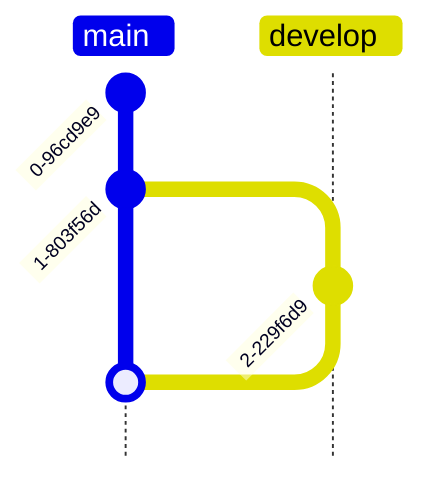

### Bottom to top

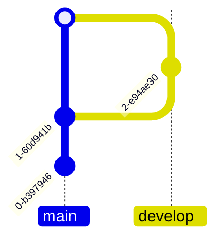

## Theming

<Accordion title="Customizing branch colors">

Use `git0` to `git7` theme variables to customize branch colors:

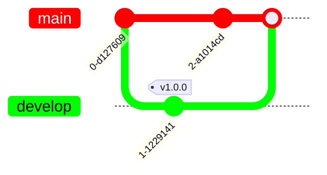

</Accordion>

<Accordion title="Customizing commit labels">

Use `commitLabelColor` and `commitLabelBackground` to style commit labels:

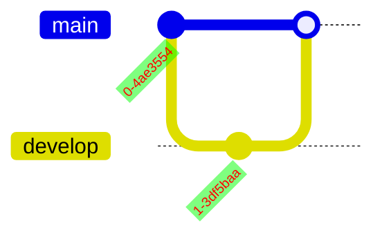

</Accordion>

<Tip>
Mermaid supports up to 8 branches with custom colors. After this threshold, theme variables are reused cyclically.
</Tip>