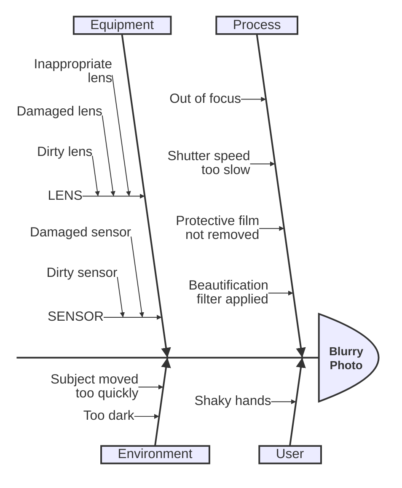
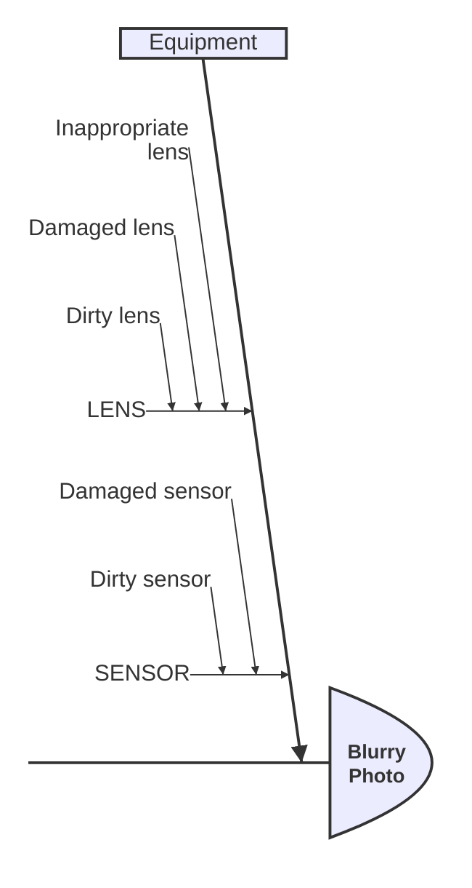
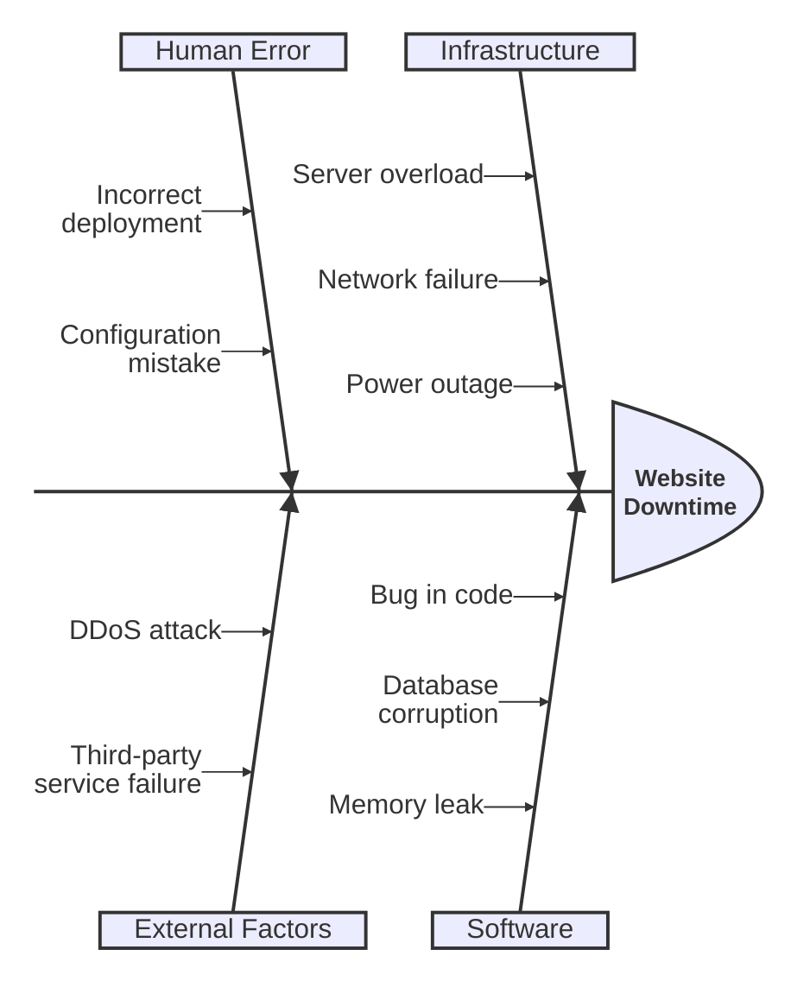
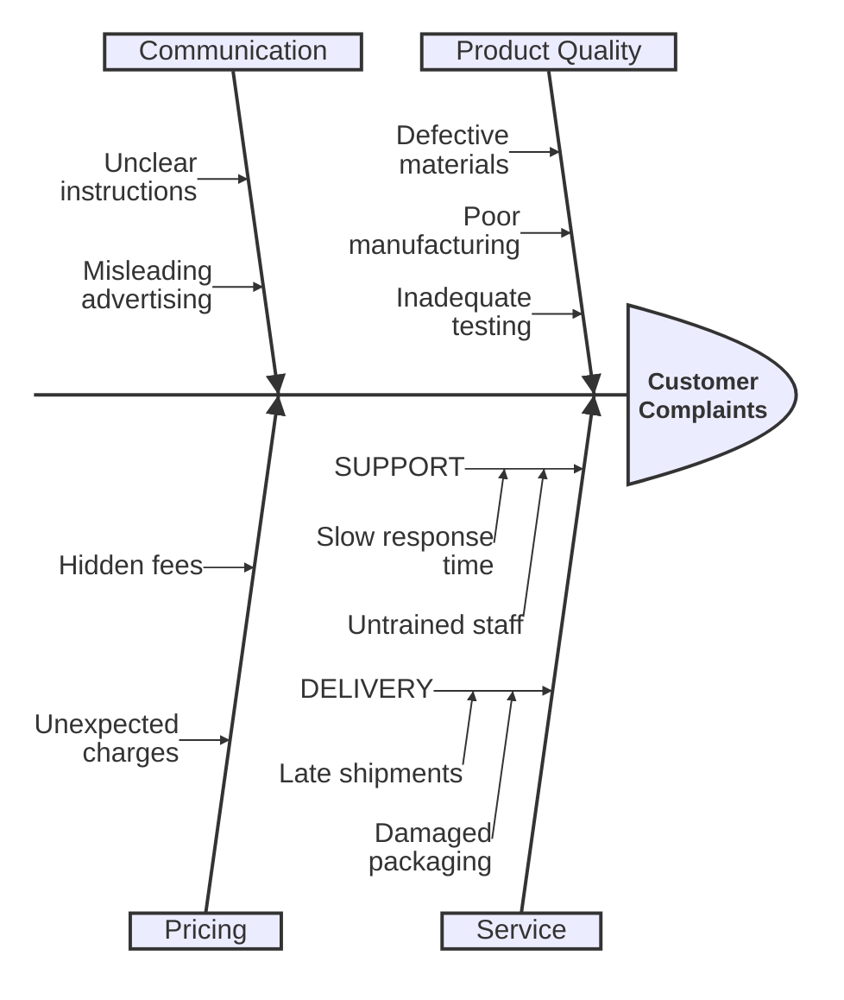

Ishikawa diagrams are used to represent causes of a specific event or problem. They are also known as fishbone diagrams, herringbone diagrams, or cause-and-effect diagrams. The diagram resembles a fish skeleton, with the main problem at the head and the causes branching off from the spine.

<Note>
This is a new diagram type in Mermaid. Its syntax may evolve in future versions. Use the `ishikawa-beta` keyword.
</Note>

## Basic Ishikawa diagram

This example analyzes the causes of a blurry photo:



## Syntax overview

The structure of an Ishikawa diagram is created using indentation:

1. **First line**: The event or problem being analyzed
2. **Subsequent lines**: Causes of the event
3. **Indentation**: Creates the hierarchical "fishbone" structure

### Problem statement

The first line defines the main problem or effect:

```
ishikawa-beta
    Blurry Photo
```

### Primary causes

Main categories of causes are defined at the first level of indentation:

```
ishikawa-beta
    Blurry Photo
    Process
    User
    Equipment
    Environment
```

### Secondary causes

Sub-causes are defined by further indentation:

```
ishikawa-beta
    Blurry Photo
    Process
        Out of focus
        Shutter speed too slow
    User
        Shaky hands
```

### Nested categories

You can create sub-categories using uppercase text and additional indentation:



## Common use cases

Ishikawa diagrams are widely used for:

- **Quality management**: Identifying root causes of defects or quality issues
- **Process improvement**: Analyzing factors affecting process performance
- **Problem-solving**: Breaking down complex problems into manageable components
- **Risk analysis**: Identifying potential causes of failures or incidents
- **Brainstorming**: Organizing team discussions about problem causes

## Example: Website downtime

Here's an example analyzing causes of website downtime:



## Example: Customer complaints

Analyzing causes of customer complaints:



<Tip>
Use uppercase text for sub-category headers to create a clear visual hierarchy in your fishbone diagram.
</Tip>

<Note>
The fishbone structure is automatically created based on your indentation. Make sure to use consistent spacing (tabs or spaces) throughout your diagram.
</Note>