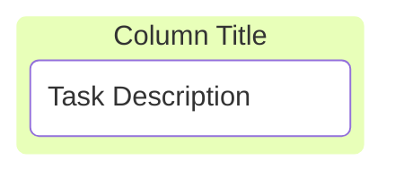
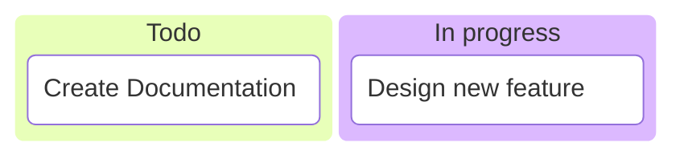
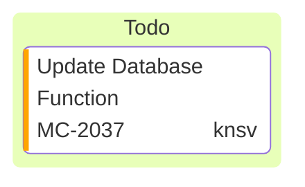
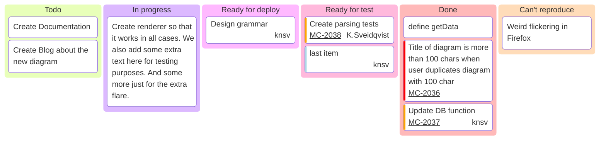
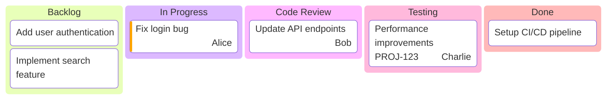
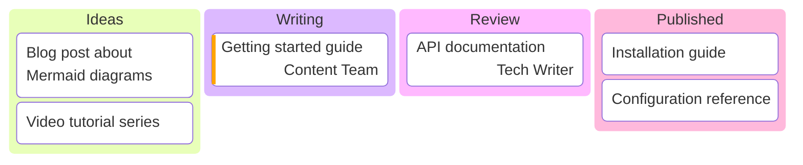

Kanban diagrams allow you to create visual representations of tasks moving through different stages of a workflow. They help visualize work in progress and manage project workflows effectively.

## Basic Kanban board

This example shows a simple Kanban board with tasks in different columns:



## Syntax overview

### Defining columns

Columns represent different stages in your workflow (e.g., "Todo", "In Progress", "Done"):

```
columnId[Column Title]
```

- `columnId`: A unique identifier for the column
- `[Column Title]`: The title displayed on the column header

**Example:**


### Adding tasks

Tasks are listed under their respective columns with indentation:

```
taskId[Task Description]
```

**Example:**



## Task metadata

Enhance tasks with additional information using the `@{ ... }` syntax:

### Supported metadata keys

- **assigned**: Specifies who is responsible for the task
- **ticket**: Links the task to a ticket or issue number
- **priority**: Indicates urgency (`Very High`, `High`, `Low`, `Very Low`)



## Configuration options

<Accordion title="Ticket base URL configuration">

You can set a base URL for ticket links using frontmatter configuration:

```yaml
---
config:
  kanban:
    ticketBaseUrl: 'https://yourproject.atlassian.net/browse/#TICKET#'
---
```

When a task has a ticket number, it will be linked to your external ticket system. The `#TICKET#` placeholder is replaced with the actual ticket value.

</Accordion>

## Complete example

Here's a full Kanban board with multiple columns and metadata:



## Best practices

<Tip>
Ensure proper indentation when adding tasks to columns. Tasks must be indented under their parent columns to maintain the correct structure.
</Tip>

### Key guidelines

1. **Unique identifiers**: Use unique IDs for both columns and tasks
2. **Proper indentation**: Tasks must be indented under their columns
3. **Meaningful titles**: Use descriptive column and task titles
4. **Metadata usage**: Add assignees and priorities to improve task tracking
5. **Ticket linking**: Configure `ticketBaseUrl` to enable external ticket links

## Example: Software development workflow



## Example: Content creation pipeline



<Note>
Kanban diagrams are excellent for visualizing workflow stages. Customize columns to match your team's specific process.
</Note>