A mindmap is a diagram used to visually organize information into a hierarchy, showing relationships among pieces of the whole. Major ideas are connected directly to the central concept, and other ideas branch out from those major ideas.

<Note>
Mindmaps are experimental. The syntax is stable except for icon integration.
</Note>

## Basic example

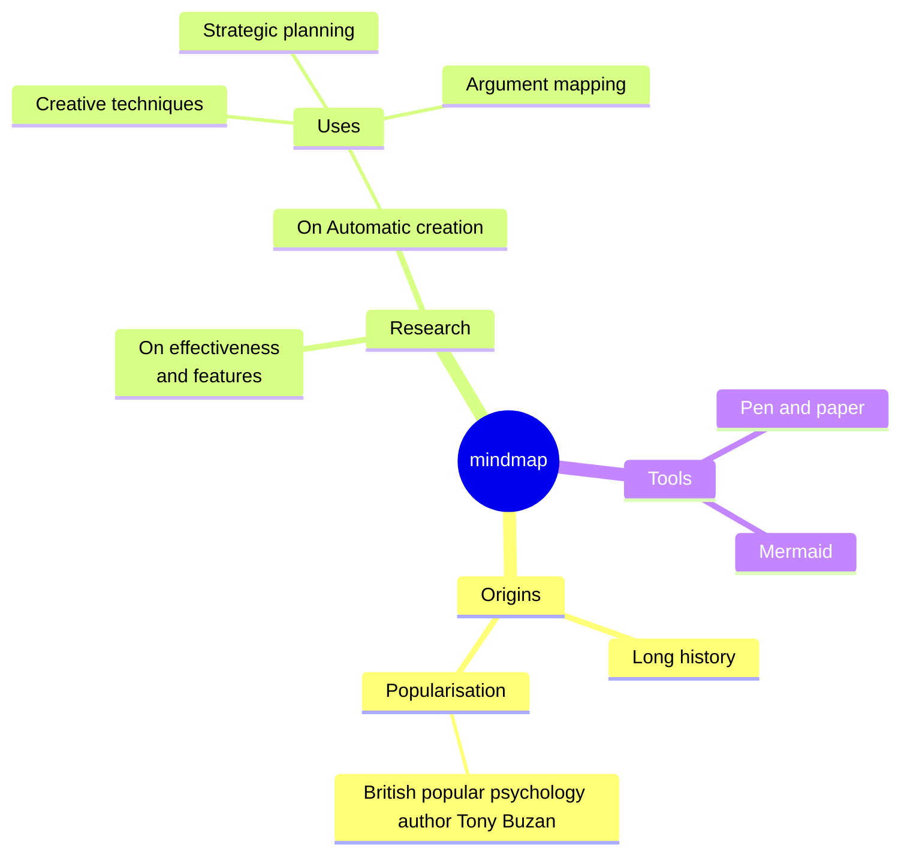

## Syntax overview

The syntax relies on indentation to set levels in the hierarchy:

```
mindmap
    Root
        A
            B
            C
```

This creates a simple hierarchy:
- Root node
  - Child A
    - Grandchild B
    - Grandchild C

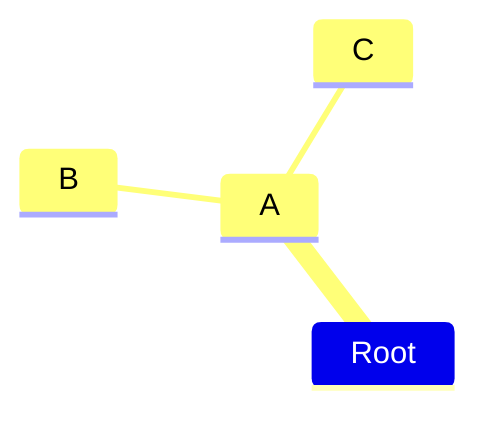

## Node shapes

Mindmaps support various node shapes:

### Square

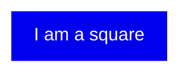

### Rounded square

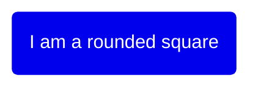

### Circle

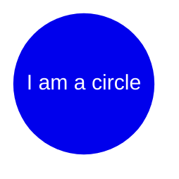

### Bang

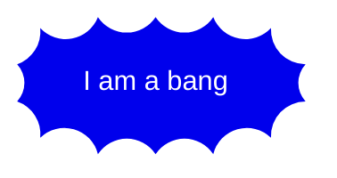

### Cloud

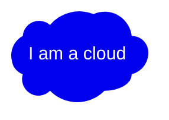

### Hexagon

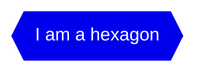

### Default

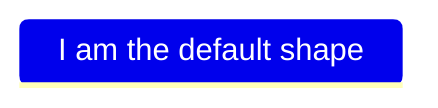

## Icons and classes

### Icons

Add icons to nodes using the `::icon()` syntax:

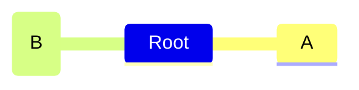

<Note>
Icon fonts must be configured by the site administrator. This feature is experimental.
</Note>

### Classes

Add CSS classes using triple colon syntax:

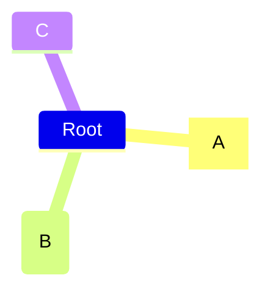

<Note>
Classes must be supplied by the site administrator.
</Note>

## Markdown strings

Markdown strings support text formatting and automatic wrapping:

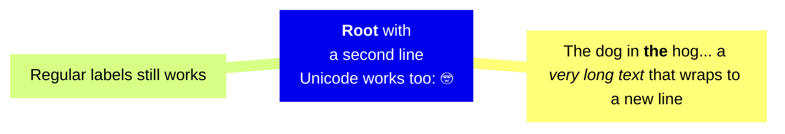

**Formatting:**
- Use `**text**` for bold
- Use `*text*` for italics
- Use newlines instead of `<br>` tags for line breaks

## Indentation handling

Mermaid handles unclear indentation by finding the first node with smaller indentation:


In this example, C becomes a sibling of B (both children of A) because A is the first parent with smaller indentation than C.

## Layouts

Mermaid supports a Tidy Tree layout for mindmaps:

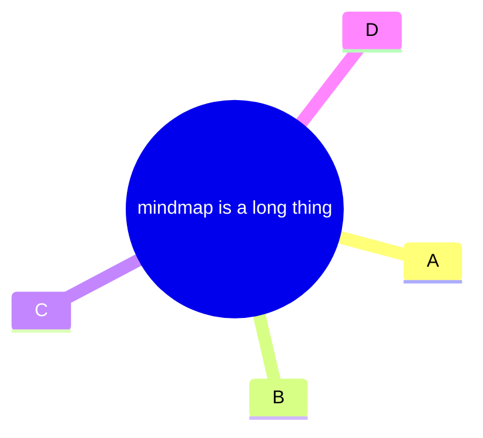

<Tip>
See the [Tidy Tree Configuration](/config/tidy-tree) documentation for instructions on registering the tidy-tree layout.
</Tip>

## Complete example

Here's a comprehensive mindmap showing various features:

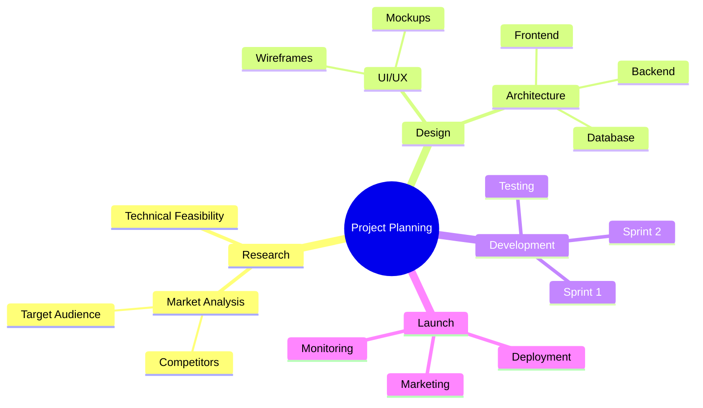