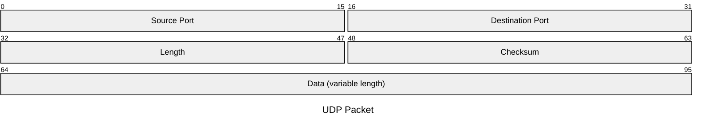
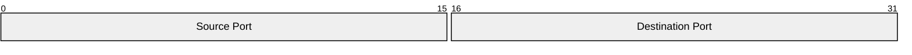
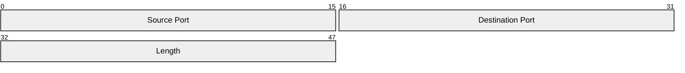
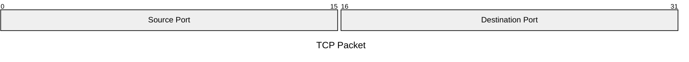
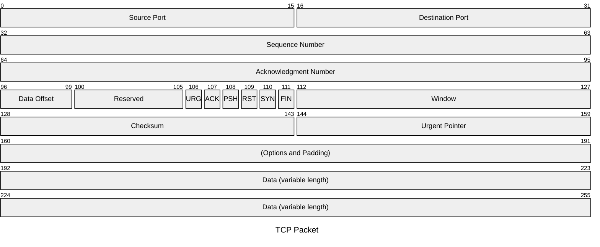
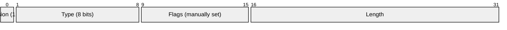
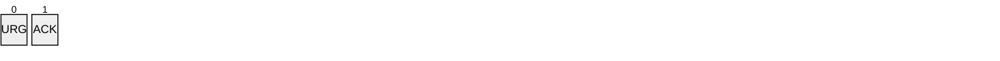
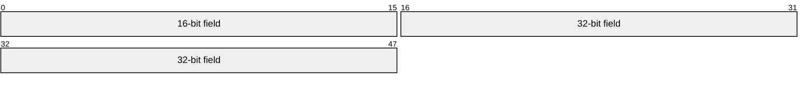
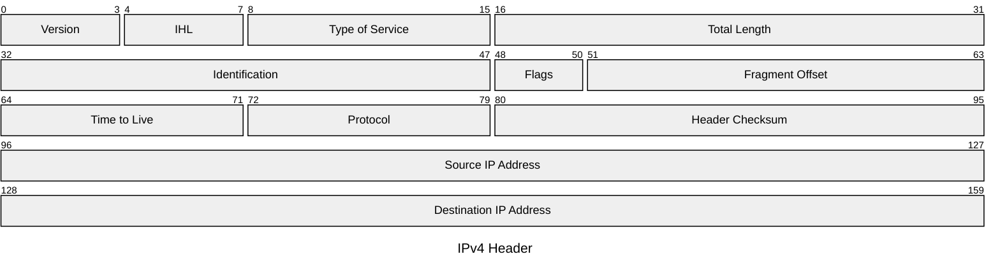

Packet diagrams are visual representations used to illustrate the structure and contents of network packets. Network packets are the fundamental units of data transferred over a network.

<Note>
Packet diagrams are available in Mermaid v11.0.0+. Bit count syntax is available in v11.7.0+.
</Note>

## Who uses packet diagrams?

This diagram type is particularly useful for:

- Network engineers designing or documenting network protocols
- Developers implementing network communication
- Educators teaching networking concepts
- Students learning about network packet structures

## Basic packet diagram

This example shows a UDP packet structure:



## Syntax overview

There are two ways to define packet fields:

### Range syntax

Specify exact bit positions using start and end values:

```
packet
start-end: "Block name"
```

**Example:**



### Bit count syntax (v11.7.0+)

Use `+<count>` to automatically calculate positions:

```
packet
+<count>: "Block name"
```

**Example:**



<Tip>
Bit count syntax is easier to maintain when modifying packet designs. The positions are calculated automatically based on the previous field.
</Tip>

## Adding titles

You can add a title to your packet diagram in two ways:

### Using frontmatter



### Using inline title


## Complete examples

### TCP packet structure



### UDP packet with bit count syntax


## Mixing syntax styles

You can mix range syntax and bit count syntax in the same diagram:



<Note>
When using bit count syntax, the position starts from the end of the previous field. You can switch between syntax styles as needed.
</Note>

## Field details

### Single-bit fields

For single-bit flags, use either syntax:

```mermaid
packet
106: "URG"
107: "ACK"
```

Or:



### Multi-bit fields

For larger fields, specify the full range or bit count:



## Configuration

For detailed configuration options, see the [packet diagram configuration reference](/configuration/setup).

<Accordion title="Configuration options">

Packet diagrams support various configuration options:

- **showBits**: Toggle bit position display
- **Styling options**: Customize colors, fonts, and stroke widths
- **Layout options**: Adjust spacing and alignment

Note: Some theme variables may not be fully functional in the current version due to known issues.

</Accordion>

## Example: IPv4 header



<Tip>
Use packet diagrams to document custom network protocols or to help visualize standard protocol structures for educational purposes.
</Tip>