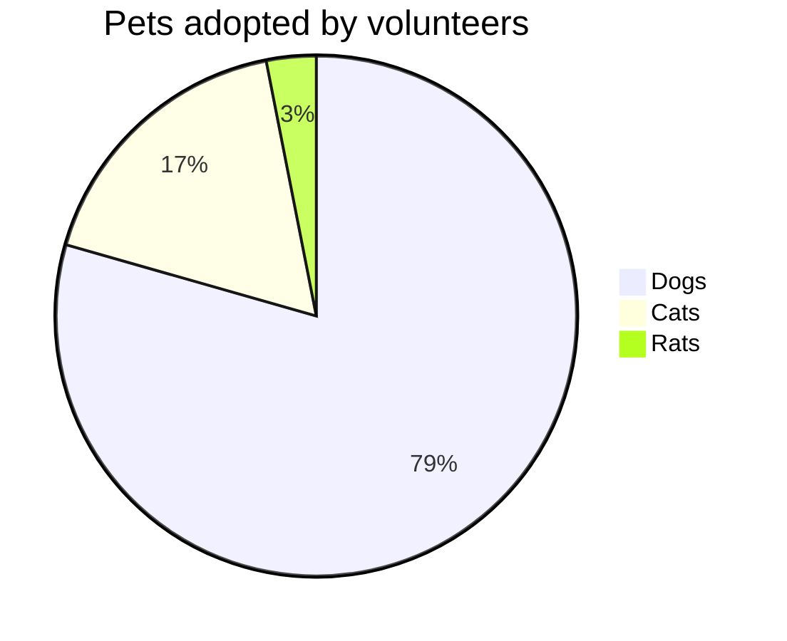
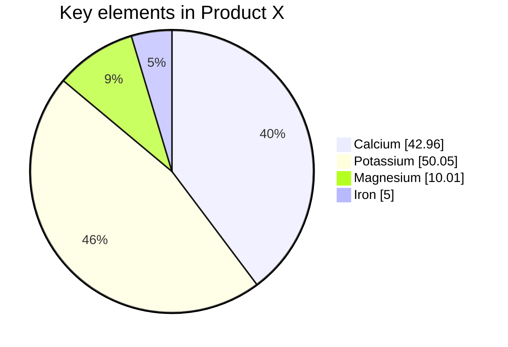
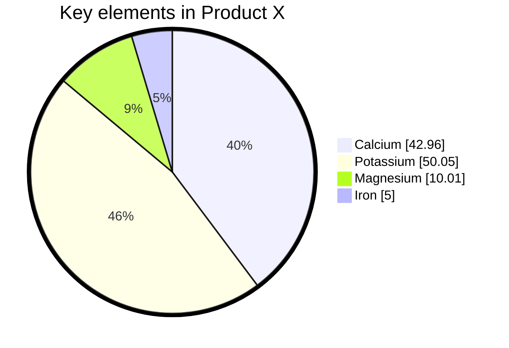
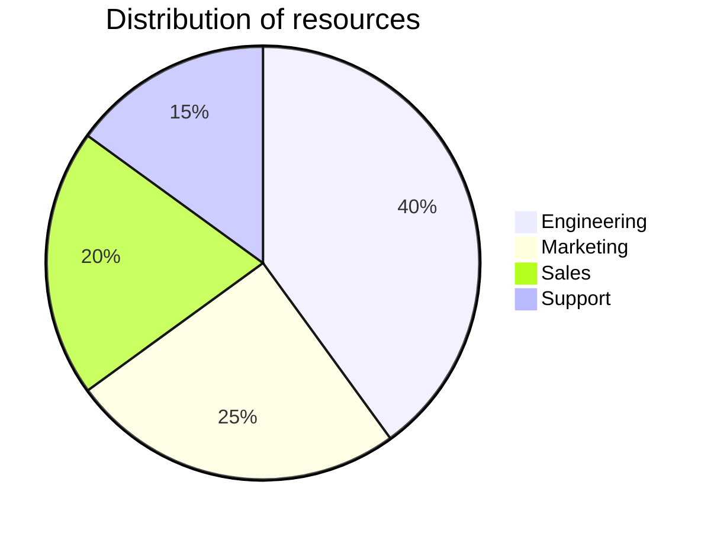
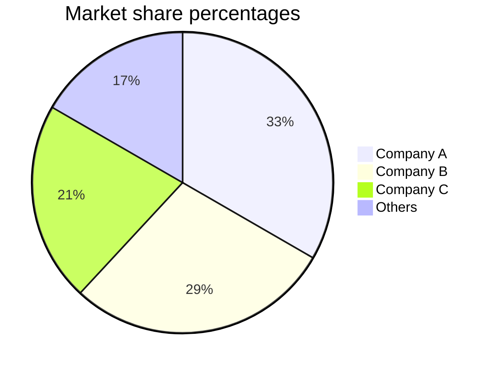
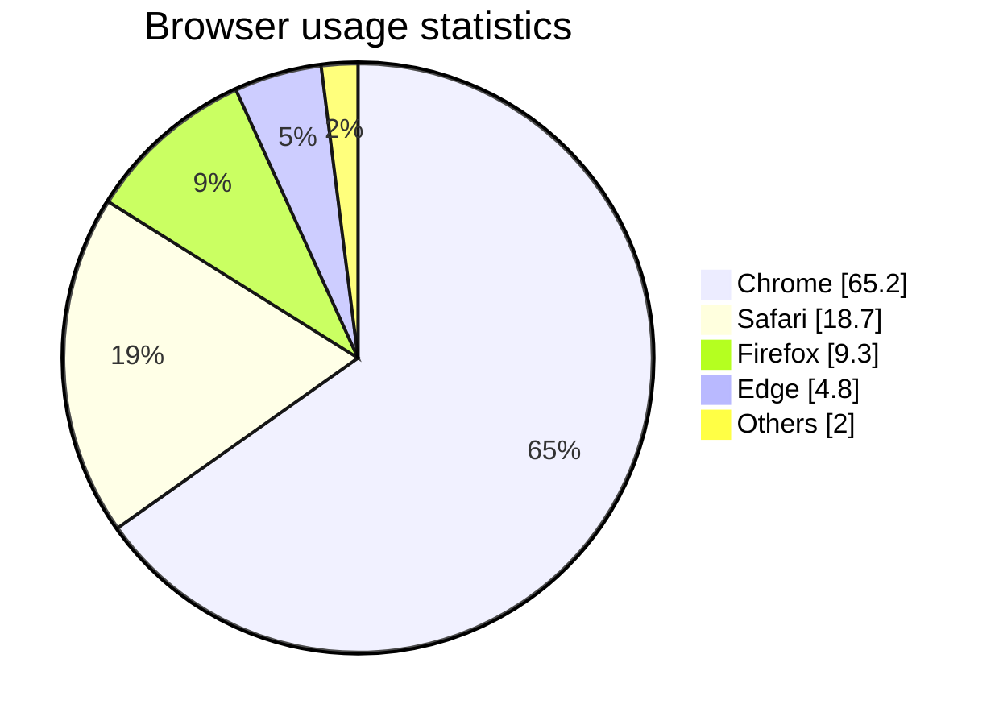

A pie chart is a circular statistical graphic divided into slices to illustrate numerical proportion. The arc length of each slice is proportional to the quantity it represents.

## Basic example



## Syntax

Drawing a pie chart is simple:

1. Start with `pie` keyword
2. Optionally add `showData` to display values
3. Optionally add `title` with a string
4. Add data pairs: `"label" : value`

```
pie [showData] [title <titleText>]
    "<label1>" : <value1>
    "<label2>" : <value2>
    "<label3>" : <value3>
```

<Note>
Pie chart values must be positive numbers greater than zero. Negative values are not allowed and will result in an error.
</Note>

## With data values

Show actual data values after legend text:



## Advanced configuration

Customize appearance with configuration:



<Accordion title="Configuration parameters">
| Parameter | Description | Default |
| --------- | ----------- | ------- |
| `textPosition` | Axial position of labels (0.0 at center to 1.0 at edge) | `0.75` |
</Accordion>

## Examples

### Simple proportions



### Decimal values



### With data displayed


