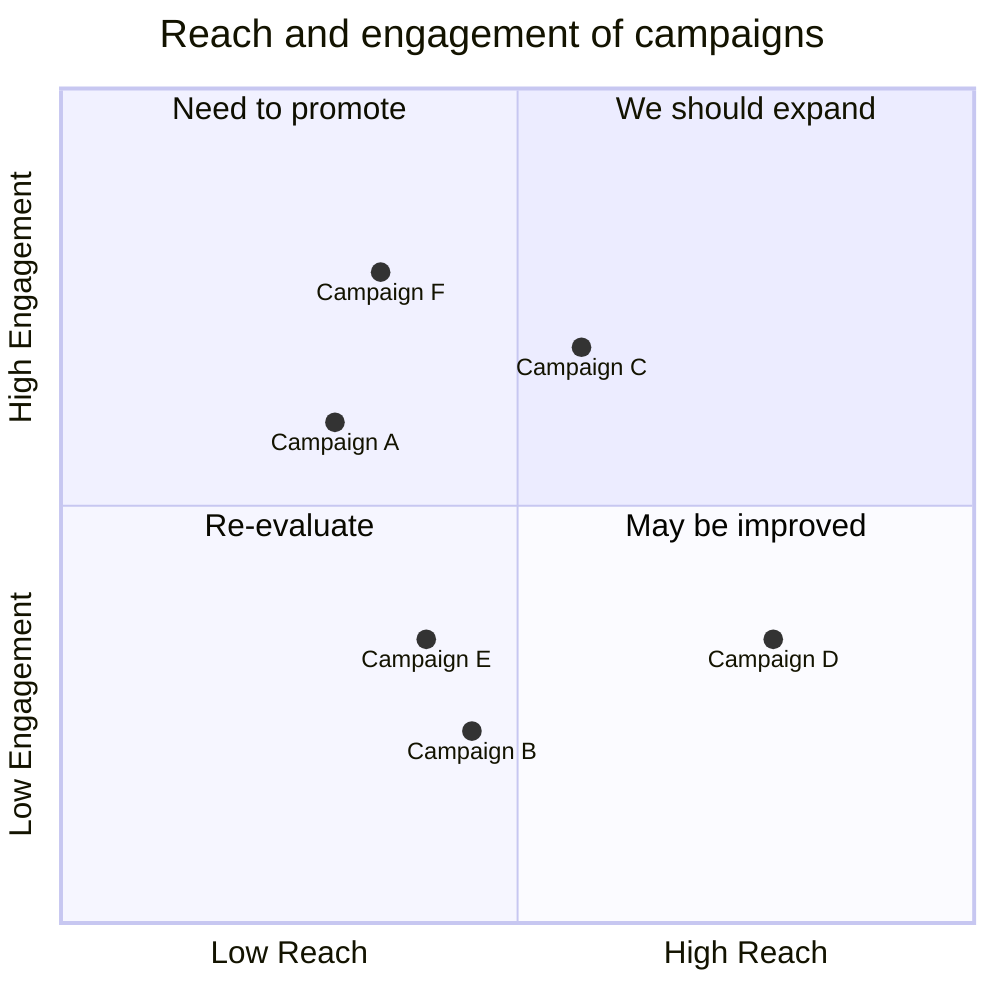
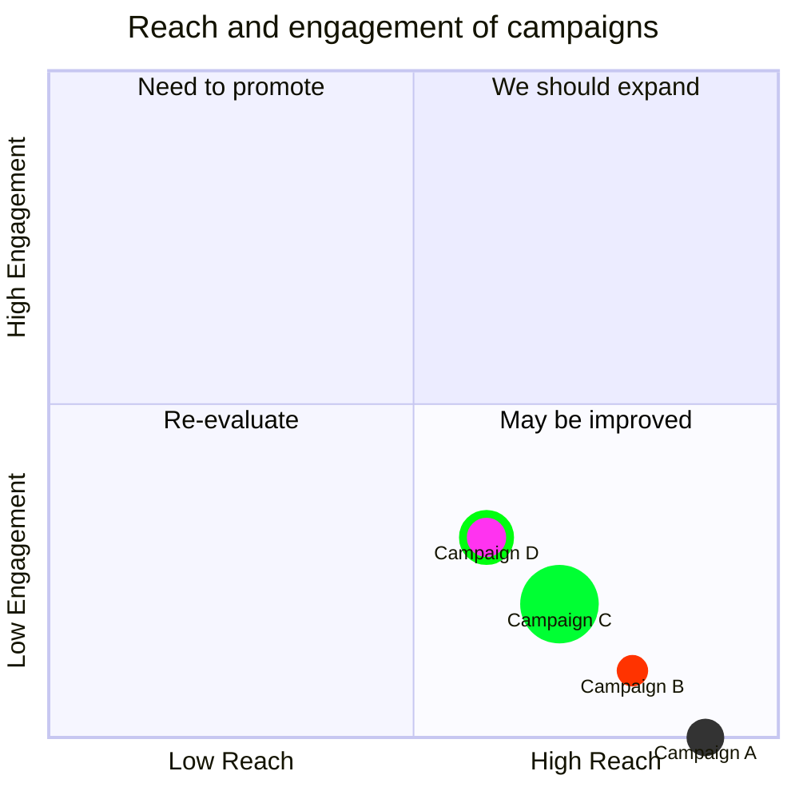
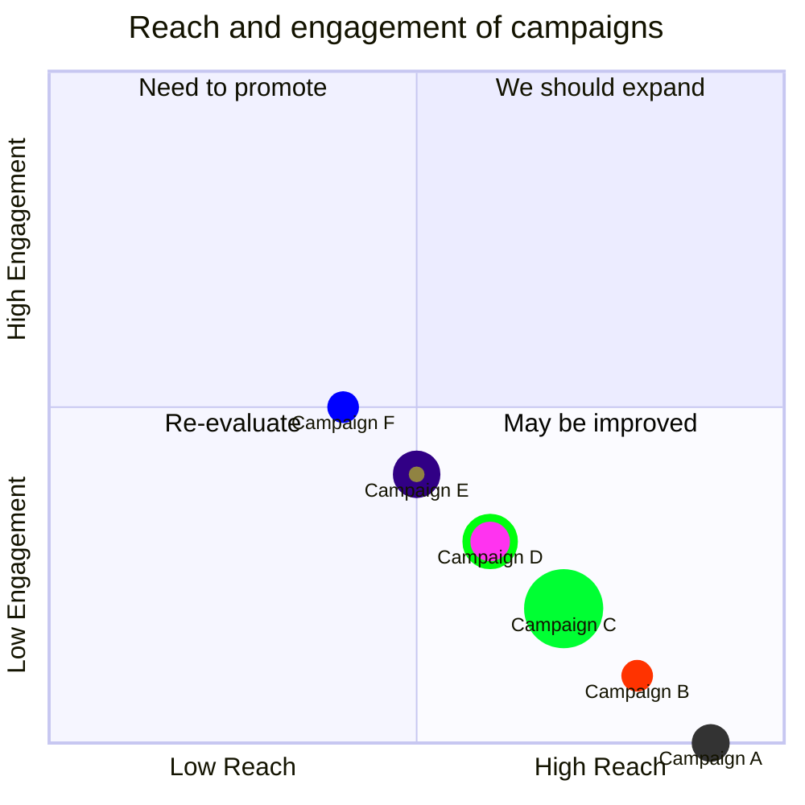
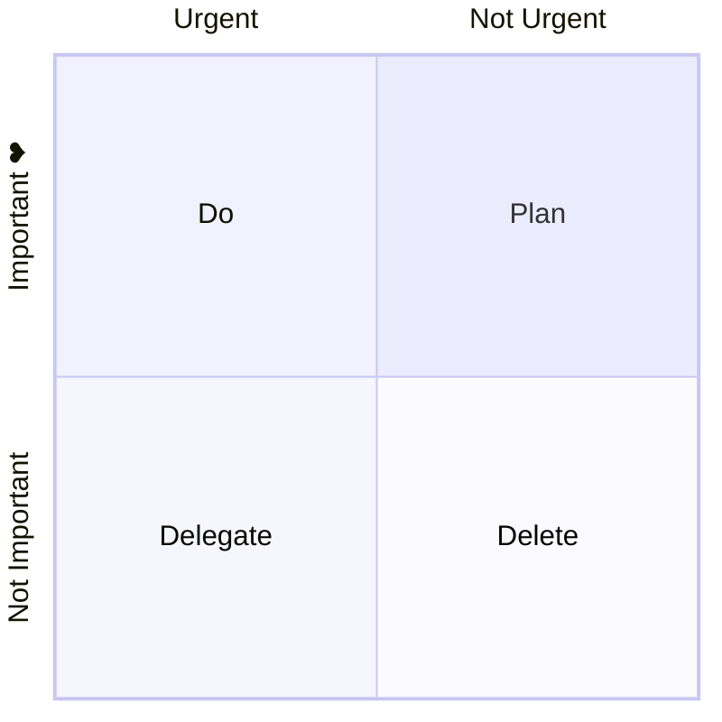
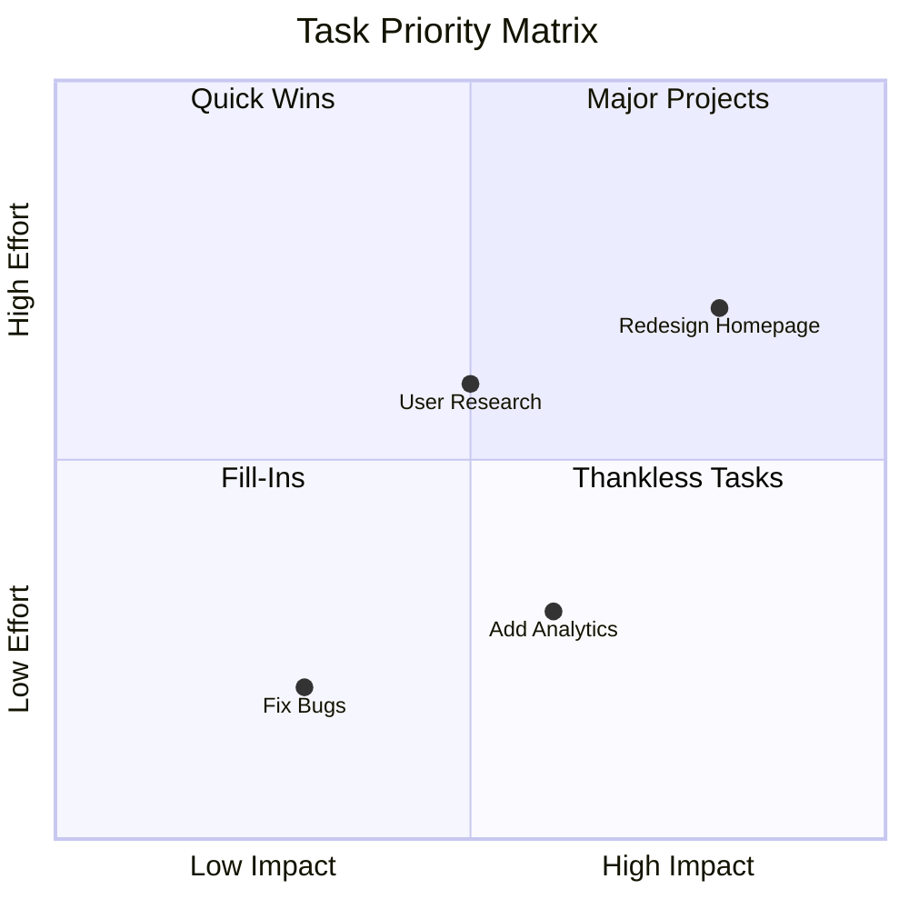
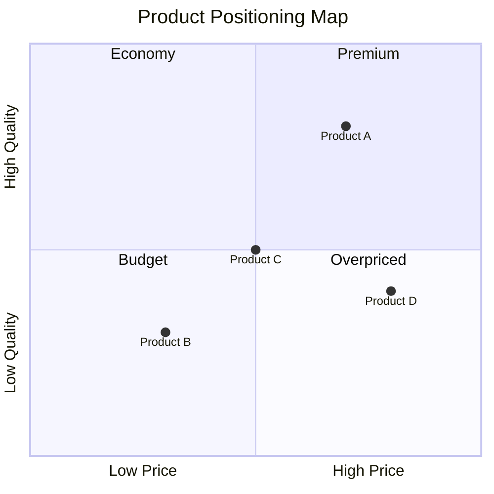

A quadrant chart is a visual representation of data divided into four quadrants. It plots data points on a two-dimensional grid to identify patterns, trends, and prioritize actions.

## Basic example



<Note>
Point values (x and y) must be in the range 0 to 1.
</Note>

## Syntax

### Title

Add a title to describe the chart:

```
quadrantChart
    title This is a sample example
```

### X-axis

Define x-axis labels:

```
x-axis Left Text --> Right Text
```

Or just the left label:

```
x-axis Left Text
```

### Y-axis

Define y-axis labels:

```
y-axis Bottom Text --> Top Text
```

Or just the bottom label:

```
y-axis Bottom Text
```

### Quadrant labels

Label each quadrant:

```
quadrant-1 Top Right Text
quadrant-2 Top Left Text
quadrant-3 Bottom Left Text
quadrant-4 Bottom Right Text
```

### Points

Plot points with x,y coordinates (0-1 range):

```
Point 1: [0.75, 0.80]
Point 2: [0.35, 0.24]
```

## Point styling

### Direct styling

Style individual points:



### Class styling

Define reusable styles:



<Accordion title="Available style properties">
| Parameter | Description |
| --------- | ----------- |
| `color` | Fill color of the point |
| `radius` | Radius of the point |
| `stroke-width` | Border width of the point |
| `stroke-color` | Border color of the point |
</Accordion>

<Tip>
Style precedence order:
1. Direct styles
2. Class styles
3. Theme styles
</Tip>

## Configuration

Customize chart appearance:



<Accordion title="Chart configuration options">
| Parameter | Description | Default |
| --------- | ----------- | ------- |
| `chartWidth` | Width of the chart | 500 |
| `chartHeight` | Height of the chart | 500 |
| `titlePadding` | Top and bottom padding of title | 10 |
| `titleFontSize` | Title font size | 20 |
| `quadrantPadding` | Padding outside quadrants | 5 |
| `quadrantLabelFontSize` | Quadrant text font size | 16 |
| `quadrantInternalBorderStrokeWidth` | Internal border width | 1 |
| `quadrantExternalBorderStrokeWidth` | External border width | 2 |
| `xAxisLabelFontSize` | X-axis text font size | 16 |
| `xAxisLabelPadding` | X-axis text padding | 5 |
| `yAxisLabelFontSize` | Y-axis text font size | 16 |
| `yAxisLabelPadding` | Y-axis text padding | 5 |
| `pointTextPadding` | Padding between point and text | 5 |
| `pointLabelFontSize` | Point text font size | 12 |
| `pointRadius` | Default point radius | 5 |
</Accordion>

<Accordion title="Theme variables">
| Variable | Description |
| -------- | ----------- |
| `quadrant1Fill` | Top right quadrant fill color |
| `quadrant2Fill` | Top left quadrant fill color |
| `quadrant3Fill` | Bottom left quadrant fill color |
| `quadrant4Fill` | Bottom right quadrant fill color |
| `quadrant1TextFill` | Top right quadrant text color |
| `quadrant2TextFill` | Top left quadrant text color |
| `quadrant3TextFill` | Bottom left quadrant text color |
| `quadrant4TextFill` | Bottom right quadrant text color |
| `quadrantPointFill` | Points fill color |
| `quadrantPointTextFill` | Points text color |
| `quadrantXAxisTextFill` | X-axis text color |
| `quadrantYAxisTextFill` | Y-axis text color |
| `quadrantInternalBorderStrokeFill` | Internal border color |
| `quadrantExternalBorderStrokeFill` | External border color |
| `quadrantTitleFill` | Title color |
</Accordion>

## Examples

### Priority matrix



### Product positioning


