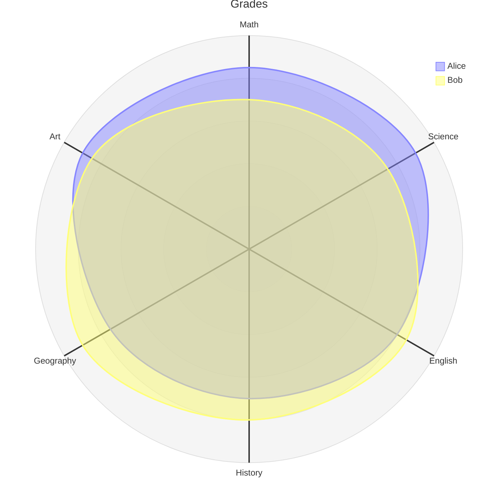
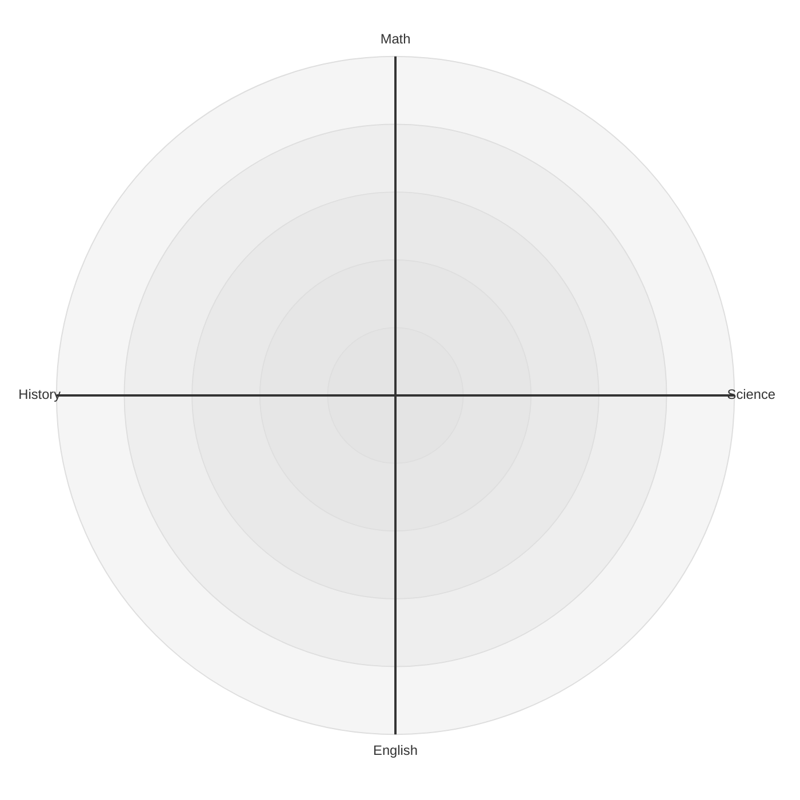
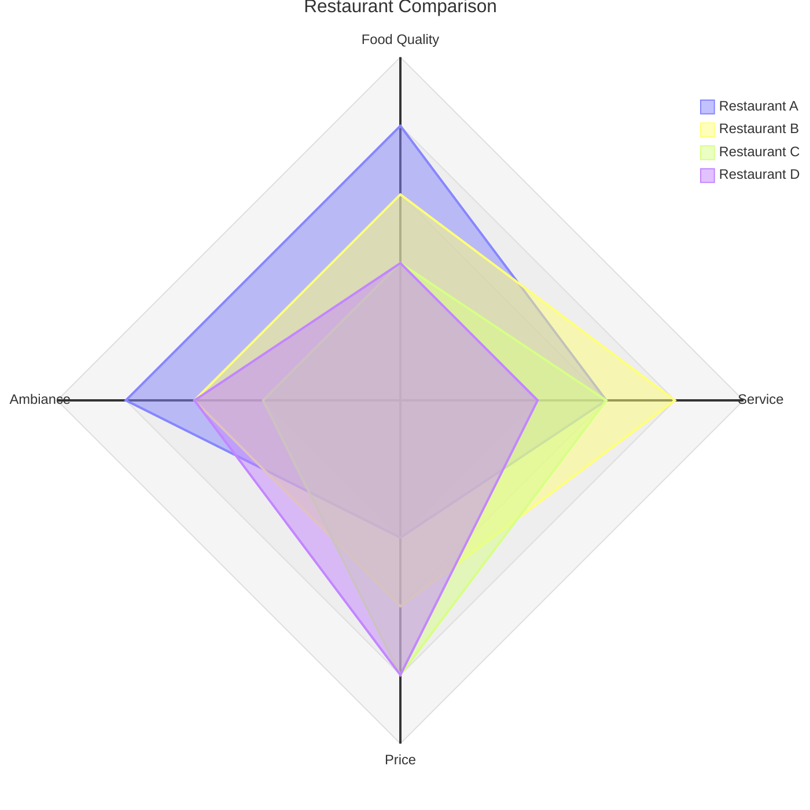
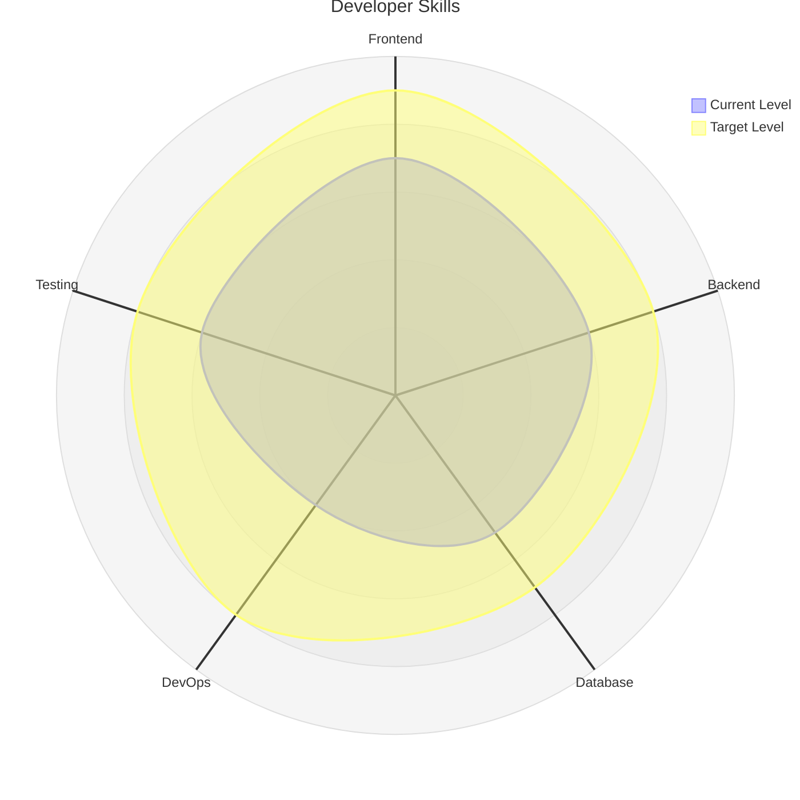
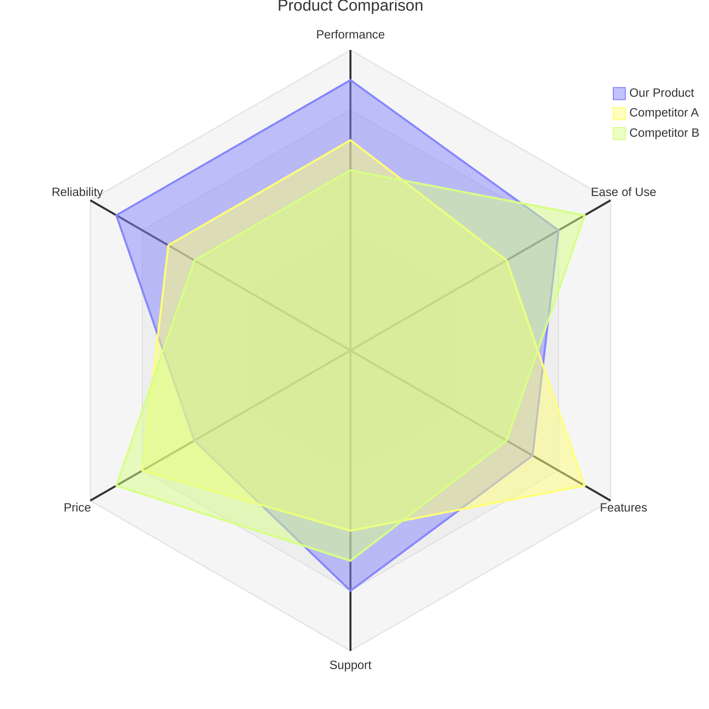
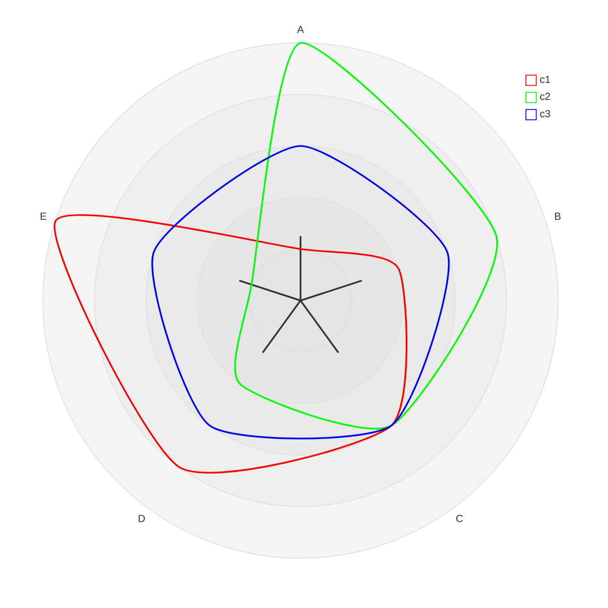
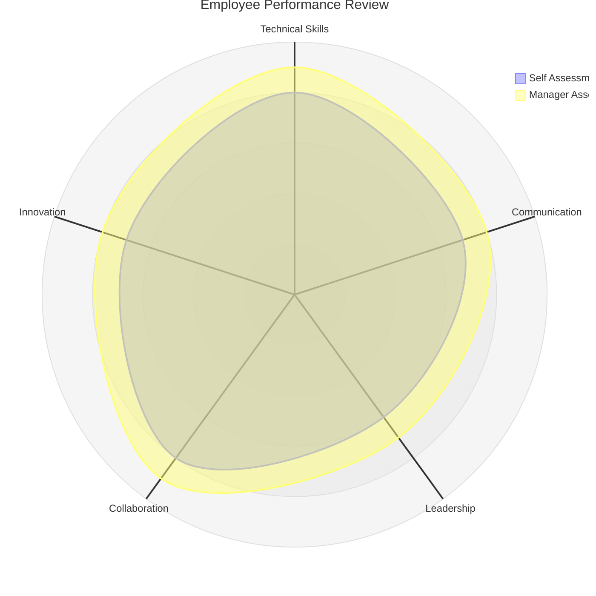
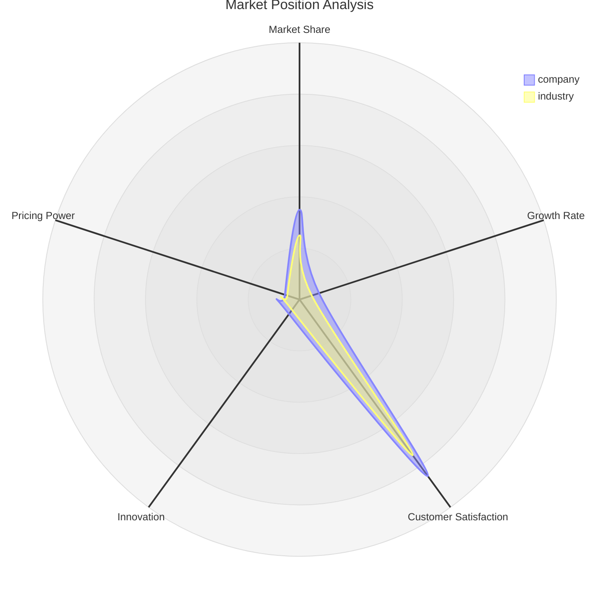

Radar diagrams (also known as radar charts, spider charts, star charts, cobweb charts, polar charts, or Kiviat diagrams) provide a simple way to plot low-dimensional data in a circular format. They are commonly used to graphically summarize and compare the performance of multiple entities across multiple dimensions.

<Note>
Radar diagrams are available in Mermaid v11.6.0+. Use the `radar-beta` keyword.
</Note>

## When to use radar charts

Radar charts are particularly useful for:

- Comparing multiple entities across several dimensions
- Displaying performance metrics
- Showing skill assessments
- Visualizing survey results
- Comparing product features
- Analyzing competitive positioning

## Basic radar chart

This example compares student grades across multiple subjects:



## Syntax overview

### Basic structure

```
radar-beta
  axis A, B, C, D, E
  curve c1{1,2,3,4,5}
  curve c2{5,4,3,2,1}
```

### Title

Add a title using the `title` keyword:

```
radar-beta
  title Title of the Radar Diagram
  ...
```

## Defining axes

Axes represent the dimensions being measured. Each axis needs an ID and optional label:

### Single axis per line

```
radar-beta
  axis id1["Label1"]
  axis id2["Label2"]
```

### Multiple axes per line

```
radar-beta
  axis id1["Label1"], id2["Label2"], id3["Label3"]
```

**Example:**



## Defining curves

Curves represent the data for each entity being compared:

### Positional values

Values correspond to axes in the order they were defined:

```
radar-beta
  axis axis1, axis2, axis3
  curve id1["Label1"]{1, 2, 3}
  curve id2["Label2"]{4, 5, 6}
```

### Key-value pairs

Explicitly map values to specific axes:

```
radar-beta
  axis axis1, axis2, axis3
  curve id4{ axis3: 30, axis1: 20, axis2: 10 }
```

### Multiple curves per line

```
radar-beta
  axis A, B, C
  curve id1{1, 2, 3}, id2{3, 2, 1}
```

## Configuration options

<Accordion title="Display options">

### Show legend

```
radar-beta
  ...
  showLegend true
```

The legend is shown by default.

### Min and max values

```
radar-beta
  ...
  max 100
  min 0
```

If not provided, max is calculated from data and min defaults to 0.

### Graticule type

```
radar-beta
  ...
  graticule polygon
```

Options: `circle` (default) or `polygon`

### Ticks

```
radar-beta
  ...
  ticks 5
```

Number of concentric circles/polygons. Default is 5.

</Accordion>

## Complete examples

### Restaurant comparison



### Skills assessment



### Product features



## Advanced configuration

<Accordion title="Configuration parameters">

| Parameter       | Description                      | Default |
| --------------- | -------------------------------- | ------- |
| width           | Width of the radar diagram       | 600     |
| height          | Height of the radar diagram      | 600     |
| marginTop       | Top margin                       | 50      |
| marginBottom    | Bottom margin                    | 50      |
| marginLeft      | Left margin                      | 50      |
| marginRight     | Right margin                     | 50      |
| axisScaleFactor | Scale factor for the axis        | 1       |
| axisLabelFactor | Axis label position adjustment   | 1.05    |
| curveTension    | Tension for rounded curves       | 0.17    |

Configure using frontmatter:

```yaml
---
config:
  radar:
    axisScaleFactor: 0.25
    curveTension: 0.1
---
```

</Accordion>

## Theme customization

<Accordion title="Theme variables">

### Global variables

```yaml
---
config:
  themeVariables:
    cScale0: "#FF0000"
    cScale1: "#00FF00"
    cScale2: "#0000FF"
---
```

Radar charts support `cScale${i}` where `i` is 0 to max colors (usually 12).

### Radar-specific variables

```yaml
---
config:
  themeVariables:
    radar:
      axisColor: "#FF0000"
      curveOpacity: 0.5
---
```

| Property             | Description              | Default |
| -------------------- | ------------------------ | ------- |
| axisColor            | Color of axis lines      | black   |
| axisStrokeWidth      | Width of axis lines      | 1       |
| axisLabelFontSize    | Font size of axis labels | 12px    |
| curveOpacity         | Opacity of curves        | 0.7     |
| curveStrokeWidth     | Width of curves          | 2       |
| graticuleColor       | Color of graticule       | black   |
| graticuleOpacity     | Opacity of graticule     | 0.5     |
| graticuleStrokeWidth | Width of graticule       | 1       |
| legendBoxSize        | Size of legend box       | 10      |
| legendFontSize       | Font size of legend      | 14px    |

</Accordion>

### Styled example



## Best practices

<Tip>
For effective radar charts:
- Use 3-8 axes (too few or too many reduces clarity)
- Keep scales consistent across axes
- Use polygon graticule for angular data
- Limit to 3-5 curves for readability
- Ensure all values are non-negative
- Order axes logically (related dimensions together)
</Tip>

## Common use cases

### Performance reviews



### Market analysis



<Note>
Radar charts are most effective when comparing entities with similar characteristics across the same set of dimensions. They work best with normalized or similarly-scaled data.
</Note>