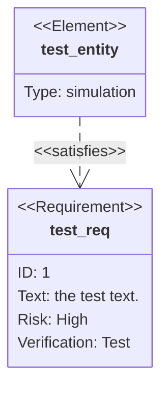
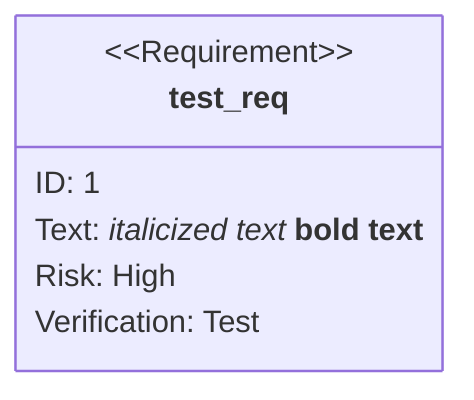
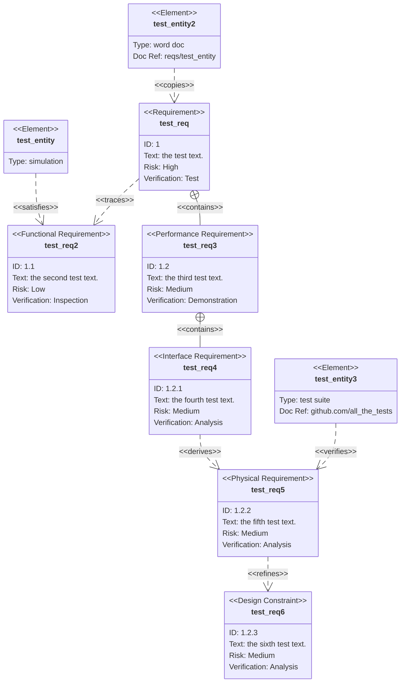
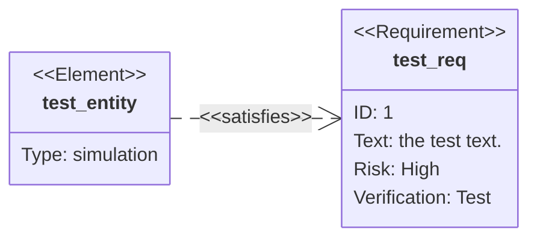
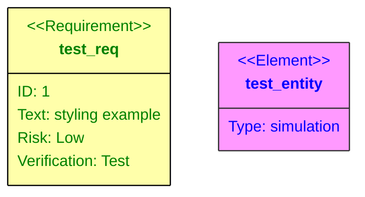
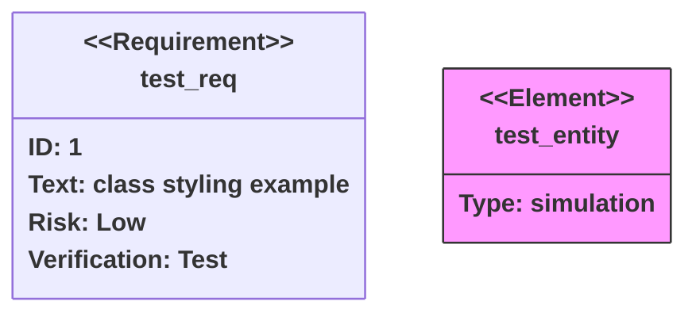

Requirement diagrams provide a visualization for requirements and their connections to each other and other documented elements. The modeling specs follow those defined by SysML v1.6.

## Basic example

Rendering requirements is straightforward:



## Syntax overview

There are three types of components to a requirement diagram: requirement, element, and relationship.

### Requirements

A requirement definition contains a requirement type, name, id, text, risk, and verification method:

```
<type> user_defined_name {
    id: user_defined_id
    text: user_defined text
    risk: <risk>
    verifymethod: <method>
}
```

**Available options:**

| Keyword | Options |
| --- | --- |
| Type | requirement, functionalRequirement, interfaceRequirement, performanceRequirement, physicalRequirement, designConstraint |
| Risk | Low, Medium, High |
| VerificationMethod | Analysis, Inspection, Test, Demonstration |

### Elements

An element definition contains an element name, type, and document reference:

```
element user_defined_name {
    type: user_defined_type
    docref: user_defined_ref
}
```

### Relationships

Relationships connect source and destination nodes:

```
{name of source} - <type> -> {name of destination}
```

or

```
{name of destination} <- <type> - {name of source}
```

**Relationship types:** contains, copies, derives, satisfies, verifies, refines, traces

## Markdown formatting

You can use markdown formatting in text fields by surrounding the text in quotes:



## Complete example

This example demonstrates all requirement types and relationship options:



## Direction

The diagram can be rendered in different directions:



**Valid directions:** TB (top to bottom), BT (bottom to top), LR (left to right), RL (right to left)

## Styling

<Accordion title="Direct styling">

Use the `style` keyword to apply CSS styles directly:



</Accordion>

<Accordion title="Class definitions">

Define reusable styles using `classDef` and apply them with the `class` keyword or `:::` syntax:



</Accordion>

<Note>
A class named `default` will be applied to all nodes. Specific styles should be defined afterwards to override the default styling.
</Note>