A sequence diagram is an interaction diagram that shows how processes operate with one another and in what order.

## Basic example

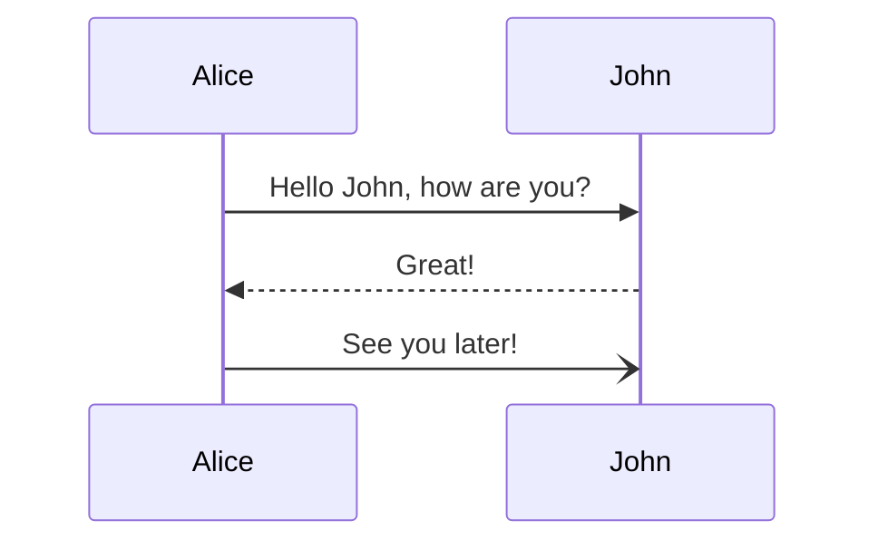
```mermaid
sequenceDiagram
    Alice->>John: Hello John, how are you?
    John-->>Alice: Great!
    Alice-)John: See you later!
```

<Note>
If you use the word "end" in a node, enclose it in parentheses `()`, quotation marks `""`, or brackets `{}`, `[]`.
</Note>

## Participants

Participants can be defined explicitly to control their order of appearance:

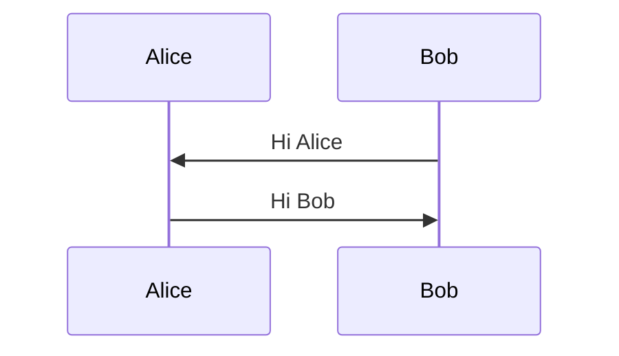
```mermaid
sequenceDiagram
    participant Alice
    participant Bob
    Bob->>Alice: Hi Alice
    Alice->>Bob: Hi Bob
```

### Actors

Use actor symbols instead of rectangles:

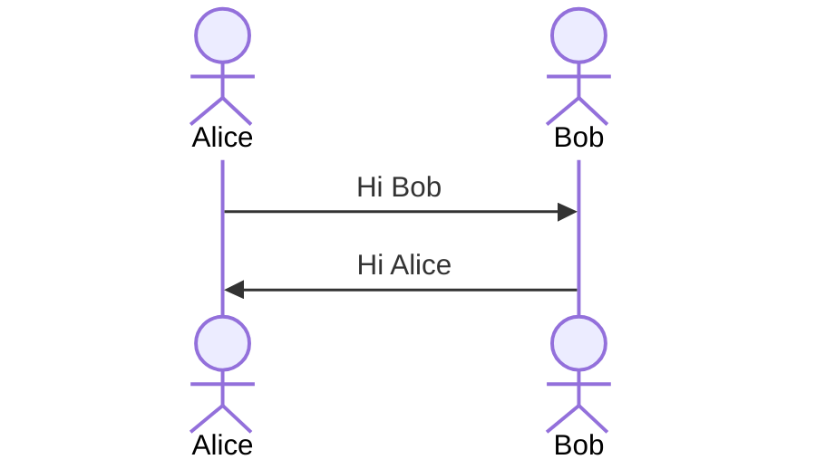
```mermaid
sequenceDiagram
    actor Alice
    actor Bob
    Alice->>Bob: Hi Bob
    Bob->>Alice: Hi Alice
```

### Participant types

You can specify different participant types using JSON configuration:

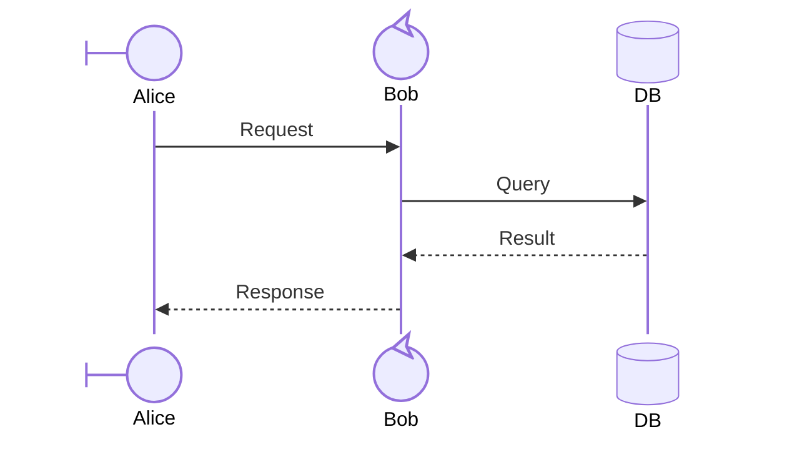
```mermaid
sequenceDiagram
    participant Alice@{ "type" : "boundary" }
    participant Bob@{ "type" : "control" }
    participant DB@{ "type" : "database" }
    Alice->>Bob: Request
    Bob->>DB: Query
    DB-->>Bob: Result
    Bob-->>Alice: Response
```

<Accordion title="Available participant types">
- `boundary` - Boundary symbol
- `control` - Control symbol
- `entity` - Entity symbol
- `database` - Database symbol
- `collections` - Collections symbol
- `queue` - Queue symbol
</Accordion>

### Aliases

Define aliases for convenient identifiers:

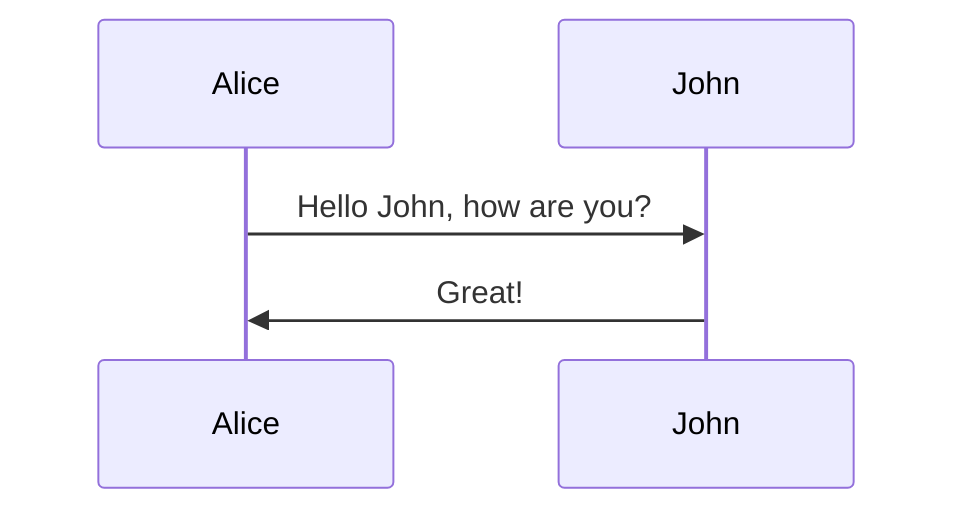
```mermaid
sequenceDiagram
    participant A as Alice
    participant J as John
    A->>J: Hello John, how are you?
    J->>A: Great!
```

You can also define aliases inline:

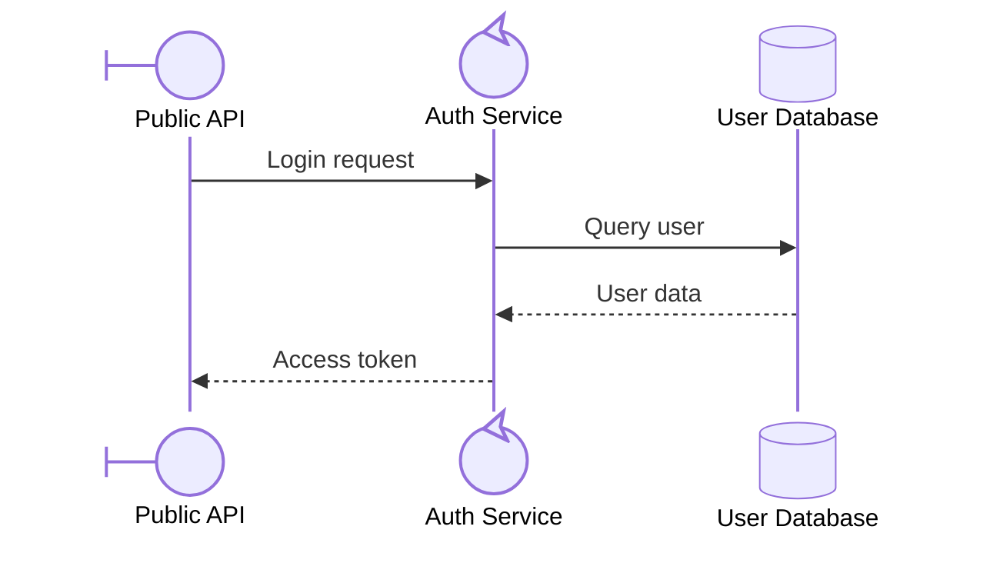
```mermaid
sequenceDiagram
    participant API@{ "type": "boundary", "alias": "Public API" }
    participant Auth@{ "type": "control", "alias": "Auth Service" }
    participant DB@{ "type": "database", "alias": "User Database" }
    API->>Auth: Login request
    Auth->>DB: Query user
    DB-->>Auth: User data
    Auth-->>API: Access token
```

## Messages

Messages can be displayed with solid or dotted lines and various arrow types:

### Arrow types

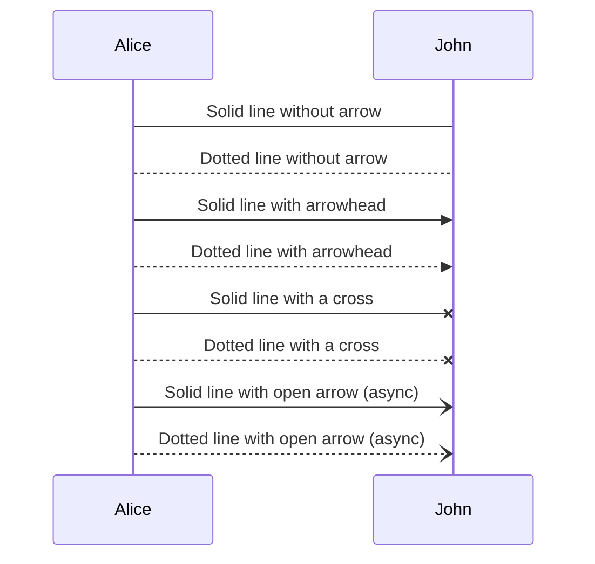
```mermaid
sequenceDiagram
    Alice->John: Solid line without arrow
    Alice-->John: Dotted line without arrow
    Alice->>John: Solid line with arrowhead
    Alice-->>John: Dotted line with arrowhead
    Alice-xJohn: Solid line with a cross
    Alice--xJohn: Dotted line with a cross
    Alice-)John: Solid line with open arrow (async)
    Alice--)John: Dotted line with open arrow (async)
```

### Bidirectional arrows (v11.0.0+)

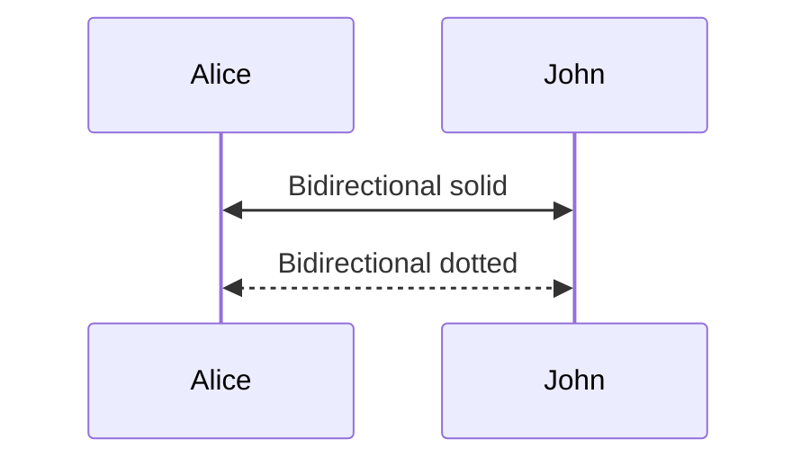
```mermaid
sequenceDiagram
    Alice<<->>John: Bidirectional solid
    Alice<<-->>John: Bidirectional dotted
```

## Activations

Activate and deactivate actors:

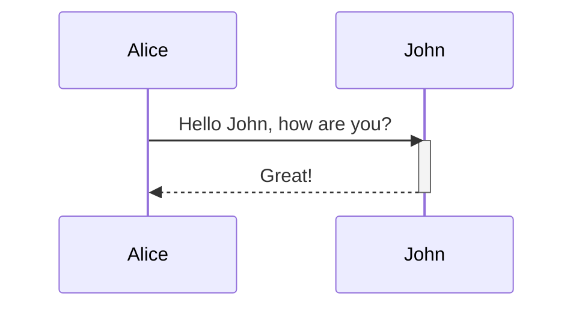
```mermaid
sequenceDiagram
    Alice->>John: Hello John, how are you?
    activate John
    John-->>Alice: Great!
    deactivate John
```

Shortcut notation:

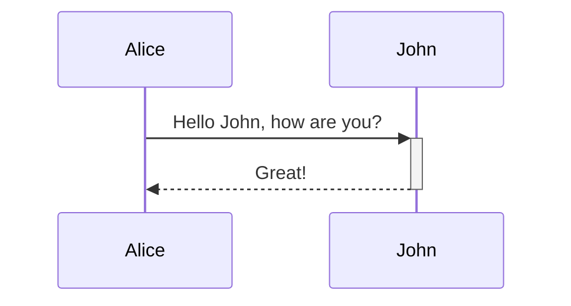
```mermaid
sequenceDiagram
    Alice->>+John: Hello John, how are you?
    John-->>-Alice: Great!
```

Activations can be stacked:

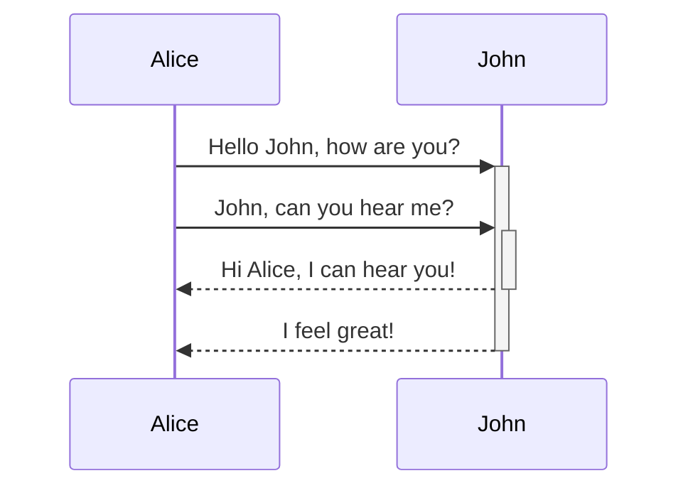
```mermaid
sequenceDiagram
    Alice->>+John: Hello John, how are you?
    Alice->>+John: John, can you hear me?
    John-->>-Alice: Hi Alice, I can hear you!
    John-->>-Alice: I feel great!
```

## Notes

Add notes to your diagram:

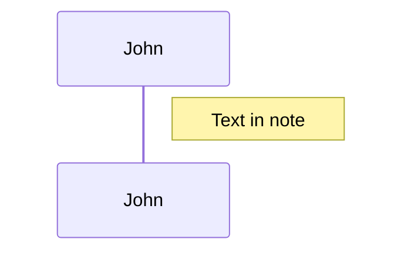
```mermaid
sequenceDiagram
    participant John
    Note right of John: Text in note
```

Notes spanning two participants:

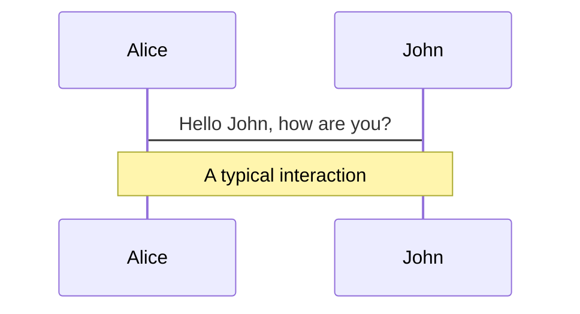
```mermaid
sequenceDiagram
    Alice->John: Hello John, how are you?
    Note over Alice,John: A typical interaction
```

## Loops

Express loops in a sequence diagram:

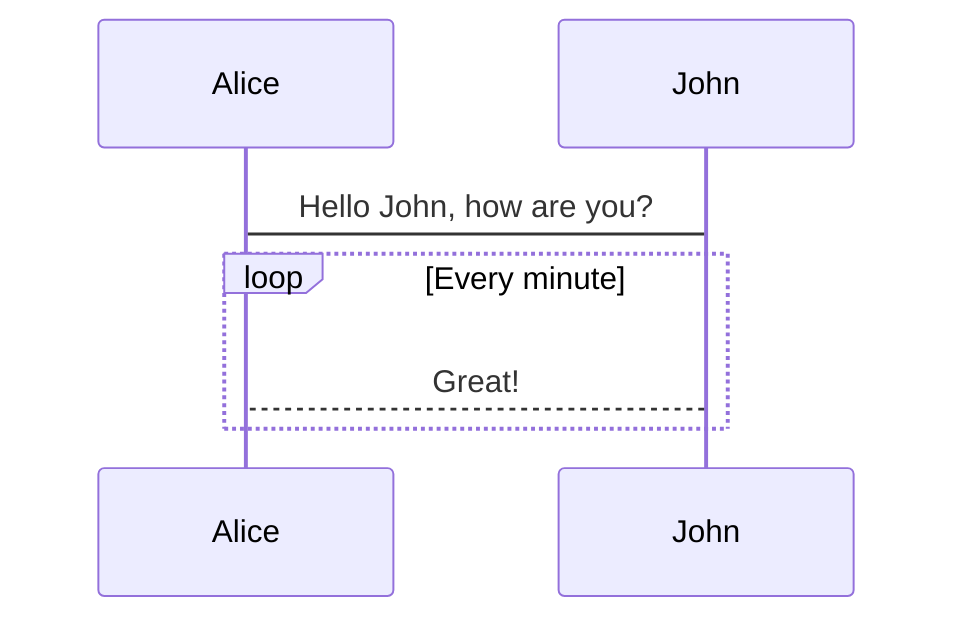
```mermaid
sequenceDiagram
    Alice->John: Hello John, how are you?
    loop Every minute
        John-->Alice: Great!
    end
```

## Alt (alternative paths)

Express alternative paths:

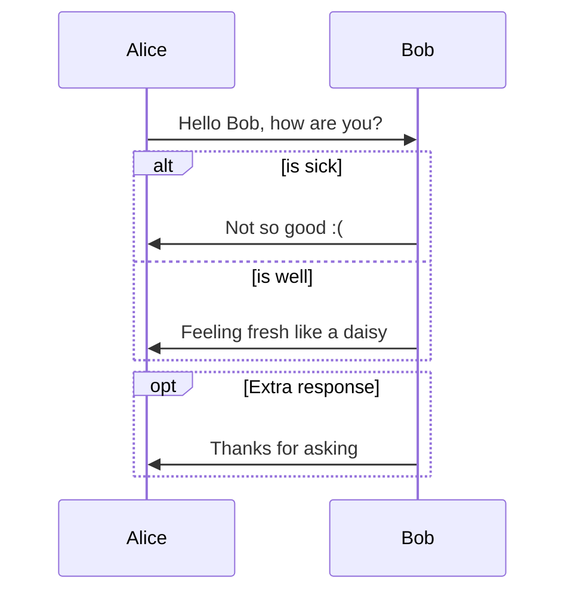
```mermaid
sequenceDiagram
    Alice->>Bob: Hello Bob, how are you?
    alt is sick
        Bob->>Alice: Not so good :(
    else is well
        Bob->>Alice: Feeling fresh like a daisy
    end
    opt Extra response
        Bob->>Alice: Thanks for asking
    end
```

## Parallel

Show actions happening in parallel:

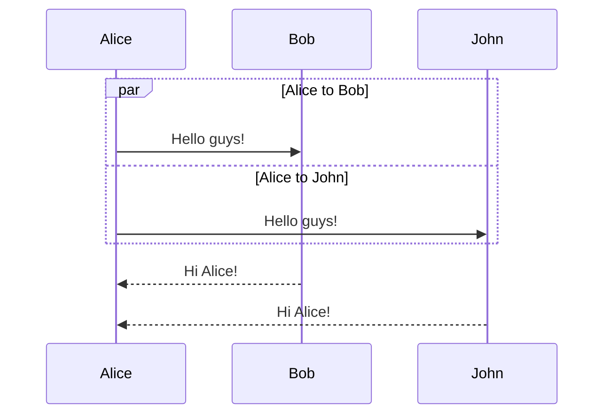
```mermaid
sequenceDiagram
    par Alice to Bob
        Alice->>Bob: Hello guys!
    and Alice to John
        Alice->>John: Hello guys!
    end
    Bob-->>Alice: Hi Alice!
    John-->>Alice: Hi Alice!
```

## Critical region

Show actions that must happen automatically:

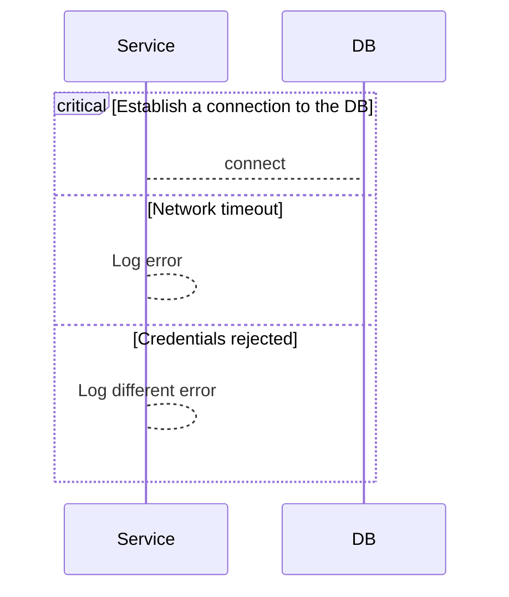
```mermaid
sequenceDiagram
    critical Establish a connection to the DB
        Service-->DB: connect
    option Network timeout
        Service-->Service: Log error
    option Credentials rejected
        Service-->Service: Log different error
    end
```

## Break

Indicate a stop in the sequence flow:

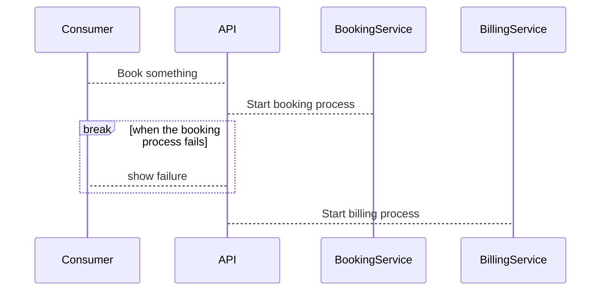
```mermaid
sequenceDiagram
    Consumer-->API: Book something
    API-->BookingService: Start booking process
    break when the booking process fails
        API-->Consumer: show failure
    end
    API-->BillingService: Start billing process
```

## Background highlighting

Highlight flows with colored backgrounds:

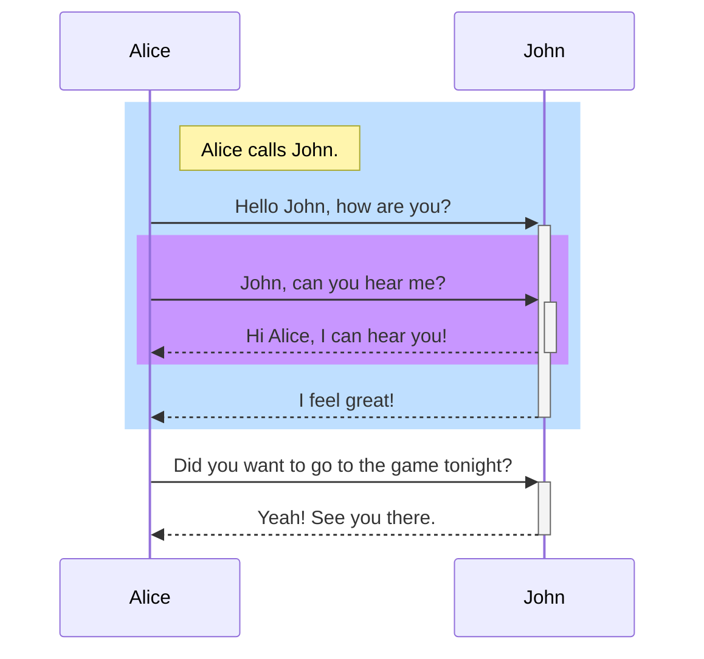
```mermaid
sequenceDiagram
    participant Alice
    participant John

    rect rgb(191, 223, 255)
    note right of Alice: Alice calls John.
    Alice->>+John: Hello John, how are you?
    rect rgb(200, 150, 255)
    Alice->>+John: John, can you hear me?
    John-->>-Alice: Hi Alice, I can hear you!
    end
    John-->>-Alice: I feel great!
    end
    Alice ->>+ John: Did you want to go to the game tonight?
    John -->>- Alice: Yeah! See you there.
```

## Grouping with boxes

Group actors in colored boxes:

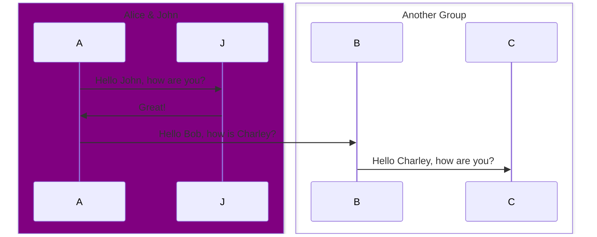
```mermaid
sequenceDiagram
    box Purple Alice & John
    participant A
    participant J
    end
    box Another Group
    participant B
    participant C
    end
    A->>J: Hello John, how are you?
    J->>A: Great!
    A->>B: Hello Bob, how is Charley?
    B->>C: Hello Charley, how are you?
```

## Sequence numbers

Add sequence numbers to arrows:

```mermaid
sequenceDiagram
    autonumber
    Alice->>John: Hello John, how are you?
    loop HealthCheck
        John->>John: Fight against hypochondria
    end
    Note right of John: Rational thoughts!
    John-->>Alice: Great!
    John->>Bob: How about you?
    Bob-->>John: Jolly good!
```

## Actor menus

Add popup menus with links to actors:

```mermaid
sequenceDiagram
    participant Alice
    participant John
    link Alice: Dashboard @ https://dashboard.contoso.com/alice
    link Alice: Wiki @ https://wiki.contoso.com/alice
    link John: Dashboard @ https://dashboard.contoso.com/john
    link John: Wiki @ https://wiki.contoso.com/john
    Alice->>John: Hello John, how are you?
    John-->>Alice: Great!
    Alice-)John: See you later!
```

## Comments

Add comments with `%%`:

```mermaid
sequenceDiagram
    Alice->>John: Hello John, how are you?
    %% this is a comment
    John-->>Alice: Great!
```

## Entity codes

Escape special characters:

```mermaid
sequenceDiagram
    A->>B: I #9829; you!
    B->>A: I #9829; you #infin; times more!
```
