A state diagram describes the behavior of systems composed of a finite number of states. State diagrams show how one state can change to another state via a transition.

## Basic example

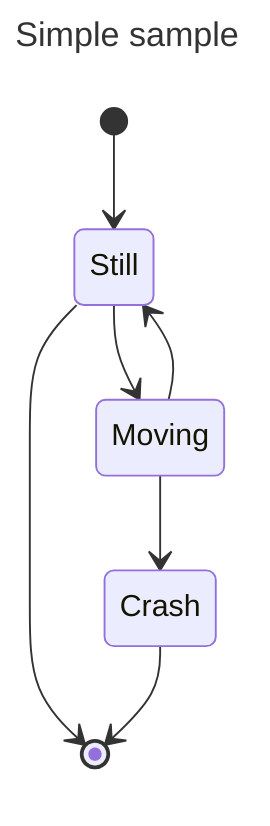

<Note>
Use `stateDiagram-v2` for the current renderer. The older `stateDiagram` syntax is also supported.
</Note>

## States

States can be declared in multiple ways:

### Simple state

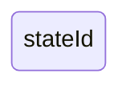

### State with description

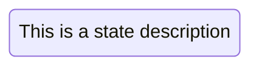

Or using colon notation:

## Transitions

Transitions are represented using `-->`:

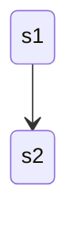

### Transitions with text

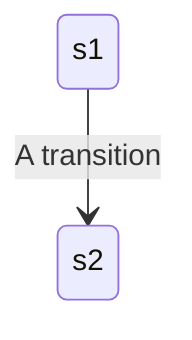

## Start and end

Use `[*]` to indicate start and stop states:

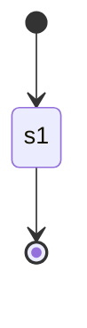

## Composite states

States can contain internal states:

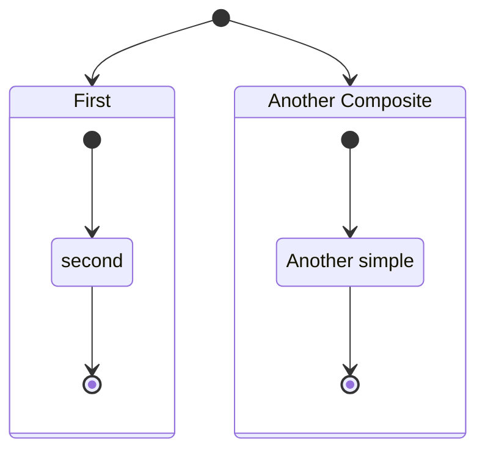

### Nested composite states

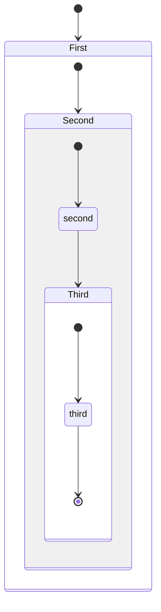

### Transitions between composite states

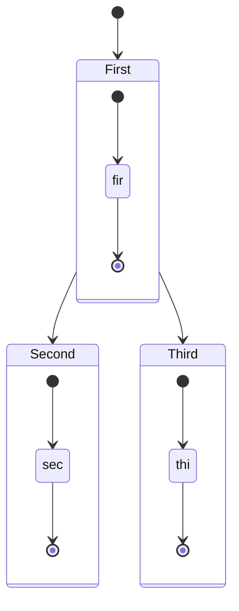

## Choice

Model choices using `<<choice>>`:

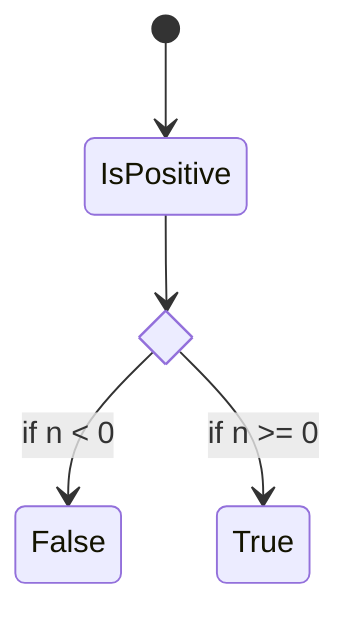

## Forks

Specify forks and joins:

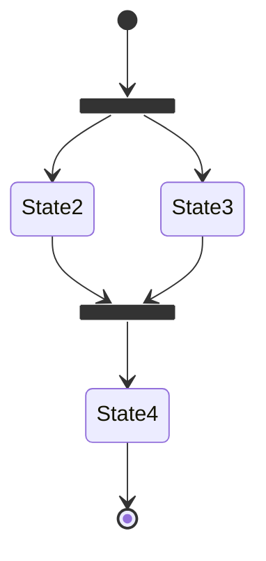

## Notes

Add notes to states:

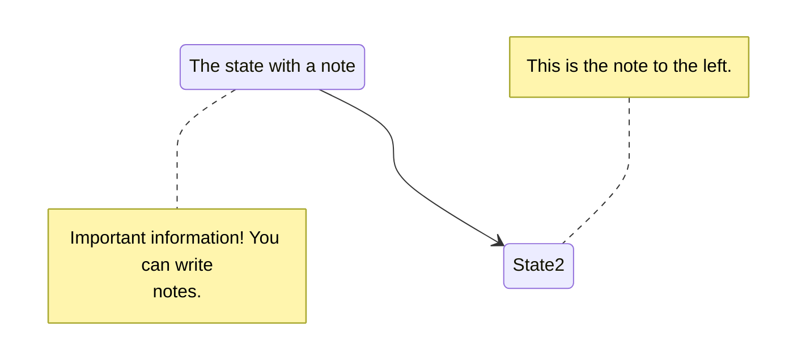

## Concurrency

Specify concurrency using `--`:

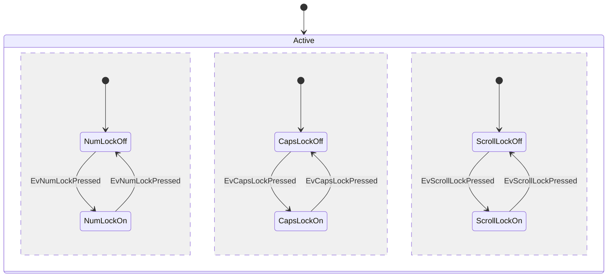

## Direction

Set the rendering direction:

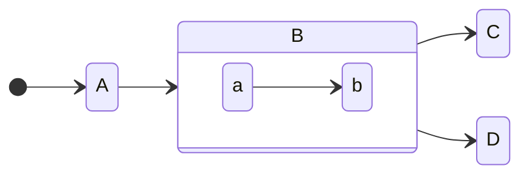

## Styling with classDefs

Apply custom styles to states:

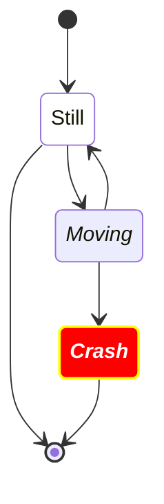

### Using the ::: operator

<Accordion title="Styling limitations">
1. Cannot be applied to start or end states
2. Cannot be applied to or within composite states

These limitations are being addressed in future versions.
</Accordion>

## Spaces in state names

Define states with IDs and reference them:

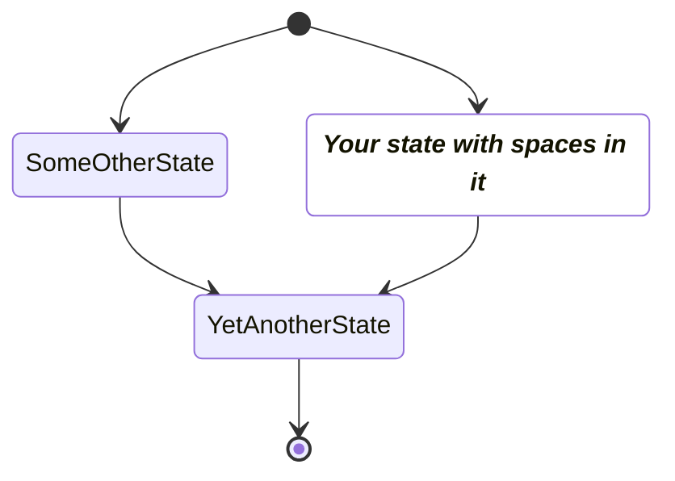

## Comments

Add comments with `%%`:

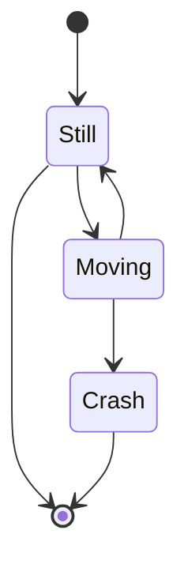
