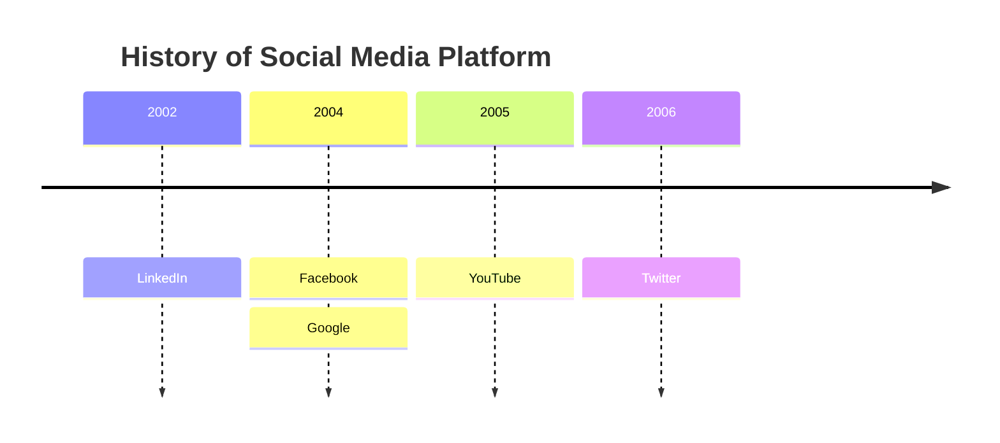
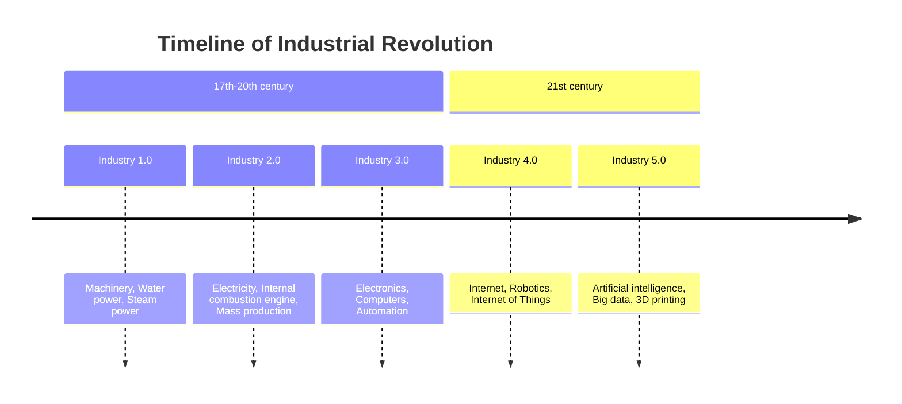
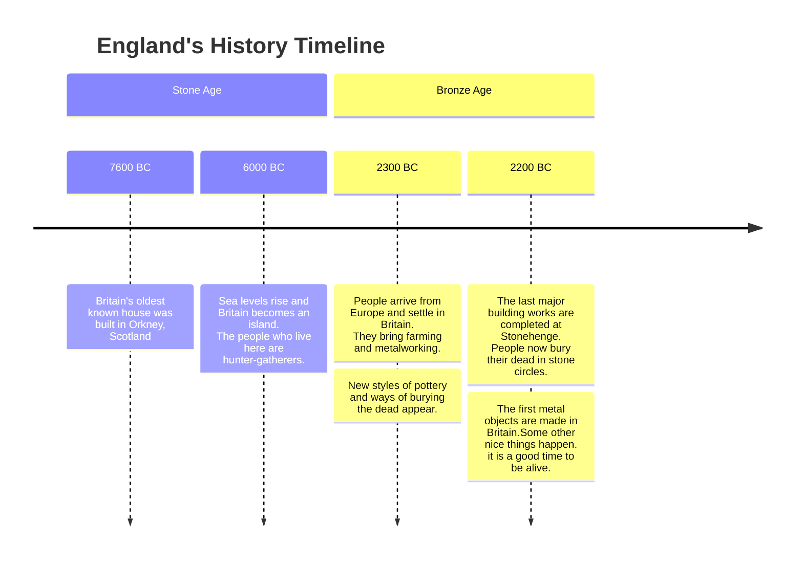
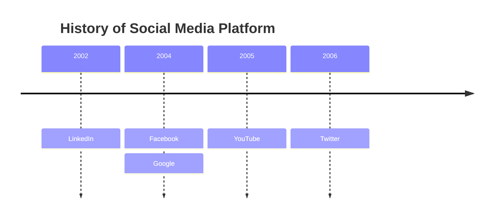
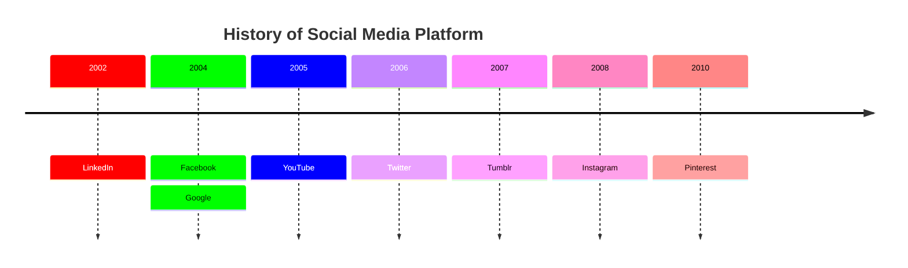
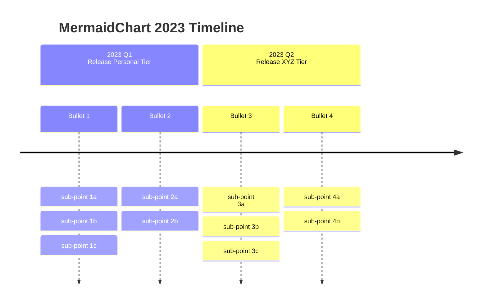

A timeline is a type of diagram used to illustrate a chronology of events, dates, or periods of time. It shows the passing of time and the relationship between events.

<Note>
Timelines are experimental. The syntax is stable except for icon integration.
</Note>

## Basic example



## Syntax overview

Timelines start with the `timeline` keyword, followed by an optional title and time periods with events:

```
timeline
    title [Title text]
    {time period} : {event}
```

### Multiple events per period

You can add multiple events to a single time period:

```
{time period} : {event} : {event}
```

or on separate lines:

```
{time period} : {event}
              : {event}
              : {event}
```

### Example


<Note>
Both time periods and events are simple text, not limited to numbers.
</Note>

## Sections and ages

Group time periods into sections using the `section` keyword:



<Tip>
All time periods and events under a section follow a similar color scheme, making relationships easier to see.
</Tip>

## Text wrapping

Long text is automatically wrapped. You can also force line breaks with `<br>`:



## Styling options

### Individual time period styling (default)

By default, each time period has its own color scheme:


### Unified color scheme

Disable multi-color with the `disableMultiColor` option:



## Customizing colors

<Accordion title="Theme variables">

Customize colors using `cScale0` to `cScale11` theme variables:



</Accordion>

<Note>
Mermaid supports up to 12 sections with unique colors. After 12 sections, the color scheme repeats.
</Note>

## Complete example

Here's a comprehensive timeline with multiple sections:



<Tip>
Use timelines to visualize project milestones, historical events, or any chronological sequence of events.
</Tip>