Treemap diagrams display hierarchical data as a set of nested rectangles. Each branch of the tree is represented by a rectangle, which is then tiled with smaller rectangles representing sub-branches. The size of each rectangle is proportional to the value it represents.

<Note>
This is a new diagram type in Mermaid. Its syntax may evolve in future versions. Use the `treemap-beta` keyword.
</Note>

## When to use treemaps

Treemap diagrams are particularly useful for:

- Visualizing hierarchical data structures
- Comparing proportions between categories
- Displaying large amounts of hierarchical data in limited space
- Identifying patterns and outliers in hierarchical data
- Showing file system disk usage
- Representing budget allocations or market shares

## Basic treemap

This example shows a simple two-level hierarchy:

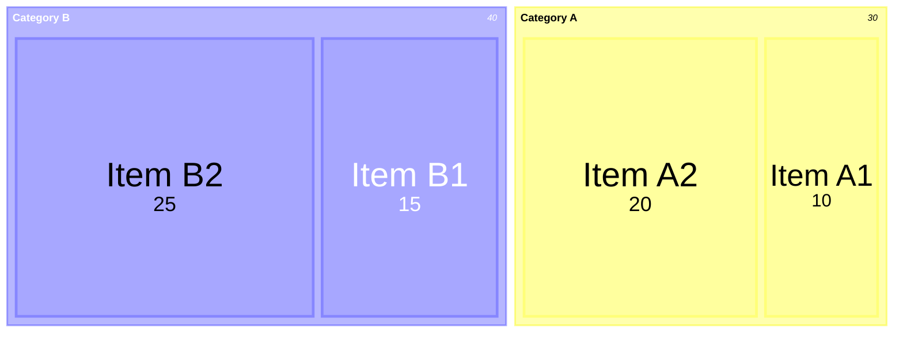

## Syntax overview

### Node definition

Treemap nodes are defined using:

- **Section/parent nodes**: Quoted text without values `"Section Name"`
- **Leaf nodes**: Quoted text with values `"Leaf Name": value`
- **Hierarchy**: Created using indentation (spaces or tabs)

### Basic structure

```
treemap-beta
"Section 1"
    "Leaf 1.1": 12
    "Section 1.2"
      "Leaf 1.2.1": 12
"Section 2"
    "Leaf 2.1": 20
    "Leaf 2.2": 25
```

## Hierarchical example

This example shows a product hierarchy with multiple levels:

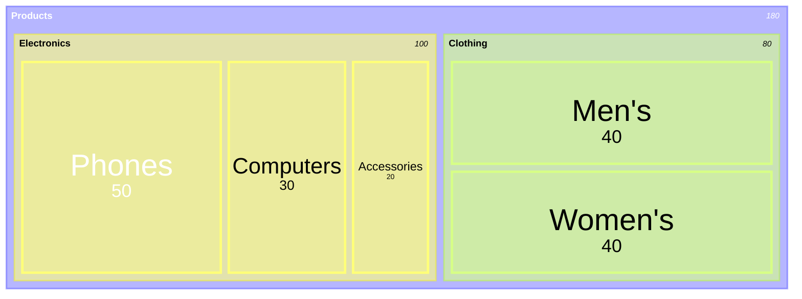

## Styling nodes

Use the `:::class` syntax to apply custom styles:

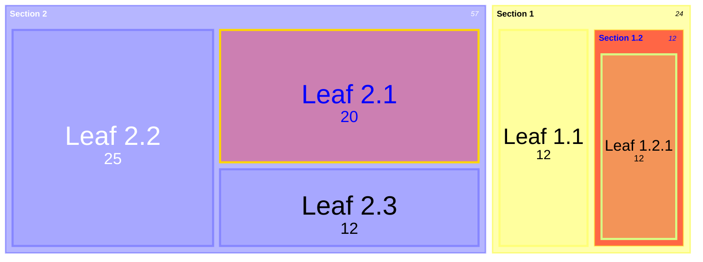

## Using classDef

Define custom styles with the `classDef` syntax:

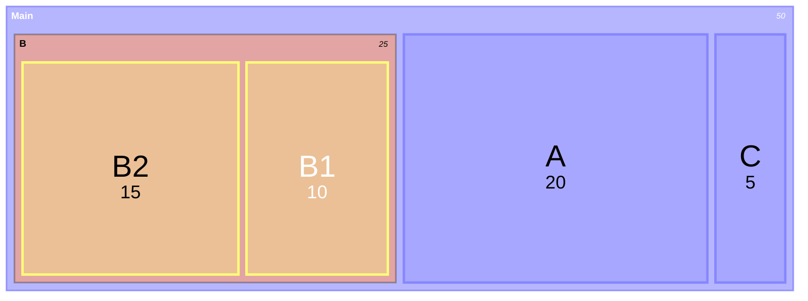

## Theme configuration

Customize colors using theme settings:

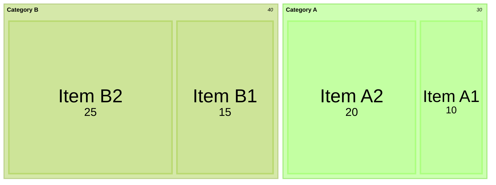

## Diagram padding

Adjust spacing around the diagram:

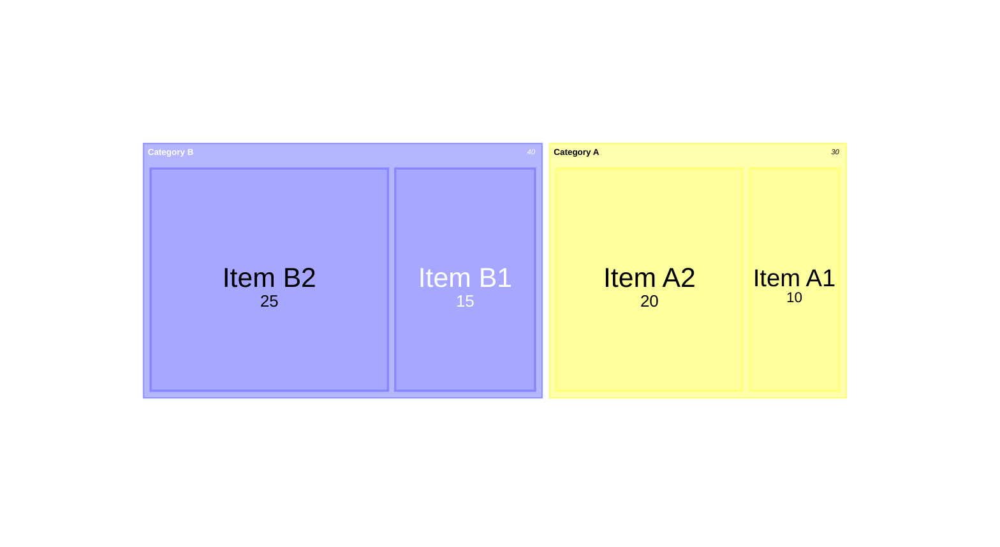

## Value formatting

<Accordion title="Formatting options">

Values can be formatted using D3's format specifiers:

- `,` - Thousands separator (default)
- `$` - Dollar sign
- `.1f` - One decimal place
- `.1%` - Percentage with one decimal
- `$0,0` - Dollar sign with thousands separator
- `$.2f` - Dollar sign with 2 decimals
- `$,.2f` - Dollar sign with thousands separator and 2 decimals

</Accordion>

### Currency formatting

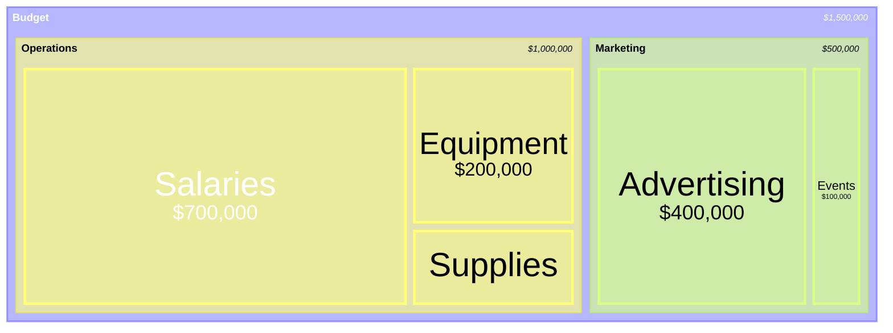

### Percentage formatting

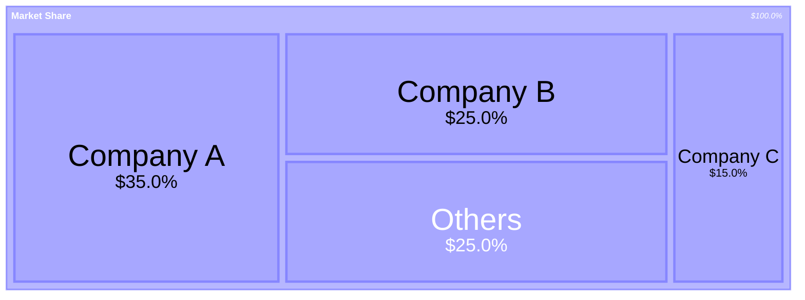

## Configuration options

<Accordion title="Available configuration options">

| Option         | Description                                     | Default |
| -------------- | ----------------------------------------------- | ------- |
| useMaxWidth    | Scale diagram to 100% width                     | true    |
| padding        | Internal padding between nodes                  | 10      |
| diagramPadding | Padding around the entire diagram               | 8       |
| showValues     | Whether to show values in the treemap           | true    |
| nodeWidth      | Width of nodes                                  | 100     |
| nodeHeight     | Height of nodes                                 | 40      |
| borderWidth    | Width of borders                                | 1       |
| valueFontSize  | Font size for values                            | 12      |
| labelFontSize  | Font size for labels                            | 14      |
| valueFormat    | Format for values (D3 format specifiers)        | ','     |

</Accordion>

## Common use cases

### Financial data visualization

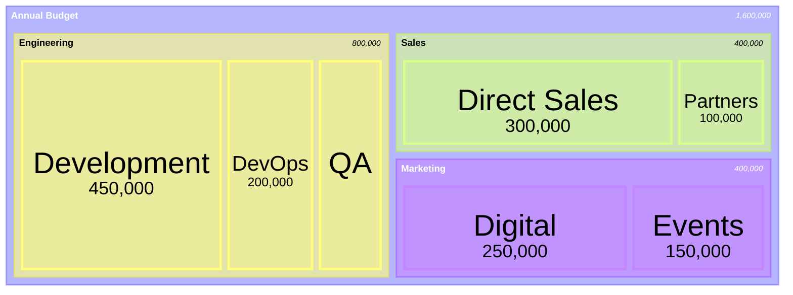

### File system analysis

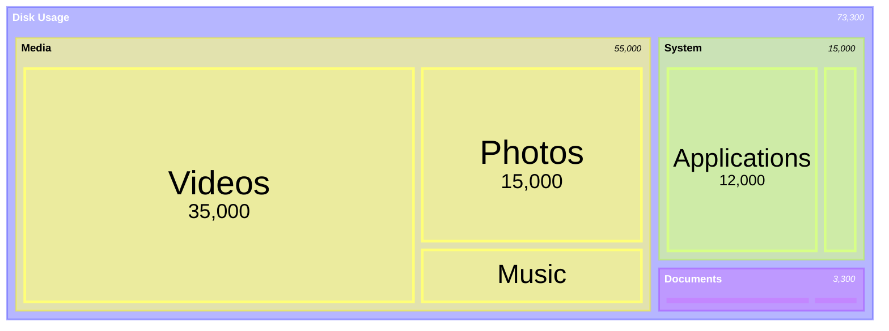

### Product hierarchy

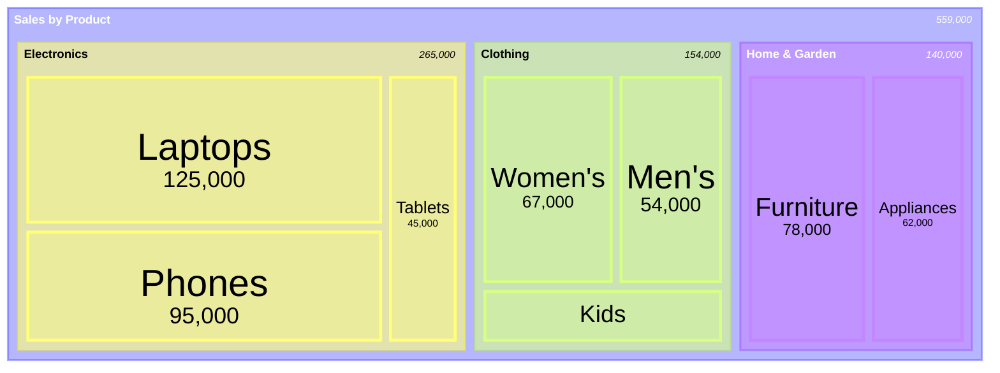

## Best practices

<Tip>
Treemap diagrams work best when:
- Data has a natural hierarchy
- You need to show proportions at multiple levels
- Space is limited but data is extensive
- Values are all positive numbers
</Tip>

## Limitations

<Note>
Treemap diagrams have some limitations:

- Very small values may be difficult to see or label
- Deep hierarchies (many levels) can be challenging to represent clearly
- Not well suited for negative values
- Comparing exact values between non-adjacent rectangles is difficult
</Note>

## Related diagrams

If treemap diagrams don't suit your needs, consider:

- [**Pie charts**](/diagrams/pie) - For simple proportion comparisons without hierarchy
- [**Sankey diagrams**](/diagrams/sankey) - For flow-based hierarchical data
- **Sunburst diagrams** - For radial hierarchical layouts (future Mermaid feature)