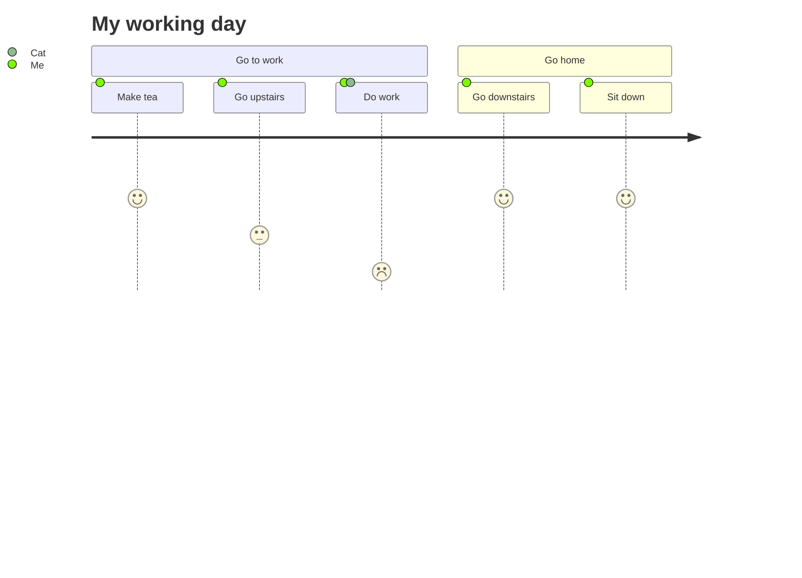
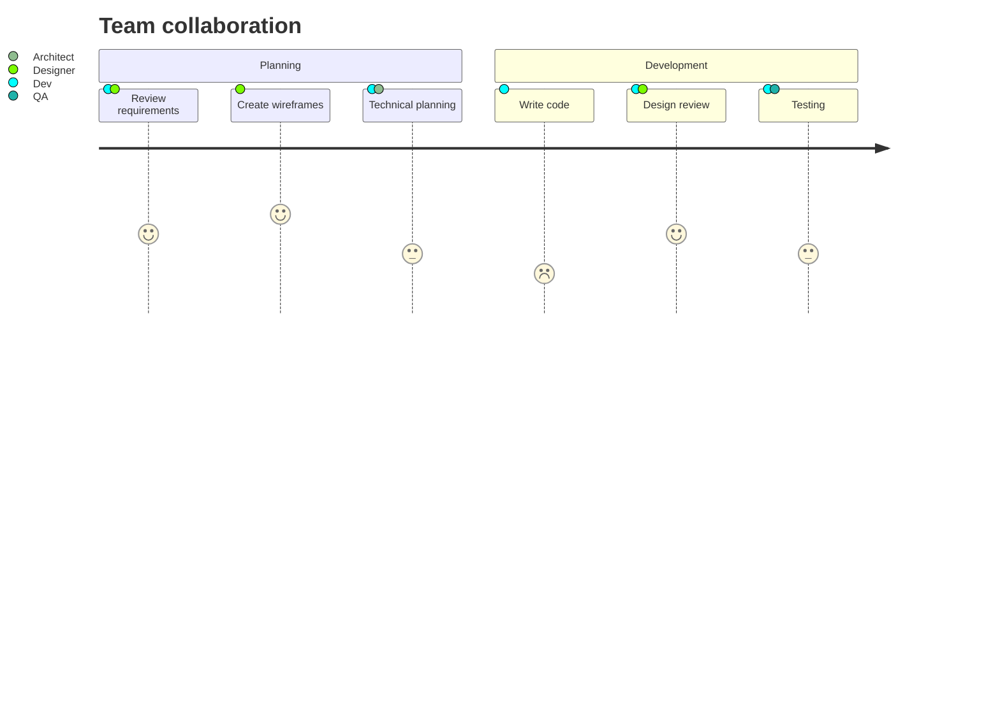

User journey diagrams describe at a high level of detail the exact steps different users take to complete a specific task within a system, application, or website. This technique shows the current (as-is) user workflow and reveals areas of improvement for the to-be workflow.

## Basic example



## Syntax overview

Each user journey is split into sections that describe the part of the task the user is trying to complete.

### Basic structure

```
journey
    title [Title text]
    section [Section name]
      [Task name]: [Score]: [Actors]
```

### Task syntax

Tasks follow this format:

```
Task name: <score>: <comma separated list of actors>
```

The score is a number between 1 and 5 (inclusive), representing the user's satisfaction or experience level with that task.

## Complete example

Here's a more detailed user journey showing a typical working day:


## Multiple actors

Tasks can involve multiple actors by separating them with commas:



## Scoring guide

The score represents the user's experience:

- **5** - Very positive experience
- **4** - Positive experience
- **3** - Neutral experience
- **2** - Negative experience
- **1** - Very negative experience

<Tip>
Use user journey diagrams to identify pain points in user workflows. Tasks with low scores (1-2) often indicate areas that need improvement.
</Tip>

<Note>
User journey diagrams are excellent for stakeholder presentations as they clearly show the user's emotional experience throughout a process.
</Note>