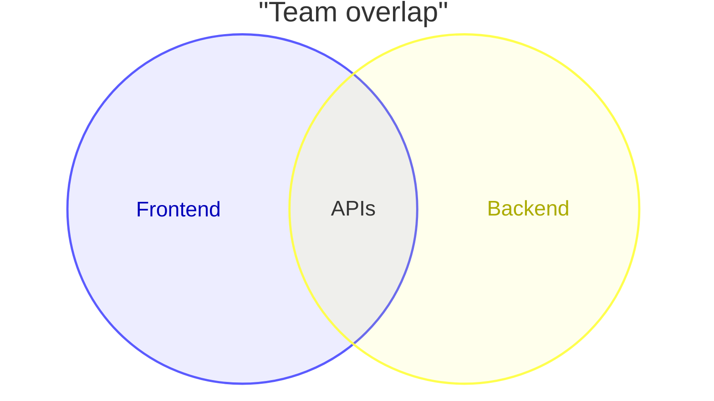
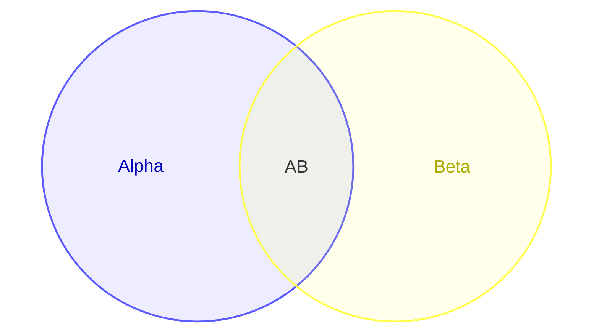
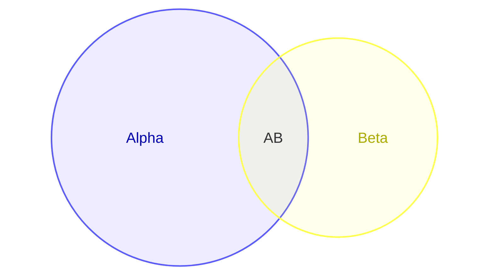
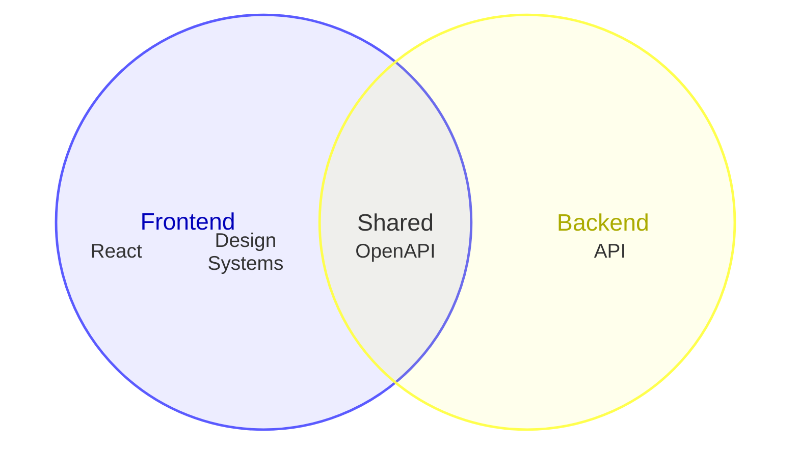
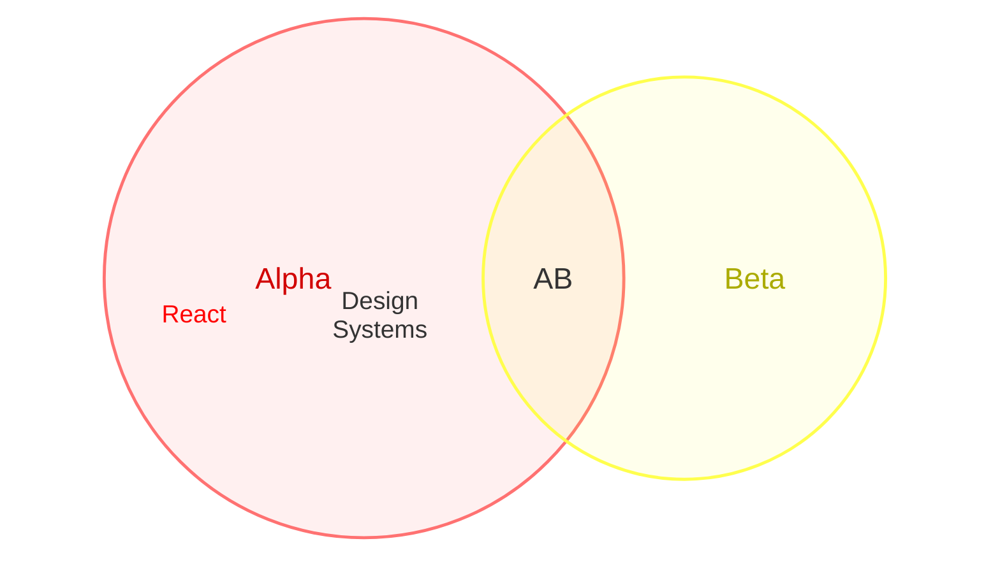
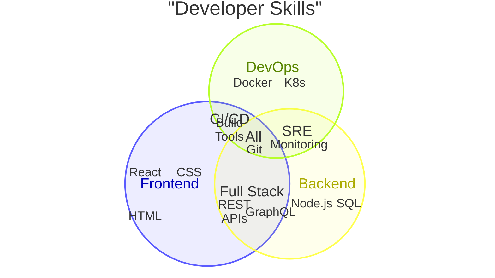
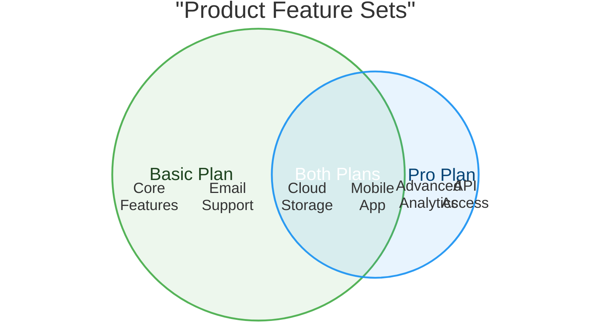
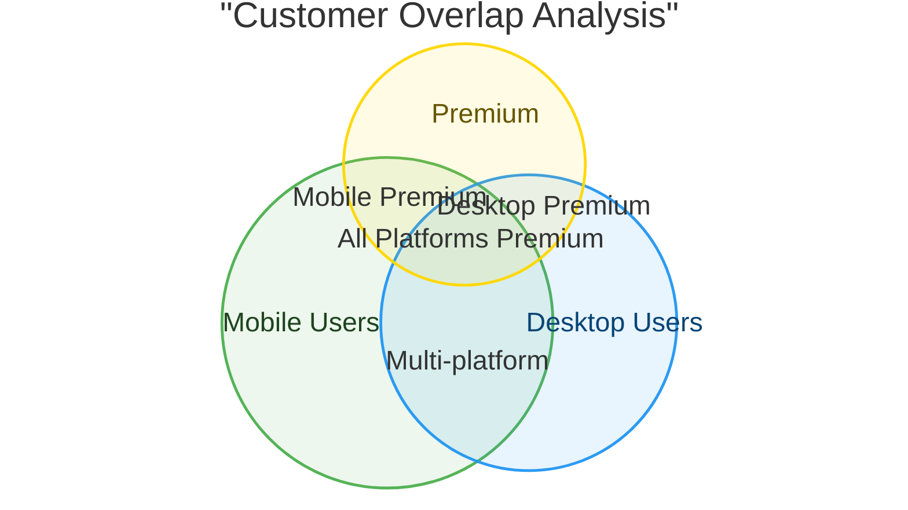
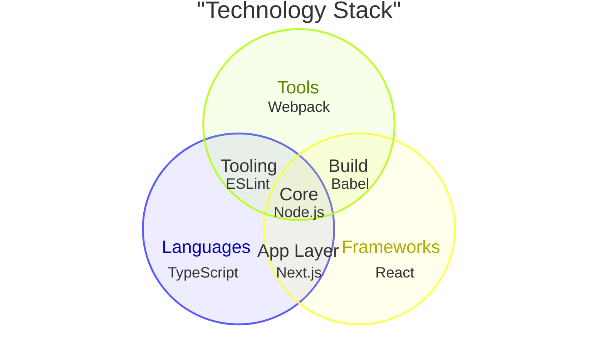

Venn diagrams show relationships between sets using overlapping circles. They are useful for visualizing intersections, unions, and differences between groups.

<Note>
This is a new diagram type in Mermaid. Its syntax may evolve in future versions. Use the `venn-beta` keyword.
</Note>

## Basic Venn diagram

This example shows team overlap:



## Syntax overview

### Starting a diagram

Begin with `venn-beta` and optionally add a title:

```
venn-beta
  title "Your Title"
```

### Defining sets

Use `set` for individual sets:

```
set SetName
```

Set identifiers can be bare words (`A`, `Set_1`) or quoted strings (`"Foo Bar"`).

### Defining unions

Use `union` for overlapping regions:

```
union SetA,SetB
```

Union identifiers must reference sets defined earlier in the diagram.

## Labels

Use bracket syntax `["..."]` to set display labels:



This keeps identifiers short while showing descriptive labels in the diagram.

## Sizes

Add sizes to sets or unions using `:N` suffix:



Sizes are proportional and help visualize the relative magnitude of each region.

## Text nodes

Add labels inside sets or unions using `text` nodes:



### Text node rules

- Use indentation to attach text to the most recent `set` or `union`
- Text nodes support the same bracket syntax for display labels
- Multiple text nodes can be added to any region

## Styling

Apply visual styles using `style` statements:



### Supported style properties

<Accordion title="Style properties">

- `fill` - Change fill color
- `color` - Change text color
- `stroke` - Change stroke color
- `stroke-width` - Change stroke width
- `fill-opacity` - Change fill opacity

</Accordion>

### Styling multiple elements

You can style multiple elements in one statement:

```
style A,B color:#333
```

## Complete examples

### Skills overlap



### Product features



### Customer segments



## Three-set diagrams

Venn diagrams can show complex relationships between three sets:



## Use cases

Venn diagrams are commonly used for:

- **Set theory**: Teaching mathematical concepts
- **Feature comparison**: Comparing product features across tiers
- **Audience analysis**: Showing customer segment overlaps
- **Skill mapping**: Visualizing team competencies
- **Data analysis**: Showing intersections in datasets
- **Decision making**: Comparing options and their overlaps

## Best practices

<Tip>
For clarity:
- Limit diagrams to 2-3 sets (more becomes visually complex)
- Use descriptive labels for all regions
- Apply sizes when representing quantitative data
- Use styling to highlight important regions
- Add text nodes to clarify what belongs in each region
</Tip>

## Limitations

<Note>
Venn diagrams in Mermaid:
- Work best with 2-3 sets (4+ sets become very complex)
- Require all union sets to be previously defined
- Show proportional relationships when sizes are specified
- May not perfectly represent complex mathematical set relationships
</Note>