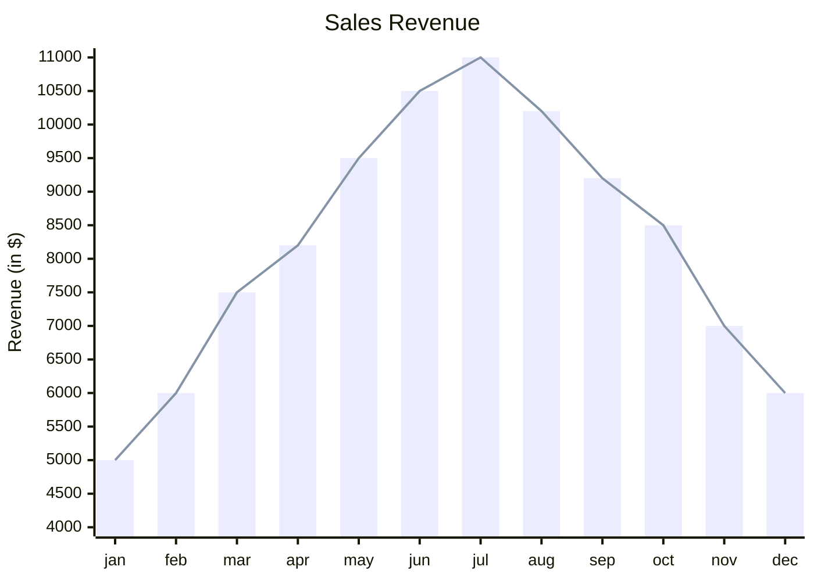
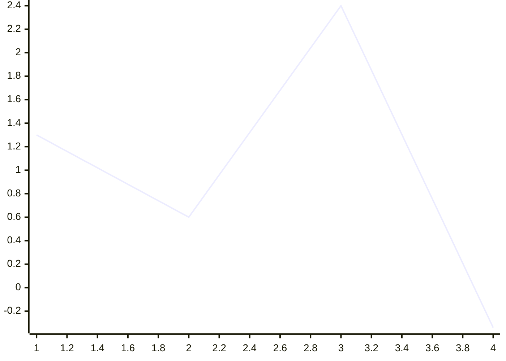
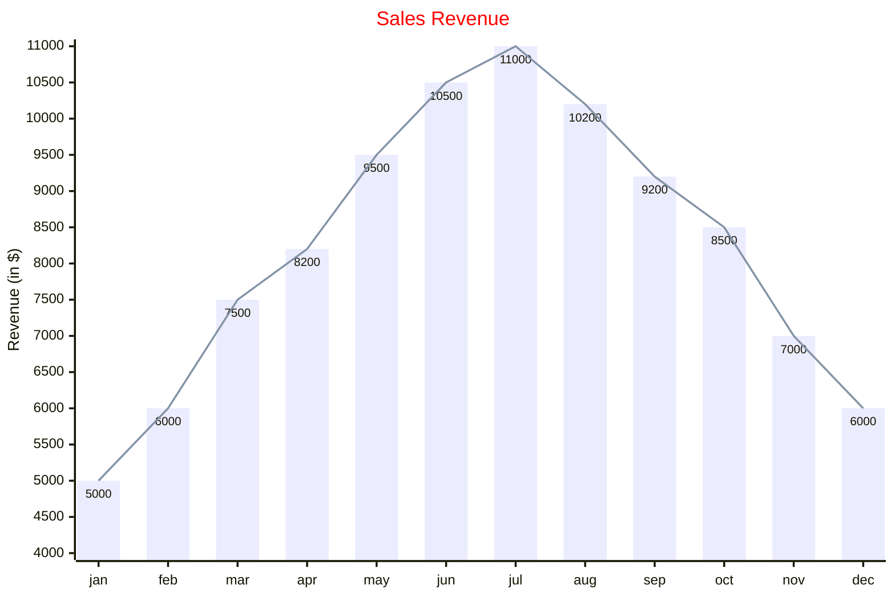

The XY chart is a comprehensive charting module that encompasses various types of charts utilizing both x-axis and y-axis for data representation. Currently, it includes bar charts and line charts.

## Basic example



## Syntax overview

<Note>
Single-word text values don't need quotes. Multi-word values with spaces must be enclosed in quotes.
</Note>

### Orientation

Charts can be horizontal or vertical (default):

```
xychart horizontal
    ...
```

### Title

Add a title to your chart:

```
xychart
    title "This is a simple example"
    ...
```

### X-axis

The x-axis can be categorical or numeric:

**Categorical:**
```
x-axis "title with space" [cat1, "cat2 with space", cat3]
```

**Numeric range:**
```
x-axis title min --> max
```

### Y-axis

The y-axis represents numerical range values:

**With range:**
```
y-axis title min --> max
```

**Auto-generated range:**
```
y-axis title
```

<Note>
Both axes are optional. If not provided, ranges will be auto-generated from data.
</Note>

### Line chart

Add a line to your chart:

```
line [2.3, 45, .98, -3.4]
```

### Bar chart

Add bars to your chart:

```
bar [2.3, 45, .98, -3.4]
```

## Simple example

The minimal chart needs only the chart name and one data set:



## Multiple data series

Combine multiple lines and bars in one chart:

```mermaid
xychart
    title "Sales and Costs"
    x-axis [Q1, Q2, Q3, Q4]
    y-axis "Amount ($)" 0 --> 12000
    bar [5000, 6000, 7500, 8200]
    line [4000, 5500, 6800, 7200]
    bar [3500, 4200, 5100, 6000]
```



## Configuration

<Accordion title="Chart dimensions and settings">

| Parameter | Description | Default |
| --- | --- | --- |
| width | Width of the chart | 700 |
| height | Height of the chart | 500 |
| titlePadding | Top and bottom padding of title | 10 |
| titleFontSize | Title font size | 20 |
| showTitle | Show or hide title | true |
| chartOrientation | 'vertical' or 'horizontal' | 'vertical' |
| plotReservedSpacePercent | Minimum space plots take | 50 |
| showDataLabel | Show values within bars | false |

</Accordion>

<Accordion title="Axis configuration">

| Parameter | Description | Default |
| --- | --- | --- |
| showLabel | Show axis labels or tick values | true |
| labelFontSize | Font size of labels | 14 |
| labelPadding | Top and bottom padding of labels | 5 |
| showTitle | Show axis title | true |
| titleFontSize | Axis title font size | 16 |
| titlePadding | Top and bottom padding of title | 5 |
| showTick | Show ticks | true |
| tickLength | Length of ticks | 5 |
| tickWidth | Width of ticks | 2 |
| showAxisLine | Show axis line | true |
| axisLineWidth | Thickness of axis line | 2 |

</Accordion>

## Theme variables

<Accordion title="Available theme variables">

Customize chart colors using theme variables:

```yaml
---
config:
  themeVariables:
    xyChart:
      titleColor: '#ff0000'
---
```

| Parameter | Description |
| --- | --- |
| backgroundColor | Background color of the whole chart |
| titleColor | Color of the title text |
| xAxisLabelColor | Color of the x-axis labels |
| xAxisTitleColor | Color of the x-axis title |
| xAxisTickColor | Color of the x-axis tick |
| xAxisLineColor | Color of the x-axis line |
| yAxisLabelColor | Color of the y-axis labels |
| yAxisTitleColor | Color of the y-axis title |
| yAxisTickColor | Color of the y-axis tick |
| yAxisLineColor | Color of the y-axis line |
| plotColorPalette | String of colors separated by comma |

</Accordion>

### Custom colors

Set colors for lines and bars using `plotColorPalette`:

```mermaid
---
config:
  themeVariables:
    xyChart:
      plotColorPalette: '#000000, #0000FF, #00FF00, #FF0000'
---
xychart
title "Different Colors in xyChart"
x-axis "categoriesX" ["Category 1", "Category 2", "Category 3", "Category 4"]
y-axis "valuesY" 0 --> 50
%% Black line
line [10,20,30,40]
%% Blue bar
bar [20,30,25,35]
%% Green bar
bar [15,25,20,30]
%% Red line
line [5,15,25,35]
```



## Complete example

Here's a comprehensive example with configuration and theming:



<Tip>
Use horizontal orientation for charts with long category names to improve readability.
</Tip>