ZenUML is an alternative syntax for creating sequence diagrams in Mermaid. It shows how processes operate with one another and in what order, using a different approach than the standard Mermaid sequence diagram syntax.

<Note>
ZenUML uses experimental lazy loading and async rendering features which may change in future versions.
</Note>

## Basic sequence diagram

This example shows a simple conversation between Alice and John:

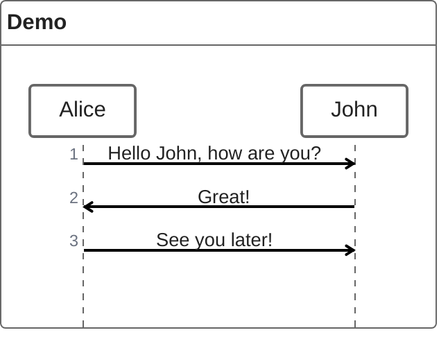

## Participants

### Implicit declaration

Participants are automatically created when first used in the diagram:

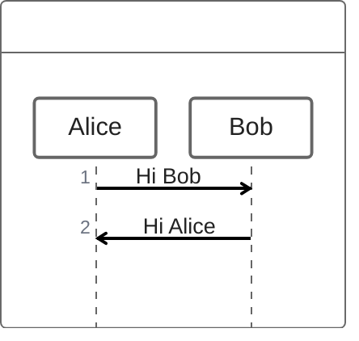

### Explicit declaration

You can control the order of participants by declaring them explicitly:

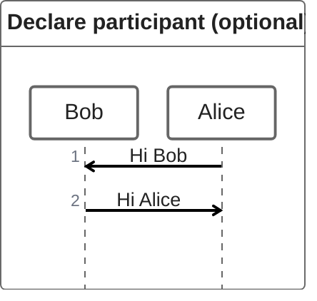

### Annotators

Use annotators to display participants as specific symbols:

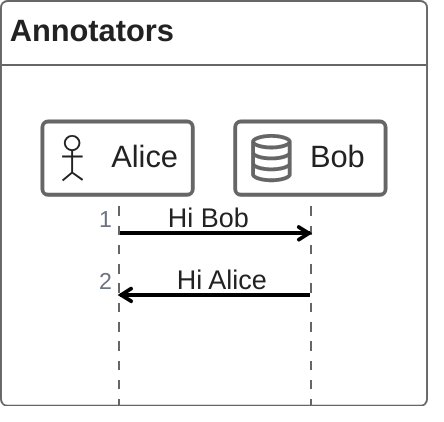

<Accordion title="Available annotators">

ZenUML supports various annotator types including:

- `@Actor` - Human actor
- `@Database` - Database system
- `@Boundary` - System boundary
- `@Control` - Control element
- `@Entity` - Entity
- `@Queue` - Message queue

</Accordion>

### Aliases

Create shorter identifiers with descriptive labels:

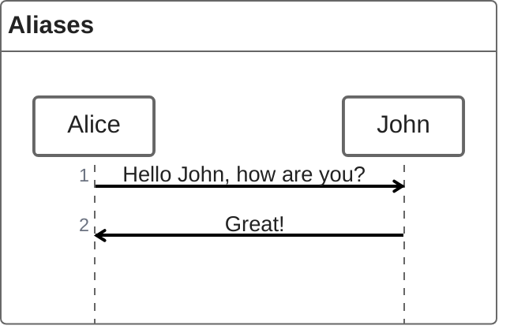

## Messages

ZenUML supports four types of messages:

### Sync messages

Synchronous (blocking) method calls:

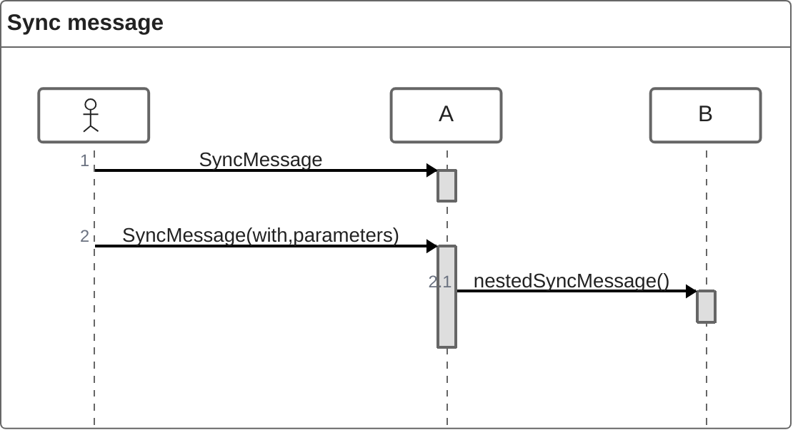

### Async messages

Asynchronous (non-blocking) messages:

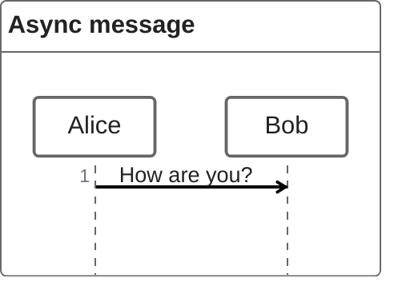

### Creation messages

Create new objects using the `new` keyword:

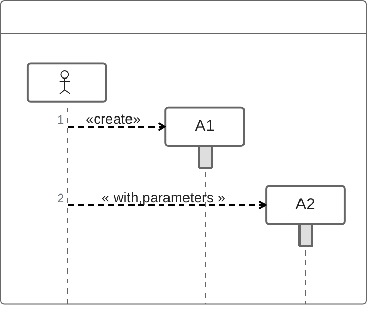

### Reply messages

There are three ways to express replies:

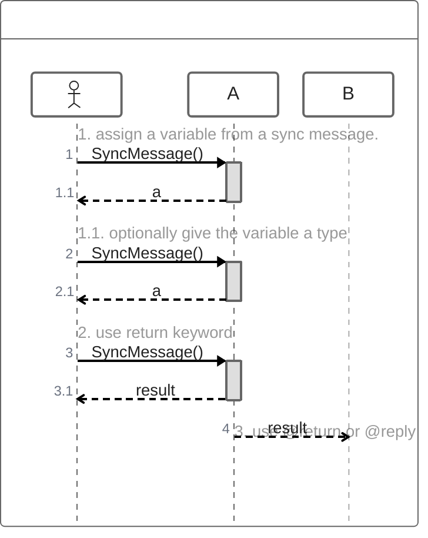

### Early return example

The `@return` annotator is useful for returning to one level up:

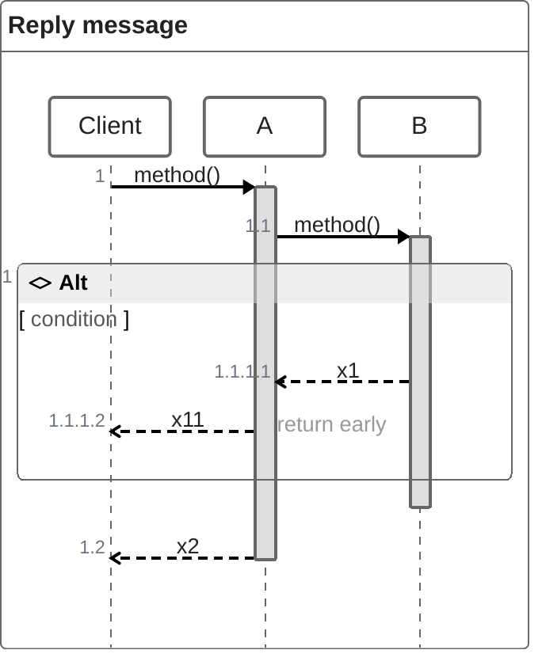

## Nesting

Sync and creation messages support nesting with curly braces:

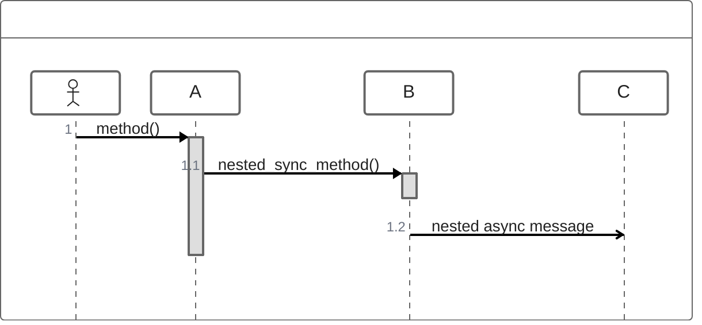

## Comments

Add comments using `//` syntax. Comments are rendered above messages and support Markdown:

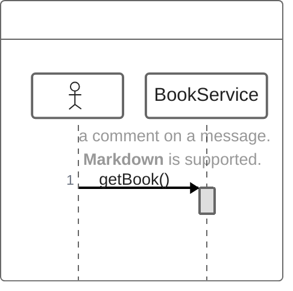

## Loops

Create loops using `while`, `for`, `forEach`, or `loop`:

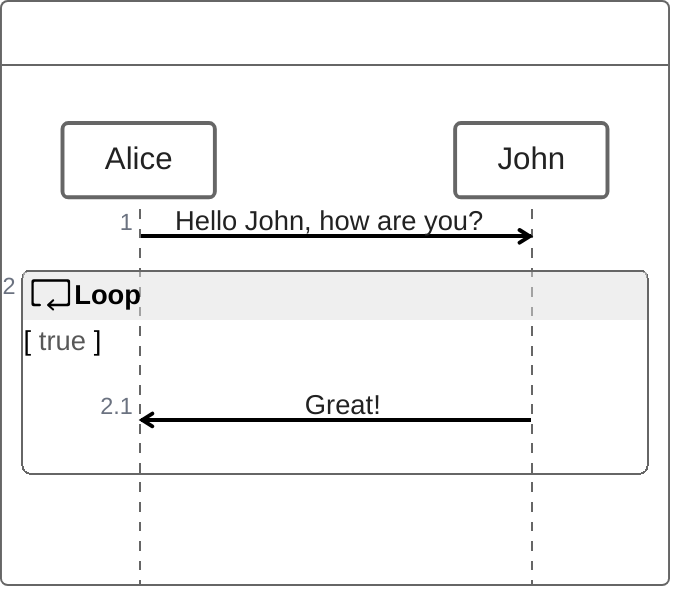

### Loop syntax

```
while(condition) {
    ...statements...
}
```

## Alternative paths

Express conditional logic with `if/else`:

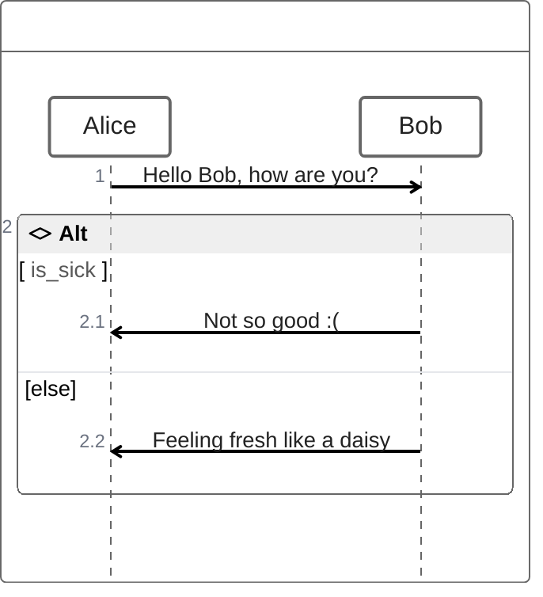

### Alt syntax

```
if(condition1) {
    ...statements...
} else if(condition2) {
    ...statements...
} else {
    ...statements...
}
```

## Optional fragments

Render optional fragments with `opt`:

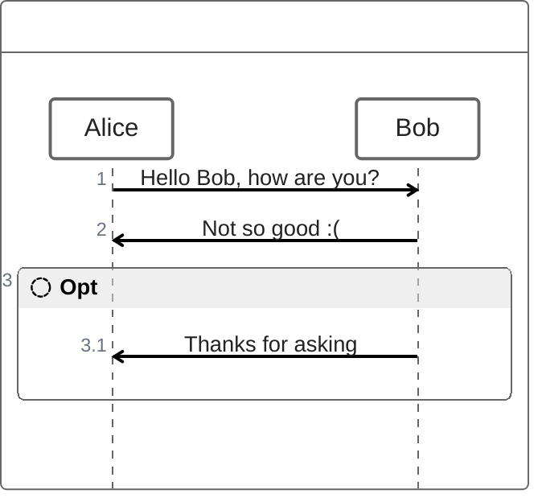

## Parallel execution

Show actions happening in parallel:

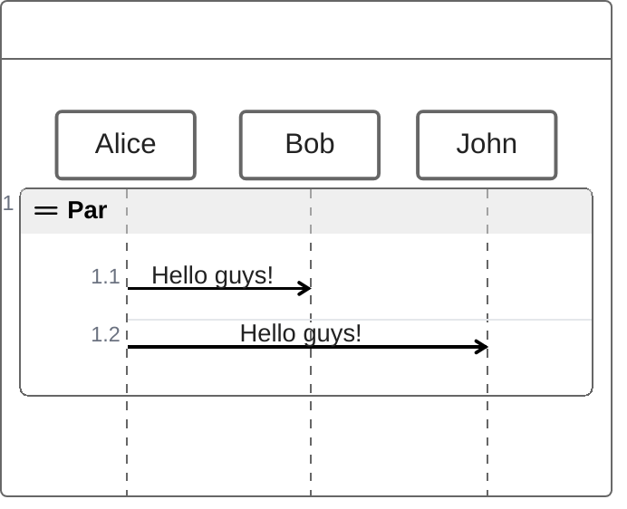

### Parallel syntax

```
par {
  statement1
  statement2
  statement3
}
```

## Try/catch/finally

Model exception handling and breaks in sequence flow:

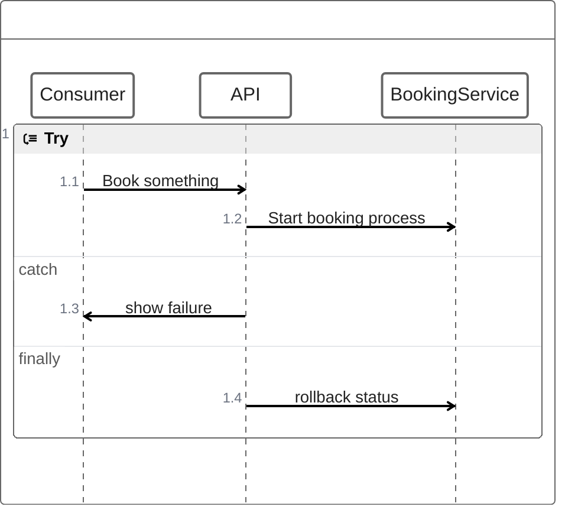

### Exception syntax

```
try {
  ...statements...
} catch {
  ...statements...
} finally {
  ...statements...
}
```

## Complete example

Here's a comprehensive example showing various ZenUML features:

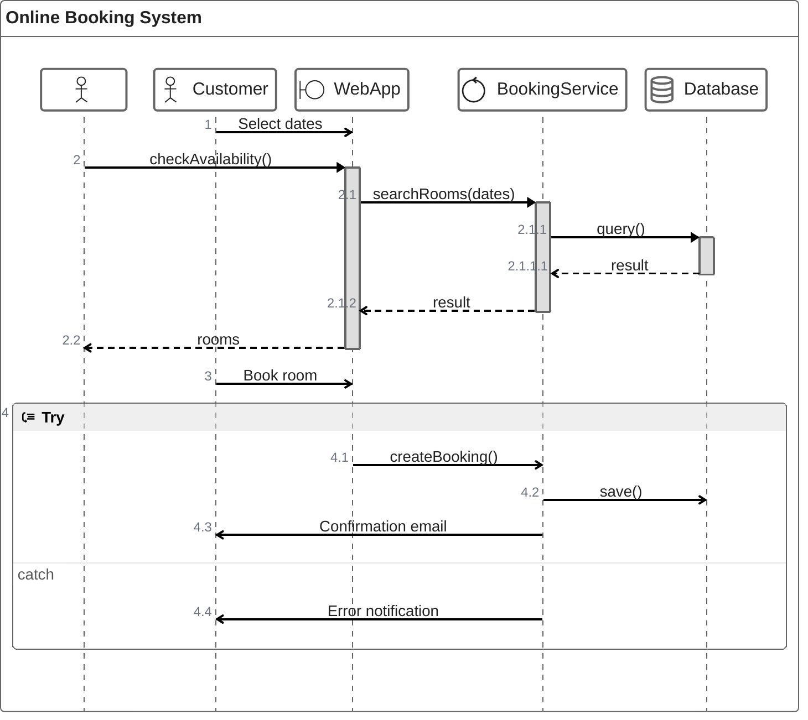

## Integration with web pages

<Accordion title="Using ZenUML in HTML">

To use ZenUML diagrams in a web page:

```html
<script type="module">
  import mermaid from 'https://cdn.jsdelivr.net/npm/mermaid@10/dist/mermaid.esm.min.mjs';
  import zenuml from 'https://cdn.jsdelivr.net/npm/@mermaid-js/mermaid-zenuml@0.1.0/dist/mermaid-zenuml.esm.min.mjs';
  await mermaid.registerExternalDiagrams([zenuml]);
</script>
```

</Accordion>

<Tip>
ZenUML syntax is often more concise than traditional sequence diagram syntax, especially for nested interactions and complex control flow.
</Tip>

<Note>
While ZenUML and standard Mermaid sequence diagrams produce similar visual results, they use different syntax. Choose the one that best fits your workflow.
</Note>