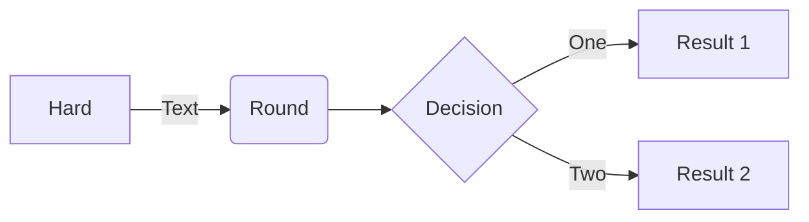

# Introduction to Mermaid

Mermaid is a JavaScript-based diagramming and charting tool that uses Markdown-inspired text definitions and a renderer to create and modify complex diagrams. The main purpose of Mermaid is to help documentation catch up with development.

<Note>
Doc-Rot is a Catch-22 that Mermaid helps to solve. Diagramming and documentation costs precious developer time and gets outdated quickly. But not having diagrams or docs ruins productivity and hurts organizational learning.
</Note>

Mermaid addresses this problem by enabling users to create easily modifiable diagrams. It can also be made part of production scripts and other pieces of code, making it easy to keep your documentation in sync with your codebase.

## Why Mermaid?

<CardGroup cols={2}>
  <Card title="Text-based diagramming" icon="chart-line">
    Create complex diagrams using simple, markdown-like text syntax. No need for graphical editors.
  </Card>
  <Card title="Developer-friendly" icon="code">
    Integrate diagrams directly into your markdown files, documentation, and code repositories.
  </Card>
  <Card title="Highly customizable" icon="palette">
    Style your diagrams with themes and custom CSS. Configure every aspect to match your brand.
  </Card>
  <Card title="Battle-tested" icon="rocket">
    Used by millions of developers worldwide. Native support in GitHub, GitLab, and many other platforms.
  </Card>
</CardGroup>

## Supported diagram types

Mermaid supports a wide variety of diagram types to cover different visualization needs:

- **Flowcharts** - Visualize processes and workflows
- **Sequence diagrams** - Show interactions between components over time
- **Class diagrams** - Illustrate object-oriented system structures
- **State diagrams** - Represent state machines and transitions
- **Entity relationship diagrams** - Model database schemas
- **Gantt charts** - Plan and track project timelines
- **Pie charts** - Display proportional data
- **Git graphs** - Visualize Git branching strategies
- **User journey diagrams** - Map user experience flows
- **C4 diagrams** - Document software architecture
- And many more!

## Quick example

Here's a simple flowchart created with Mermaid:



The code above is generated from this simple text:

```text
flowchart LR
    A[Hard] -->|Text| B(Round)
    B --> C{Decision}
    C -->|One| D[Result 1]
    C -->|Two| E[Result 2]
```

## Integrations

Mermaid works seamlessly with many platforms and tools:

- **GitHub & GitLab** - Native support in markdown files
- **Notion, Confluence, Obsidian** - Popular documentation platforms
- **VS Code, IntelliJ** - IDE plugins available
- **Docusaurus, VitePress, Mintlify** - Static site generators
- And [many more integrations](https://mermaid.js.org/ecosystem/integrations-community.html)

<Tip>
Try the [Mermaid Live Editor](https://mermaid.live/) to create and preview diagrams in real-time without any setup.
</Tip>

## Next steps

<CardGroup cols={2}>
  <Card title="Installation" icon="download" href="/installation">
    Install Mermaid in your project using npm, yarn, pnpm, or CDN
  </Card>
  <Card title="Quickstart" icon="bolt" href="/quickstart">
    Create your first diagram in under 5 minutes
  </Card>
</CardGroup>
